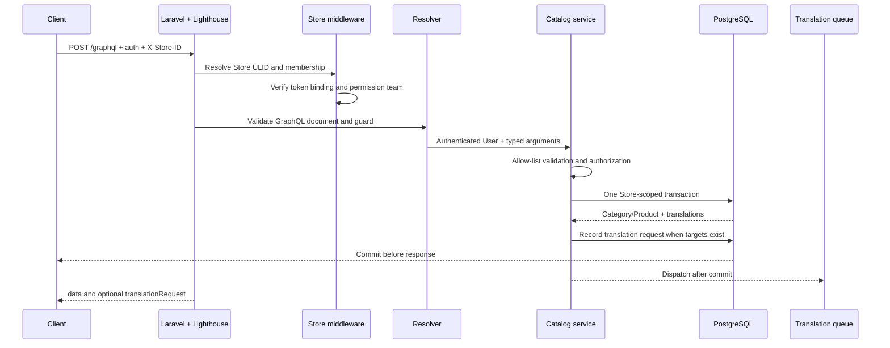

# ShopNXE API manual

This is the implementation handoff for clients and future ShopNXE applications. It explains how a request moves through authentication, Store selection, authorization, validation, persistence, translation, and response serialization. The executable sources remain the Lighthouse schemas under `graphql/` and `Modules/*/graphql/`, plus `docs/openapi.yaml` for REST.

The generated [GraphQL operation reference](generated/graphql-operations.md) is refreshed by `composer docs:update` and checked by CI. Start with that index when an operation is added or renamed.

## 1. Endpoint and request envelope

GraphQL uses one endpoint:

```http
POST /graphql
Accept: application/json
Content-Type: application/json
Authorization: Bearer <store-bound-token>
X-Store-ID: <store-public-ulid>
```

Cookie-authenticated Sanctum sessions are also supported. A bearer token used with a Store operation must have the `store:access` ability and be bound to the same Store as `X-Store-ID`. Category and product reads require an active Store membership. Mutations additionally require the Store-team permission `manage products`.

The JSON envelope is standard GraphQL:

```json
{
  "query": "query Product($id: ID!) { product(id: $id) { id status } }",
  "variables": { "id": "01K..." },
  "operationName": "Product"
}
```

All public entity IDs are ULIDs. Never send or persist ShopNXE's internal bigint primary keys in another application.

## 2. Request cycle



Resolvers are adapters. Business rules, Store ownership, permissions, translation synchronization, hierarchy checks, and product-category synchronization live in Catalog services. Database composite foreign keys are the final cross-Store boundary.

## 3. Catalog GraphQL operations

| Operation | Purpose | Permission |
| --- | --- | --- |
| `categories` | Filtered, sorted, paginated category list | Active Store membership |
| `category` | One category by public ULID | Active Store membership |
| `products` | Filtered, sorted, paginated product list | Active Store membership |
| `product` | One product by public ULID | Active Store membership |
| `createCategory`, `updateCategory`, `deleteCategory` | Category lifecycle | `manage products` |
| `createProduct`, `updateProduct`, `deleteProduct` | Product lifecycle | `manage products` |

Lists default to 20 records and permit at most 100. Category sorting is allow-listed to `SORT_ORDER`, `CREATED_AT`, or `UPDATED_AT`. Product sorting is allow-listed to `CREATED_AT`, `UPDATED_AT`, `STATUS`, or `PUBLISHED_AT`.

Category filters are `search`, `locale`, `parentId`, `rootOnly`, and `isActive`. Product filters are `search`, `locale`, `status`, `fulfillmentType`, `brandId`, and `categoryId`. Search matches localized title or slug case-insensitively; `locale` restricts which translation is searched.

## 4. Category lifecycle

A category is Store-owned navigation taxonomy. `parentId` creates a tree, `sortOrder` controls sibling ordering, and translated slugs are unique inside one Store and locale. A category cannot become its own parent or a child of one of its descendants.

Create a root category:

```graphql
mutation CreateCategory($input: CreateCategoryInput!) {
  createCategory(input: $input) {
    category {
      id
      parentId
      isActive
      sortOrder
      translation(locale: "en") {
        title
        slug
        description
        seoTitle
        pageTitle
        lockIt
      }
    }
    translationRequest {
      id
      status
      sourceLocale
      targetLocales
    }
  }
}
```

```json
{
  "input": {
    "isActive": true,
    "sortOrder": 10,
    "imageUrl": "/catalog/shoes.webp",
    "translations": [
      {
        "locale": "en",
        "title": "Shoes",
        "slug": "shoes",
        "description": "Browse every shoe",
        "imageUrl": "/catalog/localized/shoes.webp",
        "bannerUrl": "/catalog/localized/shoes-banner.webp",
        "seoTitle": "Shop shoes",
        "seoDescription": "Footwear for every occasion",
        "pageTitle": "All shoes",
        "searchKeywords": "shoe, footwear",
        "categoryTemplate": "category-grid",
        "lockIt": false
      }
    ]
  }
}
```

Create a child by sending the parent's public ULID as `parentId`. Send `parentId: null` in `UpdateCategoryInput` to move a category back to the root. Omitted update fields remain unchanged; a supplied translation is a complete value for that locale.

The Category-level `imageUrl` is the shared/default taxonomy image. Each
translation may additionally provide its own localized `imageUrl` and
`bannerUrl`; both accept a root-relative path or an HTTP(S) URL and remain
nullable. Localized image locators are saved exactly as manual metadata and are
not sent to the language-translation provider.

Delete behavior is deliberate: child categories become roots, category translations are deleted, and product assignments to that category are removed. Products themselves are not deleted.

## 5. Product lifecycle

A product can reference an existing Store-local Brand, zero or more categories, and at most one primary category. When `primaryCategoryId` is present it must also appear in `categoryIds`. Category order in `categoryIds` becomes assignment `sort_order`.

Allowed product values:

| Field | Values or behavior |
| --- | --- |
| `status` | `draft`, `active`, `archived` |
| `fulfillmentType` | `physical`, `digital`, `software`, `service` |
| `trackInventory` | Boolean; defaults to `true` |
| `hasVariants` | Read-only in this API; variant APIs will own it |
| `publishedAt` | Set on first activation, cleared when returned to draft, retained when archived |

Create a product:

```graphql
mutation CreateProduct($input: CreateProductInput!) {
  createProduct(input: $input) {
    product {
      id
      status
      fulfillmentType
      publishedAt
      primaryCategoryId
      categories { id translation(locale: "en") { title } }
      translations { locale title slug lockIt }
    }
    translationRequest { id status targetLocales }
  }
}
```

```json
{
  "input": {
    "brandId": "01K...",
    "vendor": "ShopNXE Demo",
    "productType": "running-shoe",
    "fulfillmentType": "physical",
    "trackInventory": true,
    "status": "active",
    "categoryIds": ["01K_CATEGORY"],
    "primaryCategoryId": "01K_CATEGORY",
    "translations": [
      {
        "locale": "en",
        "title": "Trail Runner",
        "slug": "trail-runner",
        "description": "A durable trail shoe",
        "seoTitle": "Trail Runner shoe",
        "lockIt": false
      }
    ]
  }
}
```

Updating `categoryIds` replaces the product's category assignments atomically. Sending an empty list removes every assignment. Sending `brandId: null` removes the Brand relationship. Deleting a product cascades its translations and category/tag/collection/options/variant-owned relationships according to the Catalog schema; it does not delete shared categories or Brands.

## 6. Reading localized data

Every category and product returns:

- `translations`: all saved manual or generated locale rows, ordered by locale.
- `translation(locale: "...")`: one exact locale using hyphen/underscore and case-insensitive normalization.

Example list query:

```graphql
query Products($filter: ProductFilterInput!) {
  products(filter: $filter, page: 1, perPage: 25, sortBy: CREATED_AT, sortDirection: DESC) {
    data {
      id
      status
      translation(locale: "de") { title slug description }
      categories { id translation(locale: "de") { title } }
    }
    paginatorInfo { count currentPage lastPage perPage total }
  }
}
```

```json
{
  "filter": {
    "search": "Laufschuh",
    "locale": "de",
    "status": "active",
    "categoryId": "01K_CATEGORY"
  }
}
```

Only Store languages that are both selected and active may be written. Locale tags normalize `en-US` and `en_US` for matching while the saved Store language spelling is retained.

## 7. Manual and automatic translation

The first/default active Store language is the preferred source. If it is not yet saved, the first supplied translation becomes the source. Category automation translates title, description, SEO title/description, page title, and search keywords. Product automation translates title, description, and SEO title/description. Slugs are generated from translated titles and made unique per Store/locale. Category image/banner URLs and category template keys are manual metadata and are not sent for language translation.

The write cycle is:

1. Validate that every supplied locale is active for the selected Store.
2. Save source/manual rows in the same transaction as the entity.
3. Preserve an existing `lockIt` value when the input omits it.
4. Create a deduplicated `translation_requests` ledger row if unlocked target locales exist.
5. Commit the entity and request.
6. Dispatch translation work after commit.
7. Recheck source hashes and target locks before applying provider output.

`lockIt: true` means a merchant owns that locale and automation must never overwrite it. Send the same complete locale with `lockIt: false` to opt it back into later automation.

`translationRequest` is nullable because no job is needed when there are no other target languages, all targets are locked, or all missing-only targets already exist. In Redis-backed environments it is eventually consistent. Poll:

```http
GET /api/v1/store/translation-requests/<translation-request-ulid>
Authorization: Bearer <store-bound-token>
X-Store-ID: <store-public-ulid>
```

Statuses are `pending`, `processing`, `completed`, `failed`, `superseded`, or `cancelled`. A failed provider call never rolls back valid source content. A changed source supersedes stale work; deleted content cancels it.

## 8. Errors and client behavior

GraphQL execution/validation failures normally return HTTP 200 with an `errors` array and may include partial `data`. HTTP middleware failures, such as missing authentication during Store resolution, may return 401/403 JSON before GraphQL execution.

Clients should:

1. Treat the presence of `errors` as failure for the affected operation.
2. Log the response `X-Request-ID` for support correlation.
3. Show field validation messages without exposing traces.
4. Treat missing/cross-Store ULIDs as not found rather than trying another internal ID.
5. Retry only transport failures and explicitly retryable jobs; do not blindly replay mutations.

Common failures include missing `X-Store-ID`, inactive membership, token/Store mismatch, missing `manage products`, inactive translation locale, duplicate localized slug, invalid category tree, and a primary category absent from `categoryIds`.

## 9. Adding another application or Catalog entity

An external application should bootstrap in this order:

1. Authenticate and obtain the user's allowed Store/interface data.
2. Select one Store public ULID.
3. Send that ULID on every Store-scoped call.
4. Load active Store languages before rendering translation editors.
5. Read the generated operation reference and executable SDL.
6. Store ShopNXE public ULIDs, never internal joins.
7. Poll returned translation requests when localized content must be immediately visible.

When developers add another translatable entity, they must add the Store-scoped model/service, explicit GraphQL resolver and SDL, translation handler and registry tag, `lock_it` migration contract, PostgreSQL feature tests, this manual's behavioral explanation, the affected module/context guide, and a development-log entry.

## 10. Keeping this manual current

After application, dependency, route, GraphQL, migration, module, configuration, or workflow changes:

```powershell
composer docs:update
composer docs:check
composer format:check
composer analyse
php artisan test
```

`docs:update` regenerates the system inventory and GraphQL operation reference. Composer also invokes it after autoload dumps. CI runs `docs:check`, so changed executable operations cannot be merged with a stale generated reference. Business intent and examples cannot be inferred safely; developers must update this manual, the project context/developer guide, and `docs/development-log.md` in the same change.
