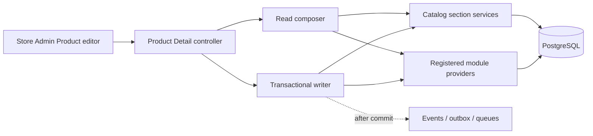

# Architecture

The application is a modular monolith: one Laravel process, one PostgreSQL shared schema, and explicit module boundaries. `Modules/Authentication`, `Modules/Settings`, `Modules/Stores`, `Modules/Billing`, `Modules/Themes`, `Modules/Catalog`, and `Modules/Customers` own their migrations and application contracts. Settings owns global SaaS configuration and never enters Store context; Stores owns merchant data and Store-specific selections. Billing owns Platform plan/feature administration; Themes owns the marketplace/release/license/installation lifecycle; Catalog owns Store-local merchandising and product persistence. Customers owns buyer profiles, groups, multilingual group names, credit ledger entries, category access, and group discounts, while storefront buyer authentication remains separate. Catalog's current API split is Brand REST, Category/Product Type GraphQL, Product REST plus GraphQL, nested Product Image REST, and Fulfillment Type REST. `app/Support` contains cross-cutting adapters for request IDs, store-aware search, media paths, internal dashboards, and the reusable translation pipeline.

HTTP is API-only. REST is versioned under `/api/v1` and serves authentication, administrative resources, selected Catalog lifecycles, files/uploads/downloads, exports, webhooks, broadcasting authentication, and health. Lighthouse serves the GraphQL business contracts at `/graphql`; not every persisted resource is exposed through both protocols. Queue work uses Redis/Horizon; Reverb handles WebSockets; Scout targets Meilisearch or the database driver; private media uses a store-prefixed path generator.

Selected high-risk REST creates can enter a disabled-by-default idempotency
boundary after validation and current authorization. PostgreSQL advisory
transaction locks serialize the same User/Store/operation/key, while the domain
write and encrypted successful-response record share one commit. Redis is not
the correctness source. The initial Store/provisioning routes remain in optional
supported mode until the additive ledger migration is explicitly applied and
the feature is enabled. See [Universal HTTP idempotency](idempotency-key-design.md).

## Product Detail application façade

The Store Admin Product editor uses `/api/v1/store/product-detail` as an
application composition boundary. The façade does not own every participating
domain. Catalog supplies Product core and built-in Product sections, while
future owning modules explicitly register `ProductDetailSectionProvider`
implementations. Registration adds a provider to read/write validation,
bounded response metadata, writable capabilities, transactional saves, and
request-local references without adding controller-to-module dependencies.

One HTTP request is not presented as one database query. Full reads execute all
registered sections; a validated `sections` manifest executes only selected
Catalog queries and providers. Writes are already dirty-section-only. Catalog
built-ins and selected providers share one outer transaction, but binary
uploads and remote effects remain outside it. New tables are never discovered
or exposed automatically; explicit provider registration is the security and
ownership boundary. See the [Store Admin guide](product-detail-guide.md) and
[provider contract](module-communication/product-detail-section-providers.md).

The shared-schema Store isolation model keeps identities in `users` with an exclusive `platform` or `store` scope. Only Store users can appear in `store_users`. That relationship grants Store membership; Store-scoped roles and permissions for the same internal `store_id` determine allowed actions. Domain entities have bigint internal keys and public ULIDs. A request-scoped `StoreContext` is set only after account-scope and active-membership validation.

All external side effects are dispatched after commit, queued jobs restore and clear store state, and `ClearRequestContext` resets store, permission-team, authentication, locale, and logging context for long-lived workers.

Automatic content translation follows a durable two-phase workflow. The HTTP transaction saves the merchant's source content and a deduplicated `translation_requests` ledger row, then an after-commit callback dispatches only the request bigint to the dedicated Redis `translations` queue. A content handler snapshots entity-owned fields, including Customer Group display names, and active, unlocked target locales. The worker verifies the snapshot hash, calls the external provider with no database transaction or row lock held, rechecks the snapshot, and applies results in a short transaction through `AutomatedTranslationWriter`. Changed source or target state supersedes stale work; deleted content is cancelled; provider failures retry without undoing the source save. A scheduled recovery pass redispatches stranded pending requests and safely reclaims stale processing rows.

Horizon separates critical `billing`/`webhooks`, normal `default`/`notifications`/`search`, `translations`, and heavy `media`/`exports` workloads into independent supervisors. Translation latency or provider throttling therefore cannot consume the worker pool serving other Store actions.
