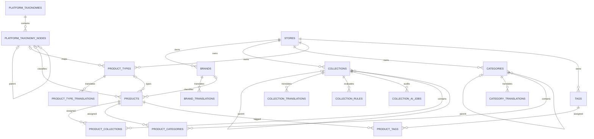
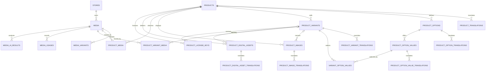
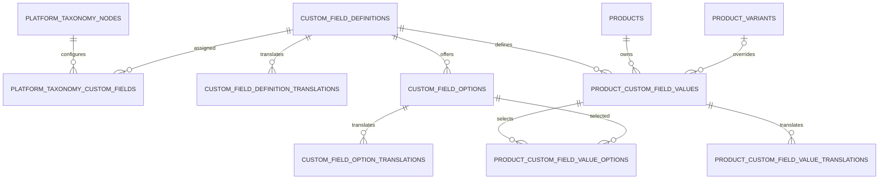

# Catalog schema reference

This document is the complete persistence contract for the Catalog module,
including its global Platform classification tree and Store-local catalog
records. The source of truth is the twenty-one migrations under
`Modules/Catalog/database/migrations` plus the application-wide reusable media
migration; this reference explains their columns,
relationships, constraints, indexes, deletion behavior, and intended use.

The Brand slice includes Store-scoped models and REST CRUD services. Category
and Product Type lifecycle APIs are GraphQL-only. Products have both
transactional GraphQL lifecycle operations and Store REST CRUD; Product Images
and Product Options/Variants have nested REST CRUD. Fulfillment Types use REST for Platform
management and active Store discovery. Category, Product Type, and Product
translations retain locale-aware manual editing and durable automatic
translation handlers. Product files/fulfillment, custom fields and search
projections remain persistence-only
or follow-up work. Product writes can assign both a global taxonomy-node ULID
and a Store-local Product Type ULID. No `/api/v1/store/categories` or
`/api/v1/store/product-types` route exists. See the [API manual](api-manual.md)
for the executable request cycle and examples.

## 1. Migration order

| Order | Migration | Responsibility |
| ---: | --- | --- |
| 1 | `2026_08_05_000100_create_catalog_taxonomy_tables.php` | Brands, collections, collection automation, categories, tags, and custom-field definitions/options |
| 2 | `2026_08_05_000200_create_catalog_product_tables.php` | Products, translations, taxonomy/collection/tag assignments, and product options/values |
| 3 | `2026_08_05_000300_create_catalog_variant_fulfillment_tables.php` | Variants, variant selections, images, digital assets, and software license keys |
| 4 | `2026_08_05_000400_create_catalog_custom_field_value_tables.php` | Product/variant custom-field values, translated values, and multi-select assignments |
| 5 | `2026_08_07_000400_add_website_url_to_brands_table.php` | Optional official Brand website URL |
| 6 | `2026_08_07_000500_add_origin_to_brands_table.php` | Optional Brand country, region, or origin label |
| 7 | `2026_08_08_000100_add_page_title_and_search_keywords_to_category_translations_table.php` | Optional localized category page title and search keywords |
| 8 | `2026_08_08_000200_add_category_template_to_category_translations_table.php` | Optional localized category template name |
| 9 | `2026_08_08_000300_add_banner_url_to_category_translations_table.php` | Optional localized category banner image locator |
| 10 | `2026_08_09_000100_add_lock_it_to_catalog_translation_tables.php` | Non-null overwrite lock for every Catalog translation table |
| 11 | `2026_08_17_000100_add_image_url_to_category_translations_table.php` | Optional localized category image locator before the banner field in application/API contracts |
| 12 | `2026_08_20_000100_create_product_type_tables.php` | Store-local product-type identities and localized names, slugs, and descriptions |
| 13 | `2026_08_20_000200_create_platform_taxonomy_tables.php` | Global Platform taxonomies/nodes, node custom-field assignments, and Product classification foreign keys |
| 14 | `2026_08_23_000100_create_fulfillment_type_tables.php` | Global fulfillment-type identities and Language-catalog translations |
| 15 | `2026_08_23_000200_add_commerce_fields_to_products_table.php` | Product-level commerce identifiers, prices, inventory, shipping, merchandising, release, and quantity fields |
| 16 | `2026_08_23_000300_add_show_related_product_to_products_table.php` | Product-level related-product display flag |
| 17 | `2026_08_23_000400_add_prodpoints_to_products_table.php` | Product-level points value |
| 18 | `2026_08_23_000500_add_reviews_on_to_products_table.php` | Product-level review enablement flag |
| 19 | `database/migrations/2026_08_25_000100_expand_media_management_subsystem.php` | Existing-media extension, reusable Product/Variant media pivots, derivatives, usage, and AI-result boundaries |
| 20 | `2026_08_25_001000_create_modifier_library_tables.php` | Reusable Store-level modifier categories, definitions, translations, values, validation, and library pricing |
| 21 | `2026_08_25_001100_create_product_modifier_assignment_tables.php` | Product groups, reusable assignments, presentation/value/settings overrides, and Product pricing |
| 22 | `2026_08_25_001200_create_cart_and_order_modifier_tables.php` | Server-priced cart selection rows and immutable localized order snapshots |

Rollback runs in the reverse order. Store deletion cascades Store-local Catalog
rows; Platform taxonomies are global and survive Store deletion.

## 2. Shared conventions

### Addressable entity columns

Every addressable entity table listed below contains these columns in addition
to its table-specific columns:

| Column | PostgreSQL type | Null/default | Contract |
| --- | --- | --- | --- |
| `id` | `bigint` identity | Required, generated | Internal primary key; never exposed publicly |
| `public_id` | `char(26)` | Required, no database default | Globally unique ULID generated by the application |
| `store_id` | `bigint` | Required | Internal `stores.id`; deleting the Store cascades the row |
| `created_at` | `timestamptz` | Nullable | Laravel creation audit time |
| `updated_at` | `timestamptz` | Nullable | Laravel update audit time |

Each entity also has a unique `(id, store_id)` key. Dependent tables reference
that pair, or a stronger `(id, product_id, store_id)`/
`(id, definition_id, store_id)` key, so a valid foreign key cannot be combined
with the wrong Store.

Addressable entity tables are:

- `brands`
- `collections`
- `collection_rules`
- `collection_ai_jobs`
- `categories`
- `product_types`
- `tags`
- `custom_field_definitions`
- `custom_field_options`
- `products`
- `product_options`
- `product_option_values`
- `product_variants`
- `product_images`
- `product_digital_assets`
- `product_license_keys`
- `product_custom_field_values`

### Platform taxonomy entity columns

`platform_taxonomies` and `platform_taxonomy_nodes` are global records and do
not contain `store_id`. Both use bigint `id`, unique application-generated ULID
`public_id`, and timezone-aware `created_at`/`updated_at`. The
`platform_taxonomy_custom_fields` association has a bigint primary key and
timestamps but no public ULID because it is not an addressable API resource.

### Translation-table columns

Translation rows are value records, not public resources. Every translation
table contains:

| Column | PostgreSQL type | Null/default | Contract |
| --- | --- | --- | --- |
| `store_id` | `bigint` | Required | Cascading Store foreign key and part of the composite parent constraint |
| Parent key | `bigint` | Required | Identifies the translated parent entity |
| `locale` | `varchar(35)` | Required | BCP 47-style locale such as `en`, `ur`, or `en-GB` |
| `lock_it` | `boolean` | Default `false` | Prevents automated translation writers from overwriting merchant-authored content |
| `created_at` | `timestamptz` | Nullable | Laravel creation audit time |
| `updated_at` | `timestamptz` | Nullable | Laravel update audit time |

Most Catalog translation tables use `(parent_key, locale)` as their primary
key. `product_type_translations` follows the requested surrogate `id` design
and instead enforces the same one-row rule with unique
`(product_type_id, locale)`. Deleting the parent or Store cascades
translations. The schema does not implement locale fallback; future reads must
request the selected locale and explicitly fall back to the Store default.
Manual editors may set or clear `lock_it`; automated writes must use
`AutomatedTranslationWriter`, which skips locked rows and never changes the
flag.

### Money

Variant money uses integer minor units instead of decimal major units. For
example, USD `1999` means `$19.99`; a zero-decimal currency interprets the same
integer according to its Settings metadata. `currency_code` is required and is
database-checked against `^[A-Z]{3}$`.

Modifier price components follow the requested decimal-major-unit contract:
`DECIMAL(18,4)` plus a Settings-owned three-letter `currency_code`. Product
overrides replace matching library components, percentages use the Product
base price, and the pricing resolver returns a four-decimal string.

### Store isolation

`store_id` is intentionally repeated on entities, translations, and
relationship tables. This is not cosmetic denormalization: composite foreign
keys make cross-Store brands, translations, product assignments, variants,
option values, media, assets, license keys, and custom-field values invalid at
the PostgreSQL boundary.

## 3. Relationship overview

### Merchandising and taxonomy



### Products, variants, media, and fulfillment



### Custom fields



## 4. Brands

### `brands`

Language-neutral brand identity for one Store. It includes the shared entity
columns plus:

| Column | Type | Null/default | Meaning |
| --- | --- | --- | --- |
| `logo_url` | `varchar(500)` | Nullable | Legacy external Brand logo locator |
| `website_url` | `varchar(2048)` | Nullable | Official brand website URL |
| `origin` | `varchar(120)` | Nullable | Brand country, region, or free-form origin label |
| `is_active` | `boolean` | Default `true` | Whether the brand is selectable/visible |
| `sort_order` | `integer` | Default `0` | Merchant-controlled brand ordering |

Query index: `(store_id, is_active, sort_order)`.

Store Brand REST operations use `/api/v1/store/brands`. Requests require
Store scope, `X-Store-ID`, and active membership. Any active member may page or
view Brands; create, update, and delete additionally require `manage products`.
Create requires at least one translation in an active Store locale. The service
uses the submitted default-locale translation, or the first submitted
translation, as the source for every other active Store language. The source
and a durable request are committed before `TranslateContentJob` calls the
provider on the dedicated queue. Updates with `translations` queue every
unlocked target; metadata-only edits queue only missing targets. Existing rows
with `lock_it = true` are preserved;
an explicitly submitted `lock_it = false` unlocks that locale before the
next refresh. The worker supersedes stale source/target snapshots and applies
results in a short transaction, so provider latency or failure never rolls
back the Brand source write. Public ULIDs identify Brands, localized slugs stay
unique within each Store/locale, and `website_url` accepts HTTP(S) only.

`image` (maximum 5 MiB) and `banner` (maximum 10 MiB) accept JPEG, PNG, WebP,
or AVIF multipart uploads. They are single-file Media Library collections
written through the shared image service, so a later upload replaces the
former asset and an explicit null clears it. Brand list/detail responses expose
the media public ID, configured storage URL, file name, MIME type, and size.
Deleting a Brand removes both media records and their physical objects along
with the database-cascaded translations. `logo_url` remains a compatibility
field for older clients; new uploads use the managed `image` collection.

### `brand_translations`

| Column | Type | Null/default | Meaning |
| --- | --- | --- | --- |
| `store_id` | `bigint` | Required | Store boundary |
| `brand_id` | `bigint` | Required | Parent brand |
| `locale` | `varchar(35)` | Required | Translation locale |
| `name` | `varchar(255)` | Required | Localized display name |
| `slug` | `varchar(255)` | Required | Localized URL segment |
| `description` | `text` | Nullable | Localized brand description |
| `seo_title` | `varchar(255)` | Nullable | Localized search title |
| `seo_description` | `text` | Nullable | Localized search description |
| `lock_it` | `boolean` | Default `false` | Prevent automatic Brand refreshes from overwriting the locale |
| `created_at`, `updated_at` | `timestamptz` | Nullable | Audit timestamps |

Primary key: `(brand_id, locale)`. Slug uniqueness:
`(store_id, locale, slug)`. Deleting the brand cascades its translations.

## 5. Collections and automation

Collections are merchandising groups. Unlike categories, they may be populated
manually, from structured rules, or from AI-generated rules.

### `collections`

Includes the shared entity columns plus:

| Column | Type | Null/default | Meaning |
| --- | --- | --- | --- |
| `parent_id` | `bigint` | Nullable | Optional parent collection in the same Store |
| `image_url` | `varchar(500)` | Nullable | Collection image locator |
| `is_active` | `boolean` | Default `true` | Storefront/admin availability |
| `sort_order` | `integer` | Default `0` | Order among siblings |
| `collection_type` | `varchar(20)` | Default `manual` | `manual`, `rule_based`, or `ai_generated` |
| `rules_match_type` | `varchar(10)` | Default `all` | `all` (AND) or `any` (OR) |
| `ai_prompt` | `text` | Nullable | Latest natural-language instruction |
| `ai_model` | `varchar(100)` | Nullable | Model identifier used for the latest run |
| `ai_status` | `varchar(20)` | Nullable | `pending`, `processing`, `completed`, or `failed` |
| `ai_last_run_at` | `timestamptz` | Nullable | Latest AI/rule refresh time |
| `ai_error_message` | `text` | Nullable | Latest failure detail intended for operators |

Deleting a parent sets only `parent_id` to null; it does not delete descendants.
Indexes cover `(store_id, collection_type)` and
`(store_id, parent_id, sort_order)`.

### `collection_translations`

| Column | Type | Null/default | Meaning |
| --- | --- | --- | --- |
| `store_id` | `bigint` | Required | Store boundary |
| `collection_id` | `bigint` | Required | Parent collection |
| `locale` | `varchar(35)` | Required | Translation locale |
| `title` | `varchar(255)` | Required | Localized collection title |
| `slug` | `varchar(255)` | Required | Localized URL segment |
| `description` | `text` | Nullable | Localized long description |
| `seo_title` | `varchar(255)` | Nullable | Localized search title |
| `seo_description` | `text` | Nullable | Localized search description |
| `created_at`, `updated_at` | `timestamptz` | Nullable | Audit timestamps |

Primary key: `(collection_id, locale)`. Slug uniqueness:
`(store_id, locale, slug)`.

### `collection_rules`

Addressable ordered conditions belonging to one collection. It includes the
shared entity columns plus:

| Column | Type | Null/default | Meaning |
| --- | --- | --- | --- |
| `collection_id` | `bigint` | Required | Collection in the same Store |
| `field` | `varchar(50)` | Required | Target field such as `product_type`, `tag`, `vendor`, `price`, or `title` |
| `operator` | `varchar(20)` | Required | Operation such as `equals`, `contains`, `greater_than`, or `less_than` |
| `value` | `varchar(255)` | Required | Serialized comparison operand |
| `position` | `integer` | Default `0` | Deterministic condition order |

Index: `(store_id, collection_id, position)`. The database does not enumerate
allowed fields/operators; the future rule service owns that whitelist and
type-aware value parsing.

### `collection_ai_jobs`

Append-style AI execution/audit record. It includes the shared entity columns
plus:

| Column | Type | Null/default | Meaning |
| --- | --- | --- | --- |
| `collection_id` | `bigint` | Required | Target collection |
| `prompt` | `text` | Required | Prompt used for this run |
| `model` | `varchar(100)` | Required | Model identifier used for this run |
| `status` | `varchar(20)` | Default `pending` | `pending`, `processing`, `completed`, or `failed` |
| `result_rules` | `jsonb` | Nullable | Raw structured rules returned before normalized writes |
| `matched_count` | `integer` | Nullable | Product count found by the completed run |
| `error_message` | `text` | Nullable | Failure detail |
| `tokens_used` | `integer` | Nullable | Usage accounting value |
| `completed_at` | `timestamptz` | Nullable | Terminal completion/failure time |

Index: `(store_id, collection_id, created_at)`. The row does not itself update
`collection_rules` or `product_collections`; a future transactional job/service
must do that and preserve pinned assignments.

### `product_collections`

| Column | Type | Null/default | Meaning |
| --- | --- | --- | --- |
| `store_id` | `bigint` | Required | Shared Store boundary |
| `collection_id` | `bigint` | Required | Assigned collection |
| `product_id` | `bigint` | Required | Assigned product |
| `sort_order` | `integer` | Default `0` | Product order inside the collection |
| `added_by` | `varchar(10)` | Default `manual` | `manual`, `rule`, or `ai` |
| `is_pinned` | `boolean` | Default `false` | Protects a manual include/exclude decision during regeneration |
| `created_at`, `updated_at` | `timestamptz` | Nullable | Assignment audit timestamps |

Primary key: `(collection_id, product_id)`. Both parents must belong to
`store_id`. Indexes cover `(store_id, product_id)` and
`(store_id, collection_id, sort_order)`.

Regeneration semantics are an application responsibility: automated refreshes
should modify unpinned automated rows and preserve pinned merchant decisions.

## 6. Categories and tags

### `categories`

Strict merchant-curated navigation taxonomy. It includes the shared entity
columns plus:

| Column | Type | Null/default | Meaning |
| --- | --- | --- | --- |
| `parent_id` | `bigint` | Nullable | Parent category in the same Store |
| `image_url` | `varchar(500)` | Nullable | Category image locator |
| `is_active` | `boolean` | Default `true` | Whether the category is active |
| `sort_order` | `integer` | Default `0` | Order among sibling categories |

Deleting a parent sets only `parent_id` to null. Indexes cover
`(store_id, parent_id, sort_order)` and `(store_id, is_active)`.

### `category_translations`

| Column | Type | Null/default | Meaning |
| --- | --- | --- | --- |
| `store_id` | `bigint` | Required | Store boundary |
| `category_id` | `bigint` | Required | Parent category |
| `locale` | `varchar(35)` | Required | Translation locale |
| `title` | `varchar(255)` | Required | Localized category title |
| `slug` | `varchar(255)` | Required | Localized URL segment |
| `description` | `text` | Nullable | Localized description |
| `image_url` | `varchar(500)` | Nullable | Localized category image locator |
| `banner_url` | `varchar(500)` | Nullable | Localized category banner image locator |
| `seo_title` | `varchar(255)` | Nullable | Localized search title |
| `seo_description` | `text` | Nullable | Localized search description |
| `page_title` | `varchar(255)` | Nullable | Localized browser/page heading title |
| `search_keywords` | `text` | Nullable | Localized search keywords or phrases |
| `category_template` | `varchar(120)` | Nullable | Template name used to render this localized category |
| `created_at`, `updated_at` | `timestamptz` | Nullable | Audit timestamps |

Primary key: `(category_id, locale)`. Slug uniqueness:
`(store_id, locale, slug)`.

### `product_categories`

| Column | Type | Null/default | Meaning |
| --- | --- | --- | --- |
| `store_id` | `bigint` | Required | Shared Store boundary |
| `category_id` | `bigint` | Required | Assigned category |
| `product_id` | `bigint` | Required | Assigned product |
| `sort_order` | `integer` | Default `0` | Product order inside the category |
| `is_primary` | `boolean` | Default `false` | Breadcrumb/canonical category marker |
| `created_at`, `updated_at` | `timestamptz` | Nullable | Assignment audit timestamps |

Primary key: `(category_id, product_id)`. A partial unique index on
`(store_id, product_id) WHERE is_primary` permits at most one primary category
per product. Indexes support product lookup and ordered category listings.

### `tags`

Language-neutral Store-local tag identity. It includes the shared entity
columns plus:

| Column | Type | Null/default | Meaning |
| --- | --- | --- | --- |
| `name` | `varchar(100)` | Required | Store-local tag label |

Unique key: `(store_id, name)`. Tags do not currently have translations.

### `product_tags`

| Column | Type | Null/default | Meaning |
| --- | --- | --- | --- |
| `store_id` | `bigint` | Required | Shared Store boundary |
| `product_id` | `bigint` | Required | Tagged product |
| `tag_id` | `bigint` | Required | Assigned tag |
| `created_at`, `updated_at` | `timestamptz` | Nullable | Assignment audit timestamps |

Primary key: `(product_id, tag_id)`. Both parents must belong to `store_id`.
Index: `(store_id, tag_id)` for tag-to-product lookup.

## 7. Platform taxonomies, product types, and products

### `platform_taxonomies`

Global, versioned classification catalogs shared by every Store.

| Column | Type | Null/default | Meaning |
| --- | --- | --- | --- |
| `id` | `bigint` identity | Required, generated | Internal primary key |
| `public_id` | `char(26)` | Required | Unique application-generated public ULID |
| `name` | `varchar(255)` | Required | Human-readable taxonomy name |
| `code` | `varchar(100)` | Required | Stable taxonomy family code |
| `version` | `integer` | Default `1` | Version within the code family |
| `status` | `varchar(20)` | Default `draft` | `draft`, `active`, or `archived` |
| `is_default` | `boolean` | Default `false` | Marks the single Platform-default taxonomy |
| `created_at`, `updated_at` | `timestamptz` | Nullable | Audit timestamps |

`(code, version)` is unique. A partial unique index permits only one row where
`is_default = true`; `(status, is_default)` supports administration lookups.

### `platform_taxonomy_nodes`

Materialized-path hierarchy for one Platform taxonomy.

| Column | Type | Null/default | Meaning |
| --- | --- | --- | --- |
| `id` | `bigint` identity | Required, generated | Internal primary key |
| `public_id` | `char(26)` | Required | Unique public ULID |
| `taxonomy_id` | `bigint` | Required | Owning `platform_taxonomies.id` |
| `parent_id` | `bigint` | Nullable | Parent node in the same taxonomy |
| `name` | `varchar(255)` | Required | Platform-managed display name |
| `slug` | `varchar(255)` | Required | Path segment |
| `code` | `varchar(100)` | Required | Stable code unique inside the taxonomy |
| `level` | `smallint` | Default `0` | Zero-based hierarchy depth |
| `path` | `varchar(500)` | Required | Canonical materialized path unique inside the taxonomy |
| `description` | `text` | Nullable | Optional explanatory content |
| `is_active` | `boolean` | Default `true` | Whether new classifications may use the node |
| `position` | `integer` | Default `0` | Sibling/display ordering |
| `created_at`, `updated_at` | `timestamptz` | Nullable | Audit timestamps |

The composite parent foreign key `(parent_id, taxonomy_id)` requires parent and
child to share a taxonomy. Deleting a taxonomy or node cascades its node
subtree. Unique keys cover `(taxonomy_id, code)` and `(taxonomy_id, path)`;
indexes cover hierarchy and active-node ordering.

### `platform_taxonomy_custom_fields`

Assigns an existing Store-local custom-field definition to a Platform node and
records how that field behaves for the classification.

| Column | Type | Null/default | Meaning |
| --- | --- | --- | --- |
| `id` | `bigint` identity | Required, generated | Internal assignment key |
| `taxonomy_node_id` | `bigint` | Required | Assigned Platform taxonomy node |
| `custom_field_definition_id` | `bigint` | Required | Assigned Store-local field definition |
| `is_required` | `boolean` | Default `false` | Field is required for this node |
| `is_filterable` | `boolean` | Default `false` | Field can drive storefront filters |
| `is_searchable` | `boolean` | Default `false` | Field contributes to search documents |
| `is_variant` | `boolean` | Default `false` | Field applies at variant level |
| `position` | `integer` | Default `0` | Field order within the node |
| `created_at`, `updated_at` | `timestamptz` | Nullable | Audit timestamps |

`(taxonomy_node_id, custom_field_definition_id)` is unique. Deleting either
parent cascades the assignment. Indexes support ordered node fields and reverse
definition lookup.

### `product_types`

Store-local reference identities for reusable product-type labels. The table
includes the shared entity columns plus:

| Column | Type | Null/default | Meaning |
| --- | --- | --- | --- |
| `code` | `varchar(100)` | Required | Stable Store-managed integration code; indexed but not database-unique |
| `platform_taxonomy_node_id` | `bigint` | Nullable | Optional global Platform taxonomy-node mapping; deletion sets it to null |
| `is_active` | `boolean` | Default `true` | Whether the type is available for selection |
| `sort_order` | `integer` | Default `0` | Merchant-defined display order |

Indexes cover `(store_id, code)`, `(store_id, platform_taxonomy_node_id)`, and
`(store_id, is_active, sort_order)`. `public_id` is globally unique and
`(id, store_id)` supports Store-safe composite child references.

### `product_type_translations`

| Column | Type | Null/default | Meaning |
| --- | --- | --- | --- |
| `id` | `bigint` identity | Required, generated | Internal primary key; not a public API identifier |
| `product_type_id` | `bigint` | Required | Parent product type |
| `store_id` | `bigint` | Required | Store boundary; must match the parent's Store |
| `locale` | `varchar(35)` | Required | Translation locale |
| `name` | `varchar(255)` | Required | Localized display name |
| `slug` | `varchar(255)` | Required | Localized URL/integration segment |
| `description` | `text` | Nullable | Localized explanatory text |
| `lock_it` | `boolean` | Default `false` | Protects merchant-authored text from automated writers |
| `created_at`, `updated_at` | `timestamptz` | Nullable | Audit timestamps |

Uniqueness is enforced exactly at `(product_type_id, locale)` and
`(store_id, locale, slug)`. The composite
`(product_type_id, store_id)` foreign key rejects a translation attached to a
product type from another Store. Parent or Store deletion cascades the row.

Product Type GraphQL exposes Store-scoped list/detail/create/update/delete
operations. Reads support bounded pagination, explicit filters/sorts, Product
counts, all translations, and exact normalized-locale selection. Mutations
require `manage products`, accept an optional global Platform-node ULID, and
route name/description generation through the durable translation pipeline.
Product create/update accepts an existing same-Store Product Type public ULID
through `productTypeId`.

### `fulfillment_types`

Global, read-only fulfillment methods shared by every Store.

| Column | Type | Null/default | Meaning |
| --- | --- | --- | --- |
| `id` | `bigint` identity | Required, generated | Internal catalog primary key |
| `code` | `varchar(100)` | Required, unique | Stable integration code |
| `is_active` | `boolean` | Default `true` | Whether the method is available |
| `sort_order` | `integer` | Default `0` | Global display order |
| `created_at`, `updated_at` | `timestamptz` | Nullable | Audit timestamps |

The active/sort index supports the Site Admin list. The seeded codes are
`merchant`, `dropship`, `third_party_logistics`, `store_pickup`,
`local_delivery`, and `digital`, with sort orders 1 through 6.

### `fulfillment_type_translations`

| Column | Type | Null/default | Meaning |
| --- | --- | --- | --- |
| `id` | `bigint` identity | Required, generated | Internal translation key |
| `fulfillment_type_id` | `bigint` | Required | Cascading fulfillment-type parent |
| `locale` | `varchar(10)` | Required | Settings Language-catalog locale |
| `name` | `varchar(255)` | Required | Localized display name |
| `description` | `text` | Nullable | Localized customer-facing explanation |

`(fulfillment_type_id, locale)` is unique. `locale` references
`languages.locale` with update/delete cascade, and parent deletion cascades all
translations. Unlike merchant-authored Catalog translations, these global seed
rows have no timestamps or `lock_it` flag. `DatabaseSeeder` upserts all six
types and one translation for every existing Language row.

The Platform Settings REST list requires an authenticated Platform-scoped
account and returns all translations without entering Store context. The
catalog does not yet replace or constrain the separate
`products.fulfillment_type` enum.

### `products`

Language-neutral product identity and lifecycle. It includes the shared entity
columns plus:

| Column | Type | Null/default | Meaning |
| --- | --- | --- | --- |
| `brand_id` | `bigint` | Nullable | Brand in the same Store; deleting it sets this field to null |
| `platform_taxonomy_node_id` | `bigint` | Nullable | Global Platform node; deleting the node sets this field to null |
| `vendor` | `varchar(255)` | Nullable | Supplier/manufacturer label |
| `product_type_id` | `bigint` | Nullable | Product Type in the same Store; deleting it sets this field to null |
| `fulfillment_type` | `varchar(20)` | Default `physical` | `physical`, `digital`, `software`, or `service` |
| `track_inventory` | `boolean` | Default `true` | Whether variant stock/policy controls sellability |
| `status` | `varchar(20)` | Default `draft` | `draft`, `active`, or `archived` |
| `has_variants` | `boolean` | Default `false` | Application-maintained variant-mode flag |
| `published_at` | `timestamptz` | Nullable | Publication time |
| `sku` | `varchar(250)` | Default empty string | Product-level stock-keeping identifier |
| `downloadfile` | `varchar(250)` | Default empty string | Legacy downloadable-file locator |
| `availability` | `varchar(250)` | Default empty string | Availability message or code |
| `price`, `costprice`, `retailprice`, `msrpprice`, `saleprice`, `calculatedprice` | `decimal(20,4)` | Default `0.0000` | Product-level price snapshots |
| `sortorder` | `integer` | Default `0` | Legacy product display order |
| `is_featured` | `smallint` | Default `0` | Featured-product flag |
| `currentinv`, `lowinv` | `integer` | Default `0` | Current and low-stock threshold snapshots |
| `warranty` | `text` | Nullable | Warranty terms |
| `weight`, `width`, `height`, `proddepth` | `decimal(20,4)` | Default `0.0000` | Shipping weight and dimensions |
| `fixedshippingcost` | `decimal(20,4)` | Default `0.0000` | Fixed shipping charge |
| `freeshipping` | `smallint` | Default `0` | Free-shipping flag |
| `ratingtotal`, `numratings` | `integer` | Default `0` | Aggregate rating score and rating count |
| `numsold`, `numviews` | `integer` | Default `0` | Sales and view counters |
| `allowpurchases` | `integer` | Default `1` | Purchasing-enabled flag |
| `hideprice`, `is_login_for_price`, `is_global_search` | `integer` | Default `0` | Price visibility/login and global-search flags |
| `condition` | checked `varchar(255)` | Default `New` | `New`, `Used`, or `Refurbished` |
| `showcondition`, `pre_order` | `smallint` | Default `0` | Condition-visibility and preorder flags |
| `releasedate` | `timestamptz` | Nullable | Scheduled product release time |
| `releasedateremove` | `smallint` | Default `0` | Remove-on-release flag |
| `minqty`, `maxqty` | `integer` | Default `0` | Per-purchase quantity bounds |
| `tax_class_id` | `integer` | Default `0` | Legacy tax-class identifier |
| `show_related_product` | `integer` | Default `0` | Related-product display count; `0` disables the block |
| `prodpoints` | `integer` | Default `0` | Product-level points value |
| `reviews_on` | `integer` | Default `0` | Product-review enablement flag |
| `upc`, `hs_code`, `gtin`, `mpn`, `bpn` | `varchar(32)` | Nullable; default empty string | External product and trade identifiers |

Indexes cover `(store_id, status)`, `(store_id, fulfillment_type)`,
`(store_id, brand_id)`, `(store_id, platform_taxonomy_node_id)`, and
`(store_id, product_type_id)`. A composite Product Type foreign key rejects a
cross-Store assignment. The database does not automatically synchronize
`status` with `published_at`, `has_variants` with child-row count, or
`track_inventory` with variant quantities. The commerce attributes are exposed
through Store-scoped Product REST CRUD but are not part of Product GraphQL
inputs or output.
MySQL `tinyint` declarations are stored as PostgreSQL `smallint`; the schema
builder retains unsigned intent for quantity/tax fields, but PostgreSQL does
not provide an unsigned integer type.

### `product_translations`

| Column | Type | Null/default | Meaning |
| --- | --- | --- | --- |
| `store_id` | `bigint` | Required | Store boundary |
| `product_id` | `bigint` | Required | Parent product |
| `locale` | `varchar(35)` | Required | Translation locale |
| `title` | `varchar(255)` | Required | Localized product title |
| `slug` | `varchar(255)` | Required | Localized URL segment |
| `description` | `text` | Nullable | Localized product description |
| `seo_title` | `varchar(255)` | Nullable | Localized search title |
| `seo_description` | `text` | Nullable | Localized search description |
| `created_at`, `updated_at` | `timestamptz` | Nullable | Audit timestamps |

Primary key: `(product_id, locale)`. Slug uniqueness:
`(store_id, locale, slug)`.

## 8. Product options and values

Options describe axes such as Size or Color. Values describe choices such as
Large or Blue. A value repeats `product_id` so PostgreSQL can prove that a
variant only selects values from its own product.

### `product_options`

Includes the shared entity columns plus:

| Column | Type | Null/default | Meaning |
| --- | --- | --- | --- |
| `product_id` | `bigint` | Required | Owning product in the same Store |
| `position` | `integer` | Default `0` | Option display/label composition order |

Additional unique key: `(id, product_id, store_id)`. Index:
`(store_id, product_id, position)`.

### `product_option_translations`

| Column | Type | Null/default | Meaning |
| --- | --- | --- | --- |
| `store_id` | `bigint` | Required | Store boundary |
| `option_id` | `bigint` | Required | Parent product option |
| `locale` | `varchar(35)` | Required | Translation locale |
| `name` | `varchar(100)` | Required | Localized label such as `Size` |
| `created_at`, `updated_at` | `timestamptz` | Nullable | Audit timestamps |

Primary key: `(option_id, locale)`.

### `product_option_values`

Includes the shared entity columns plus:

| Column | Type | Null/default | Meaning |
| --- | --- | --- | --- |
| `product_id` | `bigint` | Required | Owning product, matching the option |
| `option_id` | `bigint` | Required | Owning option |
| `position` | `integer` | Default `0` | Value order inside the option |

Additional unique key: `(id, product_id, store_id)`. The composite foreign key
`(option_id, product_id, store_id)` prevents cross-product values. Index:
`(store_id, option_id, position)`.

### `product_option_value_translations`

| Column | Type | Null/default | Meaning |
| --- | --- | --- | --- |
| `store_id` | `bigint` | Required | Store boundary |
| `option_value_id` | `bigint` | Required | Parent option value |
| `locale` | `varchar(35)` | Required | Translation locale |
| `value` | `varchar(100)` | Required | Localized value such as `Large` |
| `created_at`, `updated_at` | `timestamptz` | Nullable | Audit timestamps |

Primary key: `(option_value_id, locale)`.

Store REST exposes ordered options and values below
`/api/v1/store/products/{product}/options`. Reads require membership and writes
require `manage products`. Creates and partial updates accept only active Store
locales, upsert submitted locale rows without removing omitted languages, and
preserve an existing `lock_it` when the field is absent. Option creation may
include its initial translated values. Public ULIDs are used at every nested
boundary. Adding or deleting an option dimension is rejected while the Product
has variants; deleting a value selected by any variant is also rejected.

## 9. Variants and option selections

### `product_variants`

Sellable SKU/inventory/price/package row. It includes the shared entity columns
plus:

| Column | Type | Null/default | Meaning |
| --- | --- | --- | --- |
| `product_id` | `bigint` | Required | Owning product |
| `sku` | `varchar(100)` | Nullable | Store-local stock-keeping unit |
| `barcode` | `varchar(100)` | Nullable | UPC/EAN/other barcode text |
| `price_amount_minor` | `bigint` | Required | Current selling price in minor units |
| `compare_at_price_amount_minor` | `bigint` | Nullable | Previous/reference comparison price |
| `msrp_amount_minor` | `bigint` | Nullable | Manufacturer suggested retail price |
| `cost_per_item_amount_minor` | `bigint` | Nullable | Internal per-item cost |
| `currency_code` | `char(3)` | Required | Uppercase three-letter currency code |
| `inventory_qty` | `integer` | Default `0` | Current stock snapshot; may represent backorder state |
| `inventory_policy` | `varchar(20)` | Default `deny` | `deny` or `continue` when quantity is exhausted |
| `weight_grams` | `integer` | Nullable | Shipping weight in grams |
| `height` | `numeric(12,4)` | Nullable | Package height |
| `width` | `numeric(12,4)` | Nullable | Package width |
| `depth` | `numeric(12,4)` | Nullable | Package depth |
| `dimension_unit` | `varchar(10)` | Default `cm` | Dimension unit such as `cm`, `in`, or `mm` |
| `requires_shipping` | `boolean` | Default `true` | Whether physical delivery is required |
| `taxable` | `boolean` | Default `true` | Whether tax calculation should consider the variant |
| `call_for_price` | `boolean` | Default `false` | Whether storefronts should hide the stored price |
| `image_id` | `bigint` | Nullable | Preferred product image for this same product/Store |
| `position` | `integer` | Default `0` | Variant display order |

Additional unique key: `(id, product_id, store_id)`. A partial unique index on
`(store_id, sku) WHERE sku IS NOT NULL` enforces Store-local SKU uniqueness.
All four money fields are checked as non-negative. The database still requires
`price_amount_minor` when `call_for_price = true` so reporting/order snapshots
retain a numeric value.

Index: `(store_id, product_id, position)`. Deleting the preferred image sets
only `image_id` to null.

### `product_variant_translations`

Optional localized title override. Normally a variant label should be derived
from its selected translated option values.

| Column | Type | Null/default | Meaning |
| --- | --- | --- | --- |
| `store_id` | `bigint` | Required | Store boundary |
| `variant_id` | `bigint` | Required | Parent variant |
| `locale` | `varchar(35)` | Required | Translation locale |
| `title` | `varchar(255)` | Nullable | Manual localized title override |
| `created_at`, `updated_at` | `timestamptz` | Nullable | Audit timestamps |

Primary key: `(variant_id, locale)`.

### `variant_option_values`

| Column | Type | Null/default | Meaning |
| --- | --- | --- | --- |
| `store_id` | `bigint` | Required | Shared Store boundary |
| `product_id` | `bigint` | Required | Shared product boundary |
| `variant_id` | `bigint` | Required | Variant selecting the value |
| `option_value_id` | `bigint` | Required | Selected option value |
| `created_at` | `timestamptz` | Default current time | Assignment audit time |

Primary key: `(variant_id, option_value_id)`. Composite foreign keys require
the variant and option value to share both `product_id` and `store_id`. The
schema does not independently prevent selecting two values from the same
option; `ProductVariantManagementService` enforces exactly one value from every
current option, rejects incomplete/cross-Product/duplicate combinations, and
serializes writes by locking the Product row. Store REST exposes paginated
variant CRUD below `/api/v1/store/products/{product}/variants`; responses carry
all localized option names, value labels, and optional variant titles. The
service also resolves preferred images inside the same Product, returns
Store-local duplicate SKUs as validation errors, and synchronizes
`products.has_variants` when the first or last variant changes.

## 10. Product images

### `product_images`

Includes the shared entity columns plus:

| Column | Type | Null/default | Meaning |
| --- | --- | --- | --- |
| `product_id` | `bigint` | Required | Owning product |
| `variant_id` | `bigint` | Nullable | Optional same-product variant association |
| `url` | `varchar(500)` | Required | Image locator |
| `width` | `integer` | Nullable | Pixel width |
| `height` | `integer` | Nullable | Pixel height |
| `position` | `integer` | Default `0` | Product-gallery order |

Additional unique key: `(id, product_id, store_id)`. Indexes cover
`(store_id, product_id, position)` and `(store_id, variant_id)`. Deleting an
associated variant sets only `variant_id` to null. Product deletion cascades.

The circular variant/image link is intentional: an image may target a variant,
and a variant may nominate one of the product's images as preferred. Composite
keys keep both directions inside the same product and Store.

Store REST exposes this metadata at
`/api/v1/store/products/{product}/images`. Reads require active membership;
creates, partial updates, and deletes require `manage products`. The nested
lookup requires the Product, image, and optional variant to share one Store and
Product. The API accepts root-relative or HTTP(S) locators and does not upload,
transform, sign, or remove the referenced media object.

### `product_image_translations`

| Column | Type | Null/default | Meaning |
| --- | --- | --- | --- |
| `store_id` | `bigint` | Required | Store boundary |
| `image_id` | `bigint` | Required | Parent image |
| `locale` | `varchar(35)` | Required | Translation locale |
| `alt_text` | `varchar(255)` | Nullable | Localized accessibility/SEO text |
| `lock_it` | `boolean` | Default `false` | Preserve merchant control for a future automated translation writer |
| `created_at`, `updated_at` | `timestamptz` | Nullable | Audit timestamps |

Primary key: `(image_id, locale)`.
REST upserts supplied active Store locales, preserves an existing lock when
`lock_it` is omitted, and does not currently enqueue automatic alt-text
translation.

### Reusable master media

The application-wide master media subsystem extends the existing Spatie
`media` table and leaves the legacy `product_images` contract above unchanged.
New Product relationships use `product_media`; Product Variant relationships
use `product_variant_media`. Both repeat `store_id` and use composite foreign
keys, so neither can connect resources across Stores. A media row can be reused
by multiple Products and Variants, and one partial unique index permits at most
one primary media row per Product.

`media_variants` records `original`, `thumbnail`, `small`, `medium`, and `large`.
`media_usages` is the generic future-resource boundary, and
`media_ai_results.operation` intentionally has no operation enum/check so new
AI operations do not require a schema change. Media status and visibility are
database checked. Logical deletion detaches active Catalog relationships but
preserves master/storage/audit data. Complete columns, indexes, service flow,
and rollback behavior are in [Media management](media-management.md).

## 11. Digital assets

### `product_digital_assets`

Downloadable file metadata for digital/software products. It includes the
shared entity columns plus:

| Column | Type | Null/default | Meaning |
| --- | --- | --- | --- |
| `product_id` | `bigint` | Required | Owning product |
| `variant_id` | `bigint` | Nullable | Optional same-product edition/variant |
| `file_url` | `varchar(500)` | Required | Protected storage locator, not a public API contract |
| `file_name` | `varchar(255)` | Required | Buyer-facing/download file name |
| `file_size_bytes` | `bigint` | Nullable | File size metadata |
| `file_type` | `varchar(50)` | Nullable | Type/extension label such as `pdf` or `zip` |
| `download_limit` | `integer` | Nullable | Maximum downloads per purchase; null means unlimited |
| `link_expires_after_days` | `integer` | Nullable | Link lifetime; null means no schema-level expiry |
| `position` | `integer` | Default `0` | Delivery/display order |

Indexes cover `(store_id, product_id, position)` and `(store_id, variant_id)`.
Deleting a variant sets only `variant_id` to null. Product deletion cascades.

The schema stores metadata only. A Files service must validate objects and
issue authorized temporary access; clients must never receive an unrestricted
private locator directly.

### `product_digital_asset_translations`

| Column | Type | Null/default | Meaning |
| --- | --- | --- | --- |
| `store_id` | `bigint` | Required | Store boundary |
| `digital_asset_id` | `bigint` | Required | Parent digital asset |
| `locale` | `varchar(35)` | Required | Translation locale |
| `display_name` | `varchar(255)` | Nullable | Localized download label |
| `description` | `text` | Nullable | Localized buyer instructions/description |
| `created_at`, `updated_at` | `timestamptz` | Nullable | Audit timestamps |

Primary key: `(digital_asset_id, locale)`.

## 12. Software license keys

### `product_license_keys`

One Store-local sellable/assignable software-license unit. It includes the
shared entity columns plus:

| Column | Type | Null/default | Meaning |
| --- | --- | --- | --- |
| `product_id` | `bigint` | Required | Owning software product |
| `variant_id` | `bigint` | Nullable | Optional same-product edition/variant |
| `key_code` | `varchar(255)` | Required | Sensitive license material; application must encrypt/protect it |
| `status` | `varchar(20)` | Default `available` | `available`, `assigned`, `revoked`, or `expired` |
| `max_activations` | `integer` | Default `1` | Positive device/seat activation limit |
| `assigned_to_order_id` | `bigint` | Nullable | Opaque future Orders integration key; currently not a foreign key |
| `assigned_at` | `timestamptz` | Nullable | Assignment time |
| `expires_at` | `timestamptz` | Nullable | License expiry time |

Unique key: `(store_id, key_code)`. Indexes cover assigned order lookup,
`(store_id, product_id, status)`, and `(store_id, variant_id, status)`.
Deleting a variant sets only `variant_id` to null; deleting the product or Store
cascades the license row.

The schema does not enforce status/timestamp combinations or product
`fulfillment_type = software`; the future license service must transition rows
transactionally, encrypt material before persistence, prevent double
assignment, and integrate with Orders through a stable public contract.

## 13. Custom-field definitions and choices

Custom fields model product specifications without adding product columns per
attribute. Examples include RAM, warranty duration, material, and ports.

### `custom_field_definitions`

Includes the shared entity columns plus:

| Column | Type | Null/default | Meaning |
| --- | --- | --- | --- |
| `product_type` | `varchar(255)` | Nullable | Optional applicability filter; null means all product types |
| `field_key` | `varchar(100)` | Required | Store-local machine key such as `ram` |
| `field_type` | `varchar(20)` | Required | `text`, `number`, `boolean`, `select`, `multi_select`, `date`, or `url` |
| `is_required` | `boolean` | Default `false` | Application validation requirement |
| `is_filterable` | `boolean` | Default `false` | Whether future storefront search/filtering may expose it |
| `position` | `integer` | Default `0` | Admin/storefront field order |

Unique key: `(store_id, field_key)`. Index:
`(store_id, product_type)`. The database validates `field_type`, but does not
make `is_required` enforce a value on every matching product.

### `custom_field_definition_translations`

| Column | Type | Null/default | Meaning |
| --- | --- | --- | --- |
| `store_id` | `bigint` | Required | Store boundary |
| `definition_id` | `bigint` | Required | Parent field definition |
| `locale` | `varchar(35)` | Required | Translation locale |
| `label` | `varchar(255)` | Required | Localized field label |
| `help_text` | `text` | Nullable | Localized authoring/display guidance |
| `created_at`, `updated_at` | `timestamptz` | Nullable | Audit timestamps |

Primary key: `(definition_id, locale)`.

### `custom_field_options`

Preset choice for a `select` or `multi_select` definition. It includes the
shared entity columns plus:

| Column | Type | Null/default | Meaning |
| --- | --- | --- | --- |
| `definition_id` | `bigint` | Required | Owning definition in the same Store |
| `position` | `integer` | Default `0` | Choice order |

Additional unique key: `(id, definition_id, store_id)` supports typed value
foreign keys. Index: `(store_id, definition_id, position)`.

### `custom_field_option_translations`

| Column | Type | Null/default | Meaning |
| --- | --- | --- | --- |
| `store_id` | `bigint` | Required | Store boundary |
| `option_id` | `bigint` | Required | Parent custom-field option |
| `locale` | `varchar(35)` | Required | Translation locale |
| `label` | `varchar(255)` | Required | Localized choice label |
| `created_at`, `updated_at` | `timestamptz` | Nullable | Audit timestamps |

Primary key: `(option_id, locale)`.

## 14. Product and variant custom-field values

### `product_custom_field_values`

One value container for a definition at product level (`variant_id` null) or
variant level. It includes the shared entity columns plus:

| Column | Type | Null/default | Meaning |
| --- | --- | --- | --- |
| `product_id` | `bigint` | Required | Owning product |
| `variant_id` | `bigint` | Nullable | Optional same-product variant scope |
| `definition_id` | `bigint` | Required | Field definition in the same Store |
| `value_number` | `numeric(18,4)` | Nullable | `number` value |
| `value_boolean` | `boolean` | Nullable | `boolean` value |
| `value_date` | `date` | Nullable | `date` value |
| `value_option_id` | `bigint` | Nullable | Selected option for `select` |

Additional unique key: `(id, definition_id, store_id)`. An expression unique
index on
`(store_id, definition_id, product_id, COALESCE(variant_id, 0))` permits one
container per definition/product/scope. PostgreSQL `num_nonnulls(...) <= 1`
prevents more than one scalar storage column from being populated.

Composite foreign keys ensure product, optional variant, definition, and
selected option share the correct Store/product/definition. Deleting a variant,
product, definition, or Store cascades the value; deleting a selected option is
restricted while a scalar select value references it.

The database allows all scalar fields to be null because text/URL data lives in
translations and multi-select data lives in the junction table. The future
write service must validate the selected storage mechanism against
`field_type`, requiredness, URL/number/date syntax, and product-type
applicability.

### `product_custom_field_value_translations`

Translated free-text storage for `text` and `url` fields (and any localized
display value explicitly supported later).

| Column | Type | Null/default | Meaning |
| --- | --- | --- | --- |
| `store_id` | `bigint` | Required | Store boundary |
| `value_id` | `bigint` | Required | Parent value container |
| `locale` | `varchar(35)` | Required | Translation locale |
| `value_text` | `text` | Required | Localized text/URL value |
| `created_at`, `updated_at` | `timestamptz` | Nullable | Audit timestamps |

Primary key: `(value_id, locale)`.

### `product_custom_field_value_options`

Multi-select choices for one value container.

| Column | Type | Null/default | Meaning |
| --- | --- | --- | --- |
| `store_id` | `bigint` | Required | Shared Store boundary |
| `definition_id` | `bigint` | Required | Shared field-definition boundary |
| `value_id` | `bigint` | Required | Value container |
| `option_id` | `bigint` | Required | Selected option |
| `created_at` | `timestamptz` | Default current time | Assignment audit time |

Primary key: `(value_id, option_id)`. Composite foreign keys require both the
container and option to share `definition_id` and `store_id`.

## 15. Enumerated values and checks

| Table/column | Allowed value or check |
| --- | --- |
| `collections.collection_type` | `manual`, `rule_based`, `ai_generated` |
| `collections.rules_match_type` | `all`, `any` |
| `collections.ai_status` | Null, `pending`, `processing`, `completed`, `failed` |
| `collection_ai_jobs.status` | `pending`, `processing`, `completed`, `failed` |
| `platform_taxonomies.status` | `draft`, `active`, `archived` |
| `products.fulfillment_type` | `physical`, `digital`, `software`, `service` |
| `products.status` | `draft`, `active`, `archived` |
| `product_collections.added_by` | `manual`, `rule`, `ai` |
| `product_variants.inventory_policy` | `deny`, `continue` |
| `product_variants.currency_code` | Exactly three uppercase ASCII letters |
| Variant price columns | Required price and every populated comparison/MSRP/cost value must be non-negative |
| `product_license_keys.status` | `available`, `assigned`, `revoked`, `expired` |
| `product_license_keys.max_activations` | Greater than zero |
| `custom_field_definitions.field_type` | `text`, `number`, `boolean`, `select`, `multi_select`, `date`, `url` |
| `product_custom_field_values` scalar storage | At most one of number, boolean, date, or select option is populated |
| `modifier_definitions.type` | `select`, `radio`, `buttons`, `swatch`, `checkbox`, `checkbox_group`, `text`, `textarea`, `number`, `date`, `datetime`, `file`, `image_upload`, `toggle` |
| Modifier validation rule type | `min_length`, `max_length`, `min_number`, `max_number`, `regex`, `allowed_file_extensions`, `max_file_size`, `max_files`, `min_date`, `max_date` |
| Modifier price type | `fixed`, `percentage` |
| Modifier selection ranges | Minimum cannot exceed maximum; a non-multiple modifier cannot have a maximum above one |

## 16. Uniqueness and primary-key reference

| Scope | Guarantee |
| --- | --- |
| Every Store-local entity | Unique `public_id` and unique `(id, store_id)` |
| `platform_taxonomies` | Unique `public_id`, unique `(code, version)`, and at most one `is_default = true` row |
| `platform_taxonomy_nodes` | Unique `public_id`, `(taxonomy_id, code)`, and `(taxonomy_id, path)` |
| `platform_taxonomy_custom_fields` | Unique `(taxonomy_node_id, custom_field_definition_id)` |
| Brand/collection/category/product/product-type translation | Unique `(store_id, locale, slug)` |
| Most translations | Primary `(parent_id, locale)` using the table's specific parent-key name |
| `product_type_translations` | Primary `id`; unique `(product_type_id, locale)` |
| `tags` | Unique `(store_id, name)` |
| `product_tags` | Primary `(product_id, tag_id)` |
| `product_collections` | Primary `(collection_id, product_id)` |
| `product_categories` | Primary `(category_id, product_id)` and at most one primary row per Store/product |
| `product_options` | Unique `(id, product_id, store_id)` |
| `product_option_values` | Unique `(id, product_id, store_id)` |
| `product_variants` | Unique `(id, product_id, store_id)` and unique non-null `(store_id, sku)` |
| `variant_option_values` | Primary `(variant_id, option_value_id)` |
| `product_images` | Unique `(id, product_id, store_id)` |
| `product_license_keys` | Unique `(store_id, key_code)` |
| `custom_field_definitions` | Unique `(store_id, field_key)` |
| `custom_field_options` | Unique `(id, definition_id, store_id)` |
| `product_custom_field_values` | Unique `(id, definition_id, store_id)` and one definition/product/variant scope |
| `product_custom_field_value_options` | Primary `(value_id, option_id)` |
| Modifier library/category | Unique public ULID and Store-local code; modifier values are unique by `(modifier_id, code)` |
| Modifier translations | One row per parent and locale |
| Product modifier group | Unique public ULID and `(product_id, code)` |
| Product modifier assignment | Unique public ULID and `(product_id, modifier_id)` |
| Product modifier value assignment | Unique `(product_modifier_assignment_id, modifier_value_id)` |

## 17. Query-index reference

| Table | Query indexes beyond primary/unique keys |
| --- | --- |
| `platform_taxonomies` | `(status, is_default)` |
| `platform_taxonomy_nodes` | `(taxonomy_id, parent_id, position)`; `(taxonomy_id, is_active, position)` |
| `platform_taxonomy_custom_fields` | `(taxonomy_node_id, position)`; `custom_field_definition_id` |
| `brands` | `(store_id, is_active, sort_order)` |
| `collections` | `(store_id, collection_type)`; `(store_id, parent_id, sort_order)` |
| `collection_rules` | `(store_id, collection_id, position)` |
| `collection_ai_jobs` | `(store_id, collection_id, created_at)` |
| `categories` | `(store_id, parent_id, sort_order)`; `(store_id, is_active)` |
| `product_types` | `(store_id, code)`; `(store_id, platform_taxonomy_node_id)`; `(store_id, is_active, sort_order)` |
| `custom_field_definitions` | `(store_id, product_type)` |
| `custom_field_options` | `(store_id, definition_id, position)` |
| `products` | `(store_id, status)`; `(store_id, fulfillment_type)`; `(store_id, brand_id)`; `(store_id, platform_taxonomy_node_id)`; `(store_id, product_type_id)` |
| `product_tags` | `(store_id, tag_id)` |
| `product_collections` | `(store_id, product_id)`; `(store_id, collection_id, sort_order)` |
| `product_categories` | `(store_id, product_id)`; `(store_id, category_id, sort_order)` |
| `product_options` | `(store_id, product_id, position)` |
| `product_option_values` | `(store_id, option_id, position)` |
| `product_variants` | `(store_id, product_id, position)` |
| `variant_option_values` | `(store_id, product_id)` |
| `product_images` | `(store_id, product_id, position)`; `(store_id, variant_id)` |
| `product_digital_assets` | `(store_id, product_id, position)`; `(store_id, variant_id)` |
| `product_license_keys` | `assigned_to_order_id`; `(store_id, product_id, status)`; `(store_id, variant_id, status)` |
| `product_custom_field_values` | `(store_id, product_id)`; `(store_id, variant_id)`; `(store_id, definition_id)` |
| `product_custom_field_value_options` | `(store_id, definition_id)` |
| `modifier_library_categories` | `(store_id, is_active, sort_order)` |
| `modifier_definitions` | `(store_id, is_active)`; `(store_id, library_category_id, sort_order)` |
| `modifier_values` | `(store_id, modifier_id, is_active)` |
| `modifier_price_adjustments` | `(store_id, modifier_id, currency_code)`; audience filter |
| `modifier_value_price_adjustments` | `(store_id, modifier_value_id, currency_code)`; audience filter |
| `product_modifier_groups` | `(store_id, product_id, is_active)` |
| `product_modifier_assignments` | `(store_id, product_id, is_active)` |
| `product_modifier_value_assignments` | `(product_modifier_assignment_id, is_enabled)` |
| Product modifier price overrides | Store/assignment/value/currency and audience filters |
| `cart_item_modifier_selections` | `cart_item_id`; `(store_id, cart_item_id)` |
| `order_item_modifier_snapshots` | `order_item_id`; `(store_id, order_item_id)` |

## 18. Deletion behavior

| Deleted parent | Result |
| --- | --- |
| Store | All Catalog entities, translations, and relationships cascade |
| Platform taxonomy | Its complete node tree and node/custom-field assignments cascade; Store-local Product/Product Type mappings become null |
| Platform taxonomy node | Its descendant subtree and custom-field assignments cascade; Product/Product Type mappings become null |
| Brand | Product `brand_id` values become null; brand translations cascade |
| Parent collection/category | Child `parent_id` becomes null; children remain |
| Collection | Translations, rules, AI jobs, and product assignments cascade |
| Category/tag | Translations or product assignments cascade |
| Product type | Product-type translations cascade; Product `product_type_id` values become null |
| Product | Translations, assignments, options, variants, media, assets, keys, and custom values cascade |
| Product option | Option translations and option values cascade |
| Product option value | Translations and variant selections cascade |
| Variant | Translations/selections/custom values cascade; image/asset/license `variant_id` becomes null |
| Product image | Image translations cascade; variant preferred `image_id` becomes null |
| Digital asset | Asset translations cascade |
| Custom-field definition | Definition translations, options, and product values cascade |
| Custom-field option | Option translations/multi-select assignments cascade; deletion is restricted while used as a scalar select value |
| Custom-field value | Value translations and multi-select assignments cascade |
| Modifier library category | Translations cascade; modifier references become null |
| Modifier definition/value | Soft deletion hides active resolution without destroying relationships; physical deletion cascades Catalog children/assignments and ephemeral cart selections |
| Product modifier group | Translations cascade; assignment group reference becomes null |
| Product modifier assignment | Overrides/value controls/translations and ephemeral cart selections cascade |
| Product/modifier/value referenced by order snapshot | Snapshot remains and the nullable source bigint becomes null |

## 19. Application-layer responsibilities

PostgreSQL protects identity, Store/product/definition consistency, important
uniqueness, enum membership, and selected numeric rules. Catalog services
enforce the implemented API subsets below; future services must enforce the
remaining rules:

- authenticated Store context and `manage products` authorization;
- ULID-only public contracts and no bigint leakage;
- Platform taxonomy code/version/default lifecycle and node level/path consistency;
- same-Store Product Type resolution plus global Platform-node resolution for Product writes;
- normalized, collision-safe localized slugs;
- product-type code validation, Store-scoped CRUD, filtering, and sorting;
- locale fallback to the Store default;
- cycle prevention for category and collection parent trees;
- collection-rule field/operator whitelists and typed operand validation;
- safe AI job transitions, retry/idempotency, cost tracking, and pinned-row
  preservation during regeneration;
- product status/publication synchronization;
- currency availability and money conversion/rounding rules from Settings;
- Inventory-module ownership of ledgers, reservations, and adjustments;
- image/file upload validation, private object ownership, malware scanning,
  signed delivery, download limits, and expiry enforcement;
- encrypted/protected license-key material and atomic one-order assignment;
- custom-field requiredness, product-type applicability, filter indexing, and
  field-type-to-storage validation;
- after-commit events for future Search, Inventory, Files, Analytics, and Orders
  consumers.

## 20. Differences from the supplied draft DDL

The implementation preserves the requested domain model while adapting it to
ShopNXE standards:

- prices use integer minor-unit columns and `currency_code`, not decimal major
  units;
- translation and relationship tables carry `store_id` for database-enforced
  tenant consistency;
- localized slugs are truly unique per Store and locale;
- BCP 47-style locale columns allow 35 characters instead of 10;
- addressable rows receive public ULIDs and timezone audit timestamps;
- product-type translations retain the explicitly requested surrogate `id`
  while unique `(product_type_id, locale)` preserves one translation per locale;
- the legacy nullable Product `product_type` string is replaced by a nullable,
  same-Store `product_type_id` foreign key, and Products may also reference a
  global Platform taxonomy node;
- product/option/variant, media, asset, license, and custom-field relationships
  use composite foreign keys to prevent cross-product or cross-definition data;
- circular image/variant and nullable hierarchy relationships use PostgreSQL
  column-specific `SET NULL` behavior;
- Orders remains deliberately unreferenced until it owns a stable integration
  contract.

See the shorter [Catalog module overview](modules/catalog.md),
[ADR 006](adr/006-catalog-persistence-model.md), and the directional contracts
under [module communication](module-communication/).

## 21. PostgreSQL query patterns

These examples use internal bigint parameters only after the application has
resolved public ULIDs and authenticated the Store context.

### Localized product with Store-default fallback

```sql
SELECT
    p.public_id,
    COALESCE(requested.title, fallback.title) AS title,
    COALESCE(requested.slug, fallback.slug) AS slug,
    COALESCE(requested.description, fallback.description) AS description
FROM products AS p
JOIN stores AS s
    ON s.id = p.store_id
LEFT JOIN product_translations AS requested
    ON requested.product_id = p.id
   AND requested.store_id = p.store_id
   AND requested.locale = :requested_locale
LEFT JOIN product_translations AS fallback
    ON fallback.product_id = p.id
   AND fallback.store_id = p.store_id
   AND fallback.locale = s.language_code
WHERE p.store_id = :store_id
  AND p.public_id = :product_public_id;
```

### Variant labels from translated option values

```sql
SELECT
    variant.public_id,
    variant.sku,
    variant.price_amount_minor,
    variant.currency_code,
    string_agg(value_translation.value, ' / ' ORDER BY product_option.position) AS label
FROM product_variants AS variant
JOIN variant_option_values AS selection
    ON selection.variant_id = variant.id
   AND selection.product_id = variant.product_id
   AND selection.store_id = variant.store_id
JOIN product_option_values AS option_value
    ON option_value.id = selection.option_value_id
   AND option_value.product_id = variant.product_id
   AND option_value.store_id = variant.store_id
JOIN product_options AS product_option
    ON product_option.id = option_value.option_id
   AND product_option.product_id = variant.product_id
   AND product_option.store_id = variant.store_id
JOIN product_option_value_translations AS value_translation
    ON value_translation.option_value_id = option_value.id
   AND value_translation.store_id = variant.store_id
   AND value_translation.locale = :locale
WHERE variant.store_id = :store_id
  AND variant.product_id = :product_id
GROUP BY variant.id
ORDER BY variant.position, variant.id;
```

### Category breadcrumb from root to leaf

```sql
WITH RECURSIVE breadcrumb AS (
    SELECT category.id, category.store_id, category.parent_id, 1 AS depth
    FROM categories AS category
    WHERE category.store_id = :store_id
      AND category.public_id = :category_public_id

    UNION ALL

    SELECT parent.id, parent.store_id, parent.parent_id, child.depth + 1
    FROM categories AS parent
    JOIN breadcrumb AS child
      ON child.parent_id = parent.id
     AND child.store_id = parent.store_id
)
SELECT breadcrumb.depth, category.public_id, translation.title, translation.slug
FROM breadcrumb
JOIN categories AS category
  ON category.id = breadcrumb.id
 AND category.store_id = breadcrumb.store_id
JOIN category_translations AS translation
  ON translation.category_id = category.id
 AND translation.store_id = category.store_id
 AND translation.locale = :locale
ORDER BY breadcrumb.depth DESC;
```

### Active products in a category subtree

```sql
WITH RECURSIVE subtree AS (
    SELECT category.id, category.store_id
    FROM categories AS category
    WHERE category.store_id = :store_id
      AND category.public_id = :category_public_id

    UNION ALL

    SELECT child.id, child.store_id
    FROM categories AS child
    JOIN subtree AS parent
      ON child.parent_id = parent.id
     AND child.store_id = parent.store_id
)
SELECT DISTINCT product.*
FROM products AS product
JOIN product_categories AS assignment
  ON assignment.product_id = product.id
 AND assignment.store_id = product.store_id
JOIN subtree
  ON subtree.id = assignment.category_id
 AND subtree.store_id = assignment.store_id
WHERE product.store_id = :store_id
  AND product.status = 'active';
```

## 22. Reusable Product Modifiers

The modifier subsystem is normalized into three boundaries. Library tables
define reusable Store catalog records; Product tables attach those records and
store only Product overrides; cart/order tables persist selections and history.

### Library tables

| Table | Responsibility |
| --- | --- |
| `modifier_library_categories` / `_translations` | Optional reusable taxonomy, public category ULID, Store-local code/order/active state, localized name/description |
| `modifier_definitions` / `modifier_translations` | Public modifier ULID, stable code/type/default selection/settings behavior, localized presentation and validation copy |
| `modifier_values` / `_translations` | Public value ULID, same-modifier code/order/default/active state, color/icon/Store media/settings, localized copy |
| `modifier_validation_rules` / `_translations` | Ordered extendable input constraints and localized failure message |
| `modifier_price_adjustments` | Currency/date/audience-aware fixed or percentage whole-modifier library component |
| `modifier_value_price_adjustments` | Equivalent library component for one modifier value |

The initial modifier types are `select`, `radio`, `buttons`, `swatch`,
`checkbox`, `checkbox_group`, `text`, `textarea`, `number`, `date`, `datetime`,
`file`, `image_upload`, and `toggle`. Rule types are `min_length`,
`max_length`, `min_number`, `max_number`, `regex`,
`allowed_file_extensions`, `max_file_size`, `max_files`, `min_date`, and
`max_date`. Check constraints reject unknown types, impossible min/max ranges,
invalid single-choice maxima, invalid price types, and reversed date windows.

### Product assignment tables

| Table | Responsibility |
| --- | --- |
| `product_modifier_groups` / `_translations` | Product-local public group ULID, code/order/active/settings and localized headings |
| `product_modifier_assignments` / `_translations` | Public assignment ULID linking one reusable definition to one Product, with group/order/active/selection/settings/presentation overrides |
| `product_modifier_value_assignments` | Enabled/default/order/settings controls for values on one assignment |
| `product_modifier_price_overrides` | Whole-modifier Product component replacing a matching library component |
| `product_modifier_value_price_overrides` | Value Product component replacing a matching value-library component |

`(product_id, modifier_id)` is unique, so one definition is attached at most
once to a Product but may be shared by any number of Products. The value
junctions carry a redundant internal `modifier_id` solely for composite foreign
keys: both the assignment and value must resolve to that same Store-owned
modifier. Translation and junction rows similarly carry internal `store_id` in
accordance with the Catalog database-isolation convention. These internal
columns are never API fields.

### Resolution, cart, and order contracts

`ProductModifierResolver` returns one frontend-safe DTO and hides library,
override, translation, and pricing tables. Labels resolve through requested
Product override, requested library translation, Store-default library
translation, and code fallback. Values use requested locale, Store default,
then code. Product price rows replace the corresponding library component;
modifier and value components are added, exact audience rows outrank broad
rows, and percentages use the Product base price.

`cart_item_modifier_selections` stores one selected value per row, or typed
`input_value` JSON for free-form modifiers, plus a server-calculated amount and
currency. `order_item_modifier_snapshots` copies source public IDs, codes,
localized names, input, price, currency, locale, and metadata once. Its
catalog foreign keys use `SET NULL`, never cascade, and application code never
updates snapshots.

Cart and Orders do not yet exist as owning modules. The migration therefore
adds `cart_item_id` and `order_item_id` plus required indexes and conditionally
creates their foreign keys only if those tables already exist at migration
time. Sales Channel and Customer Group tables are likewise absent; their
nullable bigint audience columns are reserved but cannot be written through
the public API until Store-scoped ULID resolvers exist.
