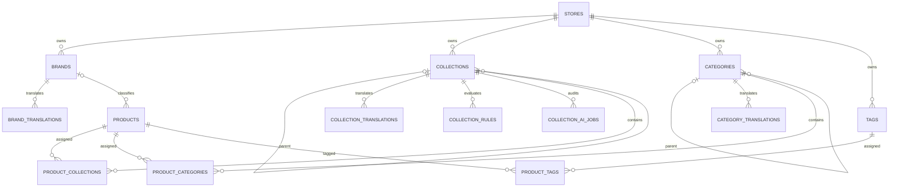
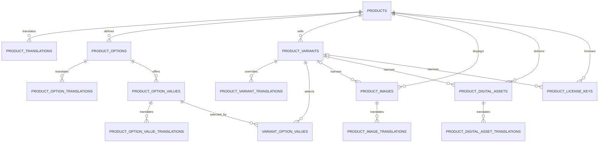
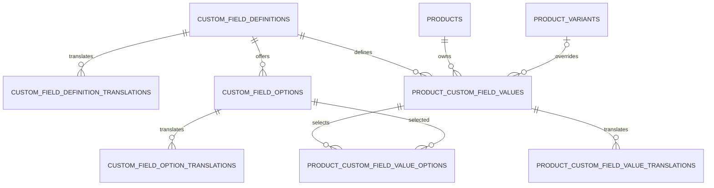

# Catalog schema reference

This document is the complete persistence contract for the Store-local Catalog
module. The source of truth is the eleven migrations under
`Modules/Catalog/database/migrations`; this reference explains their columns,
relationships, constraints, indexes, deletion behavior, and intended use.

The Brand slice includes Store-scoped models and REST CRUD services. Category
and Product slices include Store-scoped models, transactional GraphQL
queries/mutations, locale-aware manual translations, and durable automatic
translation handlers. Options, variants, product files/fulfillment, custom
fields, search projections, and administration screens remain persistence-only
or follow-up work. See the [API manual](api-manual.md) for the executable
request cycle and examples.

## 1. Migration order

| Order | Migration | Responsibility |
| ---: | --- | --- |
| 1 | `2026_08_05_000100_create_catalog_taxonomy_tables.php` | Brands, collections, collection automation, categories, tags, and custom-field definitions/options |
| 2 | `2026_08_05_000200_create_catalog_product_tables.php` | Products, translations, taxonomy/collection/tag assignments, and product options/values |
| 3 | `2026_08_05_000300_create_catalog_variant_fulfillment_tables.php` | Variants, variant selections, images, digital assets, and software license keys |
| 4 | `2026_08_05_000400_create_catalog_custom_field_value_tables.php` | Product/variant custom-field values, translated values, and multi-select assignments |
| 5 | `2026_08_07_000400_add_website_url_to_brands_table.php` | Optional official Brand website URL |
| 6 | `2026_08_07_000500_add_origin_to_brands_table.php` | Optional Brand country, region, or origin label |
| 7 | `2026_08_08_000100_add_page_title_and_search_keywords_to_category_translations_table.php` | Optional localized category page title and search keywords |
| 8 | `2026_08_08_000200_add_category_template_to_category_translations_table.php` | Optional localized category template name |
| 9 | `2026_08_08_000300_add_banner_url_to_category_translations_table.php` | Optional localized category banner image locator |
| 10 | `2026_08_09_000100_add_lock_it_to_catalog_translation_tables.php` | Non-null overwrite lock for every Catalog translation table |
| 11 | `2026_08_17_000100_add_image_url_to_category_translations_table.php` | Optional localized category image locator before the banner field in application/API contracts |

Rollback runs in the reverse order. Store deletion cascades all Catalog rows.

## 2. Shared conventions

### Addressable entity columns

Every addressable entity table listed below contains these columns in addition
to its table-specific columns:

| Column | PostgreSQL type | Null/default | Contract |
| --- | --- | --- | --- |
| `id` | `bigint` identity | Required, generated | Internal primary key; never exposed publicly |
| `public_id` | `char(26)` | Required, no database default | Globally unique ULID generated by the application |
| `store_id` | `bigint` | Required | Internal `stores.id`; deleting the Store cascades the row |
| `created_at` | `timestamptz` | Nullable | Laravel creation audit time |
| `updated_at` | `timestamptz` | Nullable | Laravel update audit time |

Each entity also has a unique `(id, store_id)` key. Dependent tables reference
that pair, or a stronger `(id, product_id, store_id)`/
`(id, definition_id, store_id)` key, so a valid foreign key cannot be combined
with the wrong Store.

Addressable entity tables are:

- `brands`
- `collections`
- `collection_rules`
- `collection_ai_jobs`
- `categories`
- `tags`
- `custom_field_definitions`
- `custom_field_options`
- `products`
- `product_options`
- `product_option_values`
- `product_variants`
- `product_images`
- `product_digital_assets`
- `product_license_keys`
- `product_custom_field_values`

### Translation-table columns

Translation rows are value records, not independently addressable resources.
Every translation table contains:

| Column | PostgreSQL type | Null/default | Contract |
| --- | --- | --- | --- |
| `store_id` | `bigint` | Required | Cascading Store foreign key and part of the composite parent constraint |
| Parent key | `bigint` | Required | Identifies the translated parent entity |
| `locale` | `varchar(35)` | Required | BCP 47-style locale such as `en`, `ur`, or `en-GB` |
| `lock_it` | `boolean` | Default `false` | Prevents automated translation writers from overwriting merchant-authored content |
| `created_at` | `timestamptz` | Nullable | Laravel creation audit time |
| `updated_at` | `timestamptz` | Nullable | Laravel update audit time |

The primary key is always `(parent_key, locale)`: one translation per entity
and locale. Deleting the parent or Store cascades translations. The schema does
not implement locale fallback; future reads must request the selected locale
and explicitly fall back to the Store default. Manual editors may set or clear
`lock_it`; automated writes must use `AutomatedTranslationWriter`, which skips
locked rows and never changes the flag.

### Money

Variant money uses integer minor units instead of decimal major units. For
example, USD `1999` means `$19.99`; a zero-decimal currency interprets the same
integer according to its Settings metadata. `currency_code` is required and is
database-checked against `^[A-Z]{3}$`.

### Store isolation

`store_id` is intentionally repeated on entities, translations, and
relationship tables. This is not cosmetic denormalization: composite foreign
keys make cross-Store brands, translations, product assignments, variants,
option values, media, assets, license keys, and custom-field values invalid at
the PostgreSQL boundary.

## 3. Relationship overview

### Merchandising and taxonomy



### Products, variants, media, and fulfillment



### Custom fields



## 4. Brands

### `brands`

Language-neutral brand identity for one Store. It includes the shared entity
columns plus:

| Column | Type | Null/default | Meaning |
| --- | --- | --- | --- |
| `logo_url` | `varchar(500)` | Nullable | Legacy external Brand logo locator |
| `website_url` | `varchar(2048)` | Nullable | Official brand website URL |
| `origin` | `varchar(120)` | Nullable | Brand country, region, or free-form origin label |
| `is_active` | `boolean` | Default `true` | Whether the brand is selectable/visible |
| `sort_order` | `integer` | Default `0` | Merchant-controlled brand ordering |

Query index: `(store_id, is_active, sort_order)`.

Store Brand REST operations use `/api/v1/store/brands`. Requests require
Store scope, `X-Store-ID`, and active membership. Any active member may page or
view Brands; create, update, and delete additionally require `manage products`.
Create requires at least one translation in an active Store locale. The service
uses the submitted default-locale translation, or the first submitted
translation, as the source for every other active Store language. The source
and a durable request are committed before `TranslateContentJob` calls the
provider on the dedicated queue. Updates with `translations` queue every
unlocked target; metadata-only edits queue only missing targets. Existing rows
with `lock_it = true` are preserved;
an explicitly submitted `lock_it = false` unlocks that locale before the
next refresh. The worker supersedes stale source/target snapshots and applies
results in a short transaction, so provider latency or failure never rolls
back the Brand source write. Public ULIDs identify Brands, localized slugs stay
unique within each Store/locale, and `website_url` accepts HTTP(S) only.

`image` (maximum 5 MiB) and `banner` (maximum 10 MiB) accept JPEG, PNG, WebP,
or AVIF multipart uploads. They are single-file Media Library collections
written through the shared image service, so a later upload replaces the
former asset and an explicit null clears it. Brand list/detail responses expose
the media public ID, configured storage URL, file name, MIME type, and size.
Deleting a Brand removes both media records and their physical objects along
with the database-cascaded translations. `logo_url` remains a compatibility
field for older clients; new uploads use the managed `image` collection.

### `brand_translations`

| Column | Type | Null/default | Meaning |
| --- | --- | --- | --- |
| `store_id` | `bigint` | Required | Store boundary |
| `brand_id` | `bigint` | Required | Parent brand |
| `locale` | `varchar(35)` | Required | Translation locale |
| `name` | `varchar(255)` | Required | Localized display name |
| `slug` | `varchar(255)` | Required | Localized URL segment |
| `description` | `text` | Nullable | Localized brand description |
| `seo_title` | `varchar(255)` | Nullable | Localized search title |
| `seo_description` | `text` | Nullable | Localized search description |
| `lock_it` | `boolean` | Default `false` | Prevent automatic Brand refreshes from overwriting the locale |
| `created_at`, `updated_at` | `timestamptz` | Nullable | Audit timestamps |

Primary key: `(brand_id, locale)`. Slug uniqueness:
`(store_id, locale, slug)`. Deleting the brand cascades its translations.

## 5. Collections and automation

Collections are merchandising groups. Unlike categories, they may be populated
manually, from structured rules, or from AI-generated rules.

### `collections`

Includes the shared entity columns plus:

| Column | Type | Null/default | Meaning |
| --- | --- | --- | --- |
| `parent_id` | `bigint` | Nullable | Optional parent collection in the same Store |
| `image_url` | `varchar(500)` | Nullable | Collection image locator |
| `is_active` | `boolean` | Default `true` | Storefront/admin availability |
| `sort_order` | `integer` | Default `0` | Order among siblings |
| `collection_type` | `varchar(20)` | Default `manual` | `manual`, `rule_based`, or `ai_generated` |
| `rules_match_type` | `varchar(10)` | Default `all` | `all` (AND) or `any` (OR) |
| `ai_prompt` | `text` | Nullable | Latest natural-language instruction |
| `ai_model` | `varchar(100)` | Nullable | Model identifier used for the latest run |
| `ai_status` | `varchar(20)` | Nullable | `pending`, `processing`, `completed`, or `failed` |
| `ai_last_run_at` | `timestamptz` | Nullable | Latest AI/rule refresh time |
| `ai_error_message` | `text` | Nullable | Latest failure detail intended for operators |

Deleting a parent sets only `parent_id` to null; it does not delete descendants.
Indexes cover `(store_id, collection_type)` and
`(store_id, parent_id, sort_order)`.

### `collection_translations`

| Column | Type | Null/default | Meaning |
| --- | --- | --- | --- |
| `store_id` | `bigint` | Required | Store boundary |
| `collection_id` | `bigint` | Required | Parent collection |
| `locale` | `varchar(35)` | Required | Translation locale |
| `title` | `varchar(255)` | Required | Localized collection title |
| `slug` | `varchar(255)` | Required | Localized URL segment |
| `description` | `text` | Nullable | Localized long description |
| `seo_title` | `varchar(255)` | Nullable | Localized search title |
| `seo_description` | `text` | Nullable | Localized search description |
| `created_at`, `updated_at` | `timestamptz` | Nullable | Audit timestamps |

Primary key: `(collection_id, locale)`. Slug uniqueness:
`(store_id, locale, slug)`.

### `collection_rules`

Addressable ordered conditions belonging to one collection. It includes the
shared entity columns plus:

| Column | Type | Null/default | Meaning |
| --- | --- | --- | --- |
| `collection_id` | `bigint` | Required | Collection in the same Store |
| `field` | `varchar(50)` | Required | Target field such as `product_type`, `tag`, `vendor`, `price`, or `title` |
| `operator` | `varchar(20)` | Required | Operation such as `equals`, `contains`, `greater_than`, or `less_than` |
| `value` | `varchar(255)` | Required | Serialized comparison operand |
| `position` | `integer` | Default `0` | Deterministic condition order |

Index: `(store_id, collection_id, position)`. The database does not enumerate
allowed fields/operators; the future rule service owns that whitelist and
type-aware value parsing.

### `collection_ai_jobs`

Append-style AI execution/audit record. It includes the shared entity columns
plus:

| Column | Type | Null/default | Meaning |
| --- | --- | --- | --- |
| `collection_id` | `bigint` | Required | Target collection |
| `prompt` | `text` | Required | Prompt used for this run |
| `model` | `varchar(100)` | Required | Model identifier used for this run |
| `status` | `varchar(20)` | Default `pending` | `pending`, `processing`, `completed`, or `failed` |
| `result_rules` | `jsonb` | Nullable | Raw structured rules returned before normalized writes |
| `matched_count` | `integer` | Nullable | Product count found by the completed run |
| `error_message` | `text` | Nullable | Failure detail |
| `tokens_used` | `integer` | Nullable | Usage accounting value |
| `completed_at` | `timestamptz` | Nullable | Terminal completion/failure time |

Index: `(store_id, collection_id, created_at)`. The row does not itself update
`collection_rules` or `product_collections`; a future transactional job/service
must do that and preserve pinned assignments.

### `product_collections`

| Column | Type | Null/default | Meaning |
| --- | --- | --- | --- |
| `store_id` | `bigint` | Required | Shared Store boundary |
| `collection_id` | `bigint` | Required | Assigned collection |
| `product_id` | `bigint` | Required | Assigned product |
| `sort_order` | `integer` | Default `0` | Product order inside the collection |
| `added_by` | `varchar(10)` | Default `manual` | `manual`, `rule`, or `ai` |
| `is_pinned` | `boolean` | Default `false` | Protects a manual include/exclude decision during regeneration |
| `created_at`, `updated_at` | `timestamptz` | Nullable | Assignment audit timestamps |

Primary key: `(collection_id, product_id)`. Both parents must belong to
`store_id`. Indexes cover `(store_id, product_id)` and
`(store_id, collection_id, sort_order)`.

Regeneration semantics are an application responsibility: automated refreshes
should modify unpinned automated rows and preserve pinned merchant decisions.

## 6. Categories and tags

### `categories`

Strict merchant-curated navigation taxonomy. It includes the shared entity
columns plus:

| Column | Type | Null/default | Meaning |
| --- | --- | --- | --- |
| `parent_id` | `bigint` | Nullable | Parent category in the same Store |
| `image_url` | `varchar(500)` | Nullable | Category image locator |
| `is_active` | `boolean` | Default `true` | Whether the category is active |
| `sort_order` | `integer` | Default `0` | Order among sibling categories |

Deleting a parent sets only `parent_id` to null. Indexes cover
`(store_id, parent_id, sort_order)` and `(store_id, is_active)`.

### `category_translations`

| Column | Type | Null/default | Meaning |
| --- | --- | --- | --- |
| `store_id` | `bigint` | Required | Store boundary |
| `category_id` | `bigint` | Required | Parent category |
| `locale` | `varchar(35)` | Required | Translation locale |
| `title` | `varchar(255)` | Required | Localized category title |
| `slug` | `varchar(255)` | Required | Localized URL segment |
| `description` | `text` | Nullable | Localized description |
| `image_url` | `varchar(500)` | Nullable | Localized category image locator |
| `banner_url` | `varchar(500)` | Nullable | Localized category banner image locator |
| `seo_title` | `varchar(255)` | Nullable | Localized search title |
| `seo_description` | `text` | Nullable | Localized search description |
| `page_title` | `varchar(255)` | Nullable | Localized browser/page heading title |
| `search_keywords` | `text` | Nullable | Localized search keywords or phrases |
| `category_template` | `varchar(120)` | Nullable | Template name used to render this localized category |
| `created_at`, `updated_at` | `timestamptz` | Nullable | Audit timestamps |

Primary key: `(category_id, locale)`. Slug uniqueness:
`(store_id, locale, slug)`.

### `product_categories`

| Column | Type | Null/default | Meaning |
| --- | --- | --- | --- |
| `store_id` | `bigint` | Required | Shared Store boundary |
| `category_id` | `bigint` | Required | Assigned category |
| `product_id` | `bigint` | Required | Assigned product |
| `sort_order` | `integer` | Default `0` | Product order inside the category |
| `is_primary` | `boolean` | Default `false` | Breadcrumb/canonical category marker |
| `created_at`, `updated_at` | `timestamptz` | Nullable | Assignment audit timestamps |

Primary key: `(category_id, product_id)`. A partial unique index on
`(store_id, product_id) WHERE is_primary` permits at most one primary category
per product. Indexes support product lookup and ordered category listings.

### `tags`

Language-neutral Store-local tag identity. It includes the shared entity
columns plus:

| Column | Type | Null/default | Meaning |
| --- | --- | --- | --- |
| `name` | `varchar(100)` | Required | Store-local tag label |

Unique key: `(store_id, name)`. Tags do not currently have translations.

### `product_tags`

| Column | Type | Null/default | Meaning |
| --- | --- | --- | --- |
| `store_id` | `bigint` | Required | Shared Store boundary |
| `product_id` | `bigint` | Required | Tagged product |
| `tag_id` | `bigint` | Required | Assigned tag |
| `created_at`, `updated_at` | `timestamptz` | Nullable | Assignment audit timestamps |

Primary key: `(product_id, tag_id)`. Both parents must belong to `store_id`.
Index: `(store_id, tag_id)` for tag-to-product lookup.

## 7. Products

### `products`

Language-neutral product identity and lifecycle. It includes the shared entity
columns plus:

| Column | Type | Null/default | Meaning |
| --- | --- | --- | --- |
| `brand_id` | `bigint` | Nullable | Brand in the same Store; deleting it sets this field to null |
| `vendor` | `varchar(255)` | Nullable | Supplier/manufacturer label |
| `product_type` | `varchar(255)` | Nullable | Merchant-defined type such as `Shoes` or `E-book` |
| `fulfillment_type` | `varchar(20)` | Default `physical` | `physical`, `digital`, `software`, or `service` |
| `track_inventory` | `boolean` | Default `true` | Whether variant stock/policy controls sellability |
| `status` | `varchar(20)` | Default `draft` | `draft`, `active`, or `archived` |
| `has_variants` | `boolean` | Default `false` | Application-maintained variant-mode flag |
| `published_at` | `timestamptz` | Nullable | Publication time |

Indexes cover `(store_id, status)`, `(store_id, fulfillment_type)`, and
`(store_id, brand_id)`. The database does not automatically synchronize
`status` with `published_at`, `has_variants` with child-row count, or
`track_inventory` with variant quantities.

### `product_translations`

| Column | Type | Null/default | Meaning |
| --- | --- | --- | --- |
| `store_id` | `bigint` | Required | Store boundary |
| `product_id` | `bigint` | Required | Parent product |
| `locale` | `varchar(35)` | Required | Translation locale |
| `title` | `varchar(255)` | Required | Localized product title |
| `slug` | `varchar(255)` | Required | Localized URL segment |
| `description` | `text` | Nullable | Localized product description |
| `seo_title` | `varchar(255)` | Nullable | Localized search title |
| `seo_description` | `text` | Nullable | Localized search description |
| `created_at`, `updated_at` | `timestamptz` | Nullable | Audit timestamps |

Primary key: `(product_id, locale)`. Slug uniqueness:
`(store_id, locale, slug)`.

## 8. Product options and values

Options describe axes such as Size or Color. Values describe choices such as
Large or Blue. A value repeats `product_id` so PostgreSQL can prove that a
variant only selects values from its own product.

### `product_options`

Includes the shared entity columns plus:

| Column | Type | Null/default | Meaning |
| --- | --- | --- | --- |
| `product_id` | `bigint` | Required | Owning product in the same Store |
| `position` | `integer` | Default `0` | Option display/label composition order |

Additional unique key: `(id, product_id, store_id)`. Index:
`(store_id, product_id, position)`.

### `product_option_translations`

| Column | Type | Null/default | Meaning |
| --- | --- | --- | --- |
| `store_id` | `bigint` | Required | Store boundary |
| `option_id` | `bigint` | Required | Parent product option |
| `locale` | `varchar(35)` | Required | Translation locale |
| `name` | `varchar(100)` | Required | Localized label such as `Size` |
| `created_at`, `updated_at` | `timestamptz` | Nullable | Audit timestamps |

Primary key: `(option_id, locale)`.

### `product_option_values`

Includes the shared entity columns plus:

| Column | Type | Null/default | Meaning |
| --- | --- | --- | --- |
| `product_id` | `bigint` | Required | Owning product, matching the option |
| `option_id` | `bigint` | Required | Owning option |
| `position` | `integer` | Default `0` | Value order inside the option |

Additional unique key: `(id, product_id, store_id)`. The composite foreign key
`(option_id, product_id, store_id)` prevents cross-product values. Index:
`(store_id, option_id, position)`.

### `product_option_value_translations`

| Column | Type | Null/default | Meaning |
| --- | --- | --- | --- |
| `store_id` | `bigint` | Required | Store boundary |
| `option_value_id` | `bigint` | Required | Parent option value |
| `locale` | `varchar(35)` | Required | Translation locale |
| `value` | `varchar(100)` | Required | Localized value such as `Large` |
| `created_at`, `updated_at` | `timestamptz` | Nullable | Audit timestamps |

Primary key: `(option_value_id, locale)`.

## 9. Variants and option selections

### `product_variants`

Sellable SKU/inventory/price/package row. It includes the shared entity columns
plus:

| Column | Type | Null/default | Meaning |
| --- | --- | --- | --- |
| `product_id` | `bigint` | Required | Owning product |
| `sku` | `varchar(100)` | Nullable | Store-local stock-keeping unit |
| `barcode` | `varchar(100)` | Nullable | UPC/EAN/other barcode text |
| `price_amount_minor` | `bigint` | Required | Current selling price in minor units |
| `compare_at_price_amount_minor` | `bigint` | Nullable | Previous/reference comparison price |
| `msrp_amount_minor` | `bigint` | Nullable | Manufacturer suggested retail price |
| `cost_per_item_amount_minor` | `bigint` | Nullable | Internal per-item cost |
| `currency_code` | `char(3)` | Required | Uppercase three-letter currency code |
| `inventory_qty` | `integer` | Default `0` | Current stock snapshot; may represent backorder state |
| `inventory_policy` | `varchar(20)` | Default `deny` | `deny` or `continue` when quantity is exhausted |
| `weight_grams` | `integer` | Nullable | Shipping weight in grams |
| `height` | `numeric(12,4)` | Nullable | Package height |
| `width` | `numeric(12,4)` | Nullable | Package width |
| `depth` | `numeric(12,4)` | Nullable | Package depth |
| `dimension_unit` | `varchar(10)` | Default `cm` | Dimension unit such as `cm`, `in`, or `mm` |
| `requires_shipping` | `boolean` | Default `true` | Whether physical delivery is required |
| `taxable` | `boolean` | Default `true` | Whether tax calculation should consider the variant |
| `call_for_price` | `boolean` | Default `false` | Whether storefronts should hide the stored price |
| `image_id` | `bigint` | Nullable | Preferred product image for this same product/Store |
| `position` | `integer` | Default `0` | Variant display order |

Additional unique key: `(id, product_id, store_id)`. A partial unique index on
`(store_id, sku) WHERE sku IS NOT NULL` enforces Store-local SKU uniqueness.
All four money fields are checked as non-negative. The database still requires
`price_amount_minor` when `call_for_price = true` so reporting/order snapshots
retain a numeric value.

Index: `(store_id, product_id, position)`. Deleting the preferred image sets
only `image_id` to null.

### `product_variant_translations`

Optional localized title override. Normally a variant label should be derived
from its selected translated option values.

| Column | Type | Null/default | Meaning |
| --- | --- | --- | --- |
| `store_id` | `bigint` | Required | Store boundary |
| `variant_id` | `bigint` | Required | Parent variant |
| `locale` | `varchar(35)` | Required | Translation locale |
| `title` | `varchar(255)` | Nullable | Manual localized title override |
| `created_at`, `updated_at` | `timestamptz` | Nullable | Audit timestamps |

Primary key: `(variant_id, locale)`.

### `variant_option_values`

| Column | Type | Null/default | Meaning |
| --- | --- | --- | --- |
| `store_id` | `bigint` | Required | Shared Store boundary |
| `product_id` | `bigint` | Required | Shared product boundary |
| `variant_id` | `bigint` | Required | Variant selecting the value |
| `option_value_id` | `bigint` | Required | Selected option value |
| `created_at` | `timestamptz` | Default current time | Assignment audit time |

Primary key: `(variant_id, option_value_id)`. Composite foreign keys require
the variant and option value to share both `product_id` and `store_id`. The
schema does not independently prevent selecting two values from the same
option; the future variant service must enforce one value per option.

## 10. Product images

### `product_images`

Includes the shared entity columns plus:

| Column | Type | Null/default | Meaning |
| --- | --- | --- | --- |
| `product_id` | `bigint` | Required | Owning product |
| `variant_id` | `bigint` | Nullable | Optional same-product variant association |
| `url` | `varchar(500)` | Required | Image locator |
| `width` | `integer` | Nullable | Pixel width |
| `height` | `integer` | Nullable | Pixel height |
| `position` | `integer` | Default `0` | Product-gallery order |

Additional unique key: `(id, product_id, store_id)`. Indexes cover
`(store_id, product_id, position)` and `(store_id, variant_id)`. Deleting an
associated variant sets only `variant_id` to null. Product deletion cascades.

The circular variant/image link is intentional: an image may target a variant,
and a variant may nominate one of the product's images as preferred. Composite
keys keep both directions inside the same product and Store.

### `product_image_translations`

| Column | Type | Null/default | Meaning |
| --- | --- | --- | --- |
| `store_id` | `bigint` | Required | Store boundary |
| `image_id` | `bigint` | Required | Parent image |
| `locale` | `varchar(35)` | Required | Translation locale |
| `alt_text` | `varchar(255)` | Nullable | Localized accessibility/SEO text |
| `created_at`, `updated_at` | `timestamptz` | Nullable | Audit timestamps |

Primary key: `(image_id, locale)`.

## 11. Digital assets

### `product_digital_assets`

Downloadable file metadata for digital/software products. It includes the
shared entity columns plus:

| Column | Type | Null/default | Meaning |
| --- | --- | --- | --- |
| `product_id` | `bigint` | Required | Owning product |
| `variant_id` | `bigint` | Nullable | Optional same-product edition/variant |
| `file_url` | `varchar(500)` | Required | Protected storage locator, not a public API contract |
| `file_name` | `varchar(255)` | Required | Buyer-facing/download file name |
| `file_size_bytes` | `bigint` | Nullable | File size metadata |
| `file_type` | `varchar(50)` | Nullable | Type/extension label such as `pdf` or `zip` |
| `download_limit` | `integer` | Nullable | Maximum downloads per purchase; null means unlimited |
| `link_expires_after_days` | `integer` | Nullable | Link lifetime; null means no schema-level expiry |
| `position` | `integer` | Default `0` | Delivery/display order |

Indexes cover `(store_id, product_id, position)` and `(store_id, variant_id)`.
Deleting a variant sets only `variant_id` to null. Product deletion cascades.

The schema stores metadata only. A Files service must validate objects and
issue authorized temporary access; clients must never receive an unrestricted
private locator directly.

### `product_digital_asset_translations`

| Column | Type | Null/default | Meaning |
| --- | --- | --- | --- |
| `store_id` | `bigint` | Required | Store boundary |
| `digital_asset_id` | `bigint` | Required | Parent digital asset |
| `locale` | `varchar(35)` | Required | Translation locale |
| `display_name` | `varchar(255)` | Nullable | Localized download label |
| `description` | `text` | Nullable | Localized buyer instructions/description |
| `created_at`, `updated_at` | `timestamptz` | Nullable | Audit timestamps |

Primary key: `(digital_asset_id, locale)`.

## 12. Software license keys

### `product_license_keys`

One Store-local sellable/assignable software-license unit. It includes the
shared entity columns plus:

| Column | Type | Null/default | Meaning |
| --- | --- | --- | --- |
| `product_id` | `bigint` | Required | Owning software product |
| `variant_id` | `bigint` | Nullable | Optional same-product edition/variant |
| `key_code` | `varchar(255)` | Required | Sensitive license material; application must encrypt/protect it |
| `status` | `varchar(20)` | Default `available` | `available`, `assigned`, `revoked`, or `expired` |
| `max_activations` | `integer` | Default `1` | Positive device/seat activation limit |
| `assigned_to_order_id` | `bigint` | Nullable | Opaque future Orders integration key; currently not a foreign key |
| `assigned_at` | `timestamptz` | Nullable | Assignment time |
| `expires_at` | `timestamptz` | Nullable | License expiry time |

Unique key: `(store_id, key_code)`. Indexes cover assigned order lookup,
`(store_id, product_id, status)`, and `(store_id, variant_id, status)`.
Deleting a variant sets only `variant_id` to null; deleting the product or Store
cascades the license row.

The schema does not enforce status/timestamp combinations or product
`fulfillment_type = software`; the future license service must transition rows
transactionally, encrypt material before persistence, prevent double
assignment, and integrate with Orders through a stable public contract.

## 13. Custom-field definitions and choices

Custom fields model product specifications without adding product columns per
attribute. Examples include RAM, warranty duration, material, and ports.

### `custom_field_definitions`

Includes the shared entity columns plus:

| Column | Type | Null/default | Meaning |
| --- | --- | --- | --- |
| `product_type` | `varchar(255)` | Nullable | Optional applicability filter; null means all product types |
| `field_key` | `varchar(100)` | Required | Store-local machine key such as `ram` |
| `field_type` | `varchar(20)` | Required | `text`, `number`, `boolean`, `select`, `multi_select`, `date`, or `url` |
| `is_required` | `boolean` | Default `false` | Application validation requirement |
| `is_filterable` | `boolean` | Default `false` | Whether future storefront search/filtering may expose it |
| `position` | `integer` | Default `0` | Admin/storefront field order |

Unique key: `(store_id, field_key)`. Index:
`(store_id, product_type)`. The database validates `field_type`, but does not
make `is_required` enforce a value on every matching product.

### `custom_field_definition_translations`

| Column | Type | Null/default | Meaning |
| --- | --- | --- | --- |
| `store_id` | `bigint` | Required | Store boundary |
| `definition_id` | `bigint` | Required | Parent field definition |
| `locale` | `varchar(35)` | Required | Translation locale |
| `label` | `varchar(255)` | Required | Localized field label |
| `help_text` | `text` | Nullable | Localized authoring/display guidance |
| `created_at`, `updated_at` | `timestamptz` | Nullable | Audit timestamps |

Primary key: `(definition_id, locale)`.

### `custom_field_options`

Preset choice for a `select` or `multi_select` definition. It includes the
shared entity columns plus:

| Column | Type | Null/default | Meaning |
| --- | --- | --- | --- |
| `definition_id` | `bigint` | Required | Owning definition in the same Store |
| `position` | `integer` | Default `0` | Choice order |

Additional unique key: `(id, definition_id, store_id)` supports typed value
foreign keys. Index: `(store_id, definition_id, position)`.

### `custom_field_option_translations`

| Column | Type | Null/default | Meaning |
| --- | --- | --- | --- |
| `store_id` | `bigint` | Required | Store boundary |
| `option_id` | `bigint` | Required | Parent custom-field option |
| `locale` | `varchar(35)` | Required | Translation locale |
| `label` | `varchar(255)` | Required | Localized choice label |
| `created_at`, `updated_at` | `timestamptz` | Nullable | Audit timestamps |

Primary key: `(option_id, locale)`.

## 14. Product and variant custom-field values

### `product_custom_field_values`

One value container for a definition at product level (`variant_id` null) or
variant level. It includes the shared entity columns plus:

| Column | Type | Null/default | Meaning |
| --- | --- | --- | --- |
| `product_id` | `bigint` | Required | Owning product |
| `variant_id` | `bigint` | Nullable | Optional same-product variant scope |
| `definition_id` | `bigint` | Required | Field definition in the same Store |
| `value_number` | `numeric(18,4)` | Nullable | `number` value |
| `value_boolean` | `boolean` | Nullable | `boolean` value |
| `value_date` | `date` | Nullable | `date` value |
| `value_option_id` | `bigint` | Nullable | Selected option for `select` |

Additional unique key: `(id, definition_id, store_id)`. An expression unique
index on
`(store_id, definition_id, product_id, COALESCE(variant_id, 0))` permits one
container per definition/product/scope. PostgreSQL `num_nonnulls(...) <= 1`
prevents more than one scalar storage column from being populated.

Composite foreign keys ensure product, optional variant, definition, and
selected option share the correct Store/product/definition. Deleting a variant,
product, definition, or Store cascades the value; deleting a selected option is
restricted while a scalar select value references it.

The database allows all scalar fields to be null because text/URL data lives in
translations and multi-select data lives in the junction table. The future
write service must validate the selected storage mechanism against
`field_type`, requiredness, URL/number/date syntax, and product-type
applicability.

### `product_custom_field_value_translations`

Translated free-text storage for `text` and `url` fields (and any localized
display value explicitly supported later).

| Column | Type | Null/default | Meaning |
| --- | --- | --- | --- |
| `store_id` | `bigint` | Required | Store boundary |
| `value_id` | `bigint` | Required | Parent value container |
| `locale` | `varchar(35)` | Required | Translation locale |
| `value_text` | `text` | Required | Localized text/URL value |
| `created_at`, `updated_at` | `timestamptz` | Nullable | Audit timestamps |

Primary key: `(value_id, locale)`.

### `product_custom_field_value_options`

Multi-select choices for one value container.

| Column | Type | Null/default | Meaning |
| --- | --- | --- | --- |
| `store_id` | `bigint` | Required | Shared Store boundary |
| `definition_id` | `bigint` | Required | Shared field-definition boundary |
| `value_id` | `bigint` | Required | Value container |
| `option_id` | `bigint` | Required | Selected option |
| `created_at` | `timestamptz` | Default current time | Assignment audit time |

Primary key: `(value_id, option_id)`. Composite foreign keys require both the
container and option to share `definition_id` and `store_id`.

## 15. Enumerated values and checks

| Table/column | Allowed value or check |
| --- | --- |
| `collections.collection_type` | `manual`, `rule_based`, `ai_generated` |
| `collections.rules_match_type` | `all`, `any` |
| `collections.ai_status` | Null, `pending`, `processing`, `completed`, `failed` |
| `collection_ai_jobs.status` | `pending`, `processing`, `completed`, `failed` |
| `products.fulfillment_type` | `physical`, `digital`, `software`, `service` |
| `products.status` | `draft`, `active`, `archived` |
| `product_collections.added_by` | `manual`, `rule`, `ai` |
| `product_variants.inventory_policy` | `deny`, `continue` |
| `product_variants.currency_code` | Exactly three uppercase ASCII letters |
| Variant price columns | Required price and every populated comparison/MSRP/cost value must be non-negative |
| `product_license_keys.status` | `available`, `assigned`, `revoked`, `expired` |
| `product_license_keys.max_activations` | Greater than zero |
| `custom_field_definitions.field_type` | `text`, `number`, `boolean`, `select`, `multi_select`, `date`, `url` |
| `product_custom_field_values` scalar storage | At most one of number, boolean, date, or select option is populated |

## 16. Uniqueness and primary-key reference

| Scope | Guarantee |
| --- | --- |
| Every entity | Unique `public_id` and unique `(id, store_id)` |
| Brand/collection/category/product translation | Unique `(store_id, locale, slug)` |
| Every translation | Primary `(parent_id, locale)` using its specific parent-key name |
| `tags` | Unique `(store_id, name)` |
| `product_tags` | Primary `(product_id, tag_id)` |
| `product_collections` | Primary `(collection_id, product_id)` |
| `product_categories` | Primary `(category_id, product_id)` and at most one primary row per Store/product |
| `product_options` | Unique `(id, product_id, store_id)` |
| `product_option_values` | Unique `(id, product_id, store_id)` |
| `product_variants` | Unique `(id, product_id, store_id)` and unique non-null `(store_id, sku)` |
| `variant_option_values` | Primary `(variant_id, option_value_id)` |
| `product_images` | Unique `(id, product_id, store_id)` |
| `product_license_keys` | Unique `(store_id, key_code)` |
| `custom_field_definitions` | Unique `(store_id, field_key)` |
| `custom_field_options` | Unique `(id, definition_id, store_id)` |
| `product_custom_field_values` | Unique `(id, definition_id, store_id)` and one definition/product/variant scope |
| `product_custom_field_value_options` | Primary `(value_id, option_id)` |

## 17. Query-index reference

| Table | Query indexes beyond primary/unique keys |
| --- | --- |
| `brands` | `(store_id, is_active, sort_order)` |
| `collections` | `(store_id, collection_type)`; `(store_id, parent_id, sort_order)` |
| `collection_rules` | `(store_id, collection_id, position)` |
| `collection_ai_jobs` | `(store_id, collection_id, created_at)` |
| `categories` | `(store_id, parent_id, sort_order)`; `(store_id, is_active)` |
| `custom_field_definitions` | `(store_id, product_type)` |
| `custom_field_options` | `(store_id, definition_id, position)` |
| `products` | `(store_id, status)`; `(store_id, fulfillment_type)`; `(store_id, brand_id)` |
| `product_tags` | `(store_id, tag_id)` |
| `product_collections` | `(store_id, product_id)`; `(store_id, collection_id, sort_order)` |
| `product_categories` | `(store_id, product_id)`; `(store_id, category_id, sort_order)` |
| `product_options` | `(store_id, product_id, position)` |
| `product_option_values` | `(store_id, option_id, position)` |
| `product_variants` | `(store_id, product_id, position)` |
| `variant_option_values` | `(store_id, product_id)` |
| `product_images` | `(store_id, product_id, position)`; `(store_id, variant_id)` |
| `product_digital_assets` | `(store_id, product_id, position)`; `(store_id, variant_id)` |
| `product_license_keys` | `assigned_to_order_id`; `(store_id, product_id, status)`; `(store_id, variant_id, status)` |
| `product_custom_field_values` | `(store_id, product_id)`; `(store_id, variant_id)`; `(store_id, definition_id)` |
| `product_custom_field_value_options` | `(store_id, definition_id)` |

## 18. Deletion behavior

| Deleted parent | Result |
| --- | --- |
| Store | All Catalog entities, translations, and relationships cascade |
| Brand | Product `brand_id` values become null; brand translations cascade |
| Parent collection/category | Child `parent_id` becomes null; children remain |
| Collection | Translations, rules, AI jobs, and product assignments cascade |
| Category/tag | Translations or product assignments cascade |
| Product | Translations, assignments, options, variants, media, assets, keys, and custom values cascade |
| Product option | Option translations and option values cascade |
| Product option value | Translations and variant selections cascade |
| Variant | Translations/selections/custom values cascade; image/asset/license `variant_id` becomes null |
| Product image | Image translations cascade; variant preferred `image_id` becomes null |
| Digital asset | Asset translations cascade |
| Custom-field definition | Definition translations, options, and product values cascade |
| Custom-field option | Option translations/multi-select assignments cascade; deletion is restricted while used as a scalar select value |
| Custom-field value | Value translations and multi-select assignments cascade |

## 19. Application-layer responsibilities

PostgreSQL protects identity, Store/product/definition consistency, important
uniqueness, enum membership, and selected numeric rules. `BrandService`
currently enforces the Brand-specific subset below; future Catalog services
must additionally enforce the remaining rules:

- authenticated Store context and `manage products` authorization;
- ULID-only public contracts and no bigint leakage;
- normalized, collision-safe localized slugs;
- locale fallback to the Store default;
- cycle prevention for category and collection parent trees;
- collection-rule field/operator whitelists and typed operand validation;
- safe AI job transitions, retry/idempotency, cost tracking, and pinned-row
  preservation during regeneration;
- product status/publication and `has_variants` synchronization;
- one option value per option in a variant and uniqueness of complete variant
  combinations;
- currency availability and money conversion/rounding rules from Settings;
- Inventory-module ownership of ledgers, reservations, and adjustments;
- image/file upload validation, private object ownership, malware scanning,
  signed delivery, download limits, and expiry enforcement;
- encrypted/protected license-key material and atomic one-order assignment;
- custom-field requiredness, product-type applicability, filter indexing, and
  field-type-to-storage validation;
- after-commit events for future Search, Inventory, Files, Analytics, and Orders
  consumers.

## 20. Differences from the supplied draft DDL

The implementation preserves the requested domain model while adapting it to
ShopNXE standards:

- prices use integer minor-unit columns and `currency_code`, not decimal major
  units;
- translation and relationship tables carry `store_id` for database-enforced
  tenant consistency;
- localized slugs are truly unique per Store and locale;
- BCP 47-style locale columns allow 35 characters instead of 10;
- addressable rows receive public ULIDs and timezone audit timestamps;
- product/option/variant, media, asset, license, and custom-field relationships
  use composite foreign keys to prevent cross-product or cross-definition data;
- circular image/variant and nullable hierarchy relationships use PostgreSQL
  column-specific `SET NULL` behavior;
- Orders remains deliberately unreferenced until it owns a stable integration
  contract.

See the shorter [Catalog module overview](modules/catalog.md),
[ADR 006](adr/006-catalog-persistence-model.md), and the directional contracts
under [module communication](module-communication/).

## 21. PostgreSQL query patterns

These examples use internal bigint parameters only after the application has
resolved public ULIDs and authenticated the Store context.

### Localized product with Store-default fallback

```sql
SELECT
    p.public_id,
    COALESCE(requested.title, fallback.title) AS title,
    COALESCE(requested.slug, fallback.slug) AS slug,
    COALESCE(requested.description, fallback.description) AS description
FROM products AS p
JOIN stores AS s
    ON s.id = p.store_id
LEFT JOIN product_translations AS requested
    ON requested.product_id = p.id
   AND requested.store_id = p.store_id
   AND requested.locale = :requested_locale
LEFT JOIN product_translations AS fallback
    ON fallback.product_id = p.id
   AND fallback.store_id = p.store_id
   AND fallback.locale = s.language_code
WHERE p.store_id = :store_id
  AND p.public_id = :product_public_id;
```

### Variant labels from translated option values

```sql
SELECT
    variant.public_id,
    variant.sku,
    variant.price_amount_minor,
    variant.currency_code,
    string_agg(value_translation.value, ' / ' ORDER BY product_option.position) AS label
FROM product_variants AS variant
JOIN variant_option_values AS selection
    ON selection.variant_id = variant.id
   AND selection.product_id = variant.product_id
   AND selection.store_id = variant.store_id
JOIN product_option_values AS option_value
    ON option_value.id = selection.option_value_id
   AND option_value.product_id = variant.product_id
   AND option_value.store_id = variant.store_id
JOIN product_options AS product_option
    ON product_option.id = option_value.option_id
   AND product_option.product_id = variant.product_id
   AND product_option.store_id = variant.store_id
JOIN product_option_value_translations AS value_translation
    ON value_translation.option_value_id = option_value.id
   AND value_translation.store_id = variant.store_id
   AND value_translation.locale = :locale
WHERE variant.store_id = :store_id
  AND variant.product_id = :product_id
GROUP BY variant.id
ORDER BY variant.position, variant.id;
```

### Category breadcrumb from root to leaf

```sql
WITH RECURSIVE breadcrumb AS (
    SELECT category.id, category.store_id, category.parent_id, 1 AS depth
    FROM categories AS category
    WHERE category.store_id = :store_id
      AND category.public_id = :category_public_id

    UNION ALL

    SELECT parent.id, parent.store_id, parent.parent_id, child.depth + 1
    FROM categories AS parent
    JOIN breadcrumb AS child
      ON child.parent_id = parent.id
     AND child.store_id = parent.store_id
)
SELECT breadcrumb.depth, category.public_id, translation.title, translation.slug
FROM breadcrumb
JOIN categories AS category
  ON category.id = breadcrumb.id
 AND category.store_id = breadcrumb.store_id
JOIN category_translations AS translation
  ON translation.category_id = category.id
 AND translation.store_id = category.store_id
 AND translation.locale = :locale
ORDER BY breadcrumb.depth DESC;
```

### Active products in a category subtree

```sql
WITH RECURSIVE subtree AS (
    SELECT category.id, category.store_id
    FROM categories AS category
    WHERE category.store_id = :store_id
      AND category.public_id = :category_public_id

    UNION ALL

    SELECT child.id, child.store_id
    FROM categories AS child
    JOIN subtree AS parent
      ON child.parent_id = parent.id
     AND child.store_id = parent.store_id
)
SELECT DISTINCT product.*
FROM products AS product
JOIN product_categories AS assignment
  ON assignment.product_id = product.id
 AND assignment.store_id = product.store_id
JOIN subtree
  ON subtree.id = assignment.category_id
 AND subtree.store_id = assignment.store_id
WHERE product.store_id = :store_id
  AND product.status = 'active';
```
