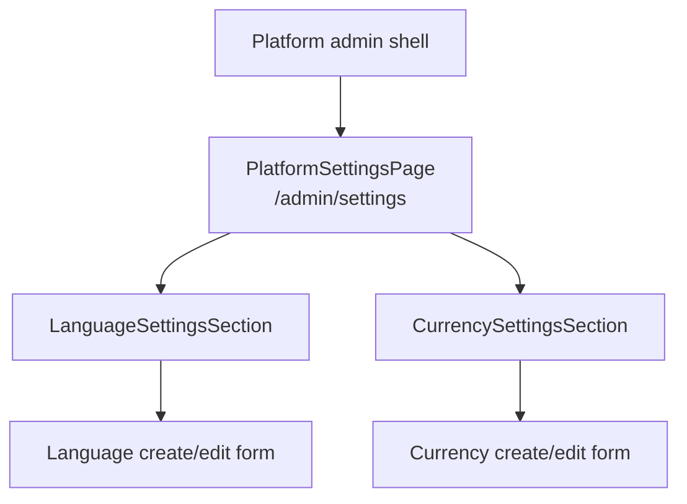

# Platform Settings admin component

The Platform Settings component is mounted at `/admin/settings`. It is the
extensible home for global SaaS configuration. The current sections are
Languages and Currencies; future Platform settings should add sections to this
shell rather than appearing under Store Management.

This repository is API-only. The guide defines the component contract for the
separate frontend.

## Boundary

The component:

- requires the `platform_settings` navigation entry and
  `manage platform settings`;
- uses `/api/v1/platform/settings/*`;
- never sends `X-Store-ID`;
- never calls `/api/v1/store/settings` or writes `store_languages`;
- treats public ULIDs as opaque identifiers.

Store Settings is a future, separate Store-admin component.

## Suggested composition

The section names are conceptual and may be adapted to the frontend's naming
conventions. Keep one Settings page/shell so future global sections can be
added without new top-level navigation entries.

## API mapping

| UI action | Method and route |
| --- | --- |
| Load languages | `GET /api/v1/platform/settings/languages` |
| Add language | `POST /api/v1/platform/settings/languages` |
| Edit language | `PATCH /api/v1/platform/settings/languages/{language}` |
| Load currencies | `GET /api/v1/platform/settings/currencies` |
| Add currency | `POST /api/v1/platform/settings/currencies` |
| Edit currency | `PATCH /api/v1/platform/settings/currencies/{currency}` |

New clients use these canonical routes. The shorter legacy aliases exist only
for backward compatibility.

## Language section

Display `lang_image` together with the name, native name, locale, direction, and
active state, retaining `lang_icon` as a fallback. The create form accepts
optional `lang_image` and `lang_icon` root-relative asset paths or HTTP(S) URLs
and previews the image; the generic bundled icon is used when either field is
omitted. The edit form can replace both references but must render locale as
read-only because the API prohibits changing it after creation.

Use an explicit active/inactive control. Deactivation changes platform
availability without rewriting historical Store selections. Inactive entries
cannot be selected by new Store create/settings requests.

## Currency section

Display name, code, symbol, symbol position, decimal places, USD-relative rate,
base status, active state, and the rate-update timestamp.

Currency code is read-only after creation. The USD row is visibly marked as the
base; its rate and active status cannot be changed. A null non-USD rate means
unconfigured, not zero. Inactive currencies cannot be selected by new Store
create/settings requests.

## Interaction states

Each section should handle:

- initial loading and retry;
- empty catalogs without hiding the add action;
- create/edit submitting state with duplicate-submit prevention;
- field-level `422` validation messages;
- `401` session expiry;
- `403` permission loss;
- `404` after editing a stale/deleted identifier;
- refetch or local replacement after a successful mutation.

Do not optimistically display a successful rate or active-state change before
the API confirms it.

## Localization

Use stable dictionary keys rather than the English API/navigation labels as
translation keys. Keep every supported admin-locale dictionary synchronized
when labels, fields, actions, statuses, or errors change. Arabic, Persian, and
Urdu layouts require RTL handling.

The Store-supported language catalog does not prove that an admin UI dictionary
exists. Follow the [admin localization contract](localization.md), including
missing-key checks and frontend locale registration.

## Acceptance criteria

- A Super Admin sees the Settings navigation entry and can load, add, and edit
  languages and currencies.
- Platform users without `manage platform settings` do not see the component
  navigation and cannot mutate catalogs.
- Store users cannot mount the component or access its API.
- Locale and currency code are immutable in edit forms.
- Every language row and selector renders `lang_image` (falling back to
  `lang_icon`) with the native name as
  accessible fallback text.
- USD base invariants are visible and enforced.
- No request from this component contains Store context.
- Languages and Currencies remain sections of one extensible Settings shell.
- Relevant frontend language dictionaries contain every Settings key with no
  missing-key fallback in supported admin locales.

See [Platform settings](../settings.md), [REST API](../rest-api.md), and the
[OpenAPI contract](../openapi.yaml).
