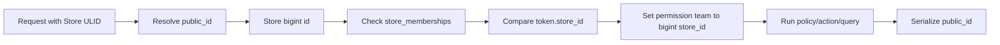

# ShopNXE application context

This is the canonical context for architecture and future implementation work. Read it before changing a module, migration, route, API contract, authorization rule, queue job, search document, or media path.

## Domain language

ShopNXE is a multi-store SaaS commerce platform. A **store** is the business/account boundary that some libraries call a tenant. Application code, database columns, routes, headers, events, documentation, and user-facing messages use **Store**. The word “tenant” is retained only when referring to a third-party class, interface, configuration key, or command that cannot be renamed.

A **user** is a global identity. Platform administrators, support staff, billing staff, store owners, store managers, sales staff, and inventory staff all use the same `users` table. Store access is represented by `store_memberships`; no separate admin or merchant user tables are allowed.

## Identifier contract

Domain entities have two identifiers:

| Purpose | Column | Type | Visibility |
| --- | --- | --- | --- |
| Database primary key | `id` | PostgreSQL `bigint` | Internal only |
| Public identifier | `public_id` | 26-character ULID | REST, GraphQL, URLs, events exposed outside the process |
| Relationships | `*_id` | PostgreSQL `bigint` | Internal only |

Laravel route binding uses `public_id`. Requests resolve a ULID once and then use the bigint key for joins, scopes, permission teams, token binding, cache/search filters, and internal events. API resources and GraphQL types must never expose an internal bigint key as `id`.

Entity tables such as `users`, `stores`, `store_memberships`, `roles`, `permissions`, `personal_access_tokens`, `media`, and future commerce records require both columns. Pure relationship tables managed through direct package inserts may use only an internal bigint `id`, because they are not addressable public resources. Protocol/infrastructure identifiers required by Laravel packages remain exceptions: notification IDs and Media Library UUIDs are UUIDs, failed-job UUIDs remain diagnostic identifiers, and cache/queue/monitoring tables follow their package contracts.

## Store context and request flow

Store-scoped operations receive `X-Store-ID: <store-ulid>`. `ResolveStore` validates the ULID and loads `stores.public_id`. `EnsureStoreMembership` verifies an active membership, prevents a store-bound bearer token from crossing stores, and sets Spatie Permission’s team to the internal `stores.id`. `ClearRequestContext` always removes store, permission-team, guard, locale, and log context after a request.

## Roles and permissions

Roles and permissions are data, not hard-coded user types. Both have a `scope` of `platform` or `store`, and the catalog is extendable.

Platform roles:

| Role | Initial permissions |
| --- | --- |
| Super Admin | manage stores, manage plans, manage subscriptions, impersonate store, manage marketplace |
| Support | manage stores, impersonate store |
| Billing | manage plans, manage subscriptions |

Store roles:

| Role | Initial permissions |
| --- | --- |
| Owner | access/manage store, members, roles, products, orders, customers, discounts |
| Manager | access/manage store, members, products, orders, customers, discounts |
| Sales | access store, manage orders, customers, discounts |
| Inventory | access store, manage products |

Platform roles are evaluated without an active store team. Store-role assignments carry an internal `store_id`; the active store can never grant a platform role. `Super Admin` is the only global Gate bypass. New roles or permissions are added through the authorization catalog, migrations/seeders, policies, tests, and documentation—not through boolean columns on `users`.

## Module boundaries

- Authentication owns global identities, credentials, sessions, MFA, tokens, email verification, password reset, and the role/permission catalog.
- Stores owns stores, memberships, store resolution, context lifecycle, provisioning, and store isolation helpers.
- Business modules own their records and actions. Store-owned records use bigint `store_id` and `StoreScoped`, then return ULIDs publicly.
- Cross-module calls use contracts, typed actions, immutable data objects, or after-commit domain events. A module must not update another module’s tables directly.

See [Authentication module](modules/authentication.md), [Stores module](modules/stores.md), and the directional communication contracts in [module communication](module-communication/).

## Change rule

Every meaningful change must update the affected module document and directional communication document. Architecture or execution-flow changes also update the [developer guide](developer-guide.md), and every meaningful change receives a [development log](development-log.md) entry. Finish with `composer docs:update`, `composer docs:check`, Pint, and PostgreSQL-backed tests.
