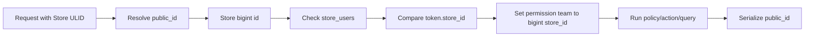

# ShopNXE application context

This is the canonical context for architecture and future implementation work. Read it before changing a module, migration, route, API contract, authorization rule, queue job, search document, or media path.

## Domain language

ShopNXE is a multi-store SaaS commerce platform. A **store** is the business/account boundary that some libraries call a tenant. Application code, database columns, routes, headers, events, documentation, and user-facing messages use **Store**. The word “tenant” is retained only when referring to a third-party class, interface, configuration key, or command that cannot be renamed.

A **user** is an authenticated identity stored in the shared `users` table, but every row has one exclusive `scope`: `platform` or `store`. Platform administrators/support/billing staff are Platform users. Store owners/managers/sales/inventory staff are Store users. A user cannot change scope while memberships, roles, or direct permissions exist.

A **customer** is a Store-owned buyer profile, not a merchant/admin `user`.
Customers may share an email across different Stores and do not receive Store
roles, merchant memberships, or merchant Sanctum tokens. Storefront customer
authentication remains a future Authentication contract; the Customers module
currently exposes merchant management, grouping, credit, and eligibility data.

## Access interfaces

The two account classes and interfaces are mutually exclusive:

| Interface | Administrative user | Scoped users | Context |
| --- | --- | --- | --- |
| `platform_admin` | `Super Admin` is the SaaS Owner | `Support` and `Billing` are platform staff | Platform scope; no Store header |
| `store_admin` | `Owner` and `Manager` administer the merchant | `Sales`, `Inventory`, and future Store roles are Store staff | One selected Store ULID |

After authentication, `GET /api/v1/auth/session` returns the current User plus both stable interface keys, with exactly one side available. `GET /api/v1/auth/interfaces` remains the profile-only variant. A Platform user receives only `platform_admin` roles/permissions/navigation and can never have Store membership, Store roles, or Store-bound tokens. `Plans & Pricing` is returned only with `manage plans`; `Settings` only with `manage platform settings`; `Admin Users` only with `manage platform users`; and `Merchants` only with `manage stores`. A Store user receives only `store_admin` Stores/roles/permissions and can never receive a Platform role or permission. Backend scope middleware, Store membership/context, permissions, and policies remain authoritative.

Platform staff creation and merchant provisioning are separate APIs. `/api/v1/platform/users` creates only Platform identities. `/api/v1/platform/merchants` atomically creates a Store identity, Store, active membership, and Store roles. `/api/v1/store/users` lets an authorized merchant create staff only inside the selected Store. “All roles” is always restricted to the identity's own scope. See [User and merchant management](user-merchant-management.md).

Platform Store catalog administration is exposed separately at
`/api/v1/platform/stores*`. It requires `manage stores`, never enters Store
context, and supports public-ULID detail/edit plus case-insensitive search,
exact filters, whitelisted sorting, and bounded pagination. Direct creation
produces an unassigned Store; administrators use `/platform/merchants` when an
owner identity, membership, and roles must be provisioned atomically.

## Administration component contract

The backend is API-only, but its navigation metadata defines stable component
entry points for the separate admin frontend. `/admin/settings` is the single
extensible Platform Settings shell. Languages and Currencies are sections of
that shell; they are not Store Management components. The shell uses only
`/api/v1/platform/settings/*`, never sends `X-Store-ID`, and requires
`manage platform settings`.

The `merchants` navigation entry may compose the searchable Platform Store
catalog and the owner-aware merchant workflow. Its Store catalog uses only
`/api/v1/platform/stores*`, never sends `X-Store-ID`, and requires
`manage stores`. See the
[Platform Stores component guide](components/platform-stores-admin.md).

The `themes` navigation entry mounts at `/admin/themes` only for a Platform
user with `manage marketplace`. Its catalog, publisher, category, immutable
version, submission, review, publication, and license calls use
`/api/v1/platform/theme*` routes without Store context. Merchant installations
are a separate Store interface under `/api/v1/store/theme*`, require
`X-Store-ID` plus `manage themes`, and never store merchant customization on
the global Theme listing.

Store Settings is a separate Store-admin component. It operates on one selected
Store through Store-scoped routes and must not create or edit Platform master
catalog rows. The global localized Fulfillment Types catalog belongs to Site
Admin and is exposed read-only through
`GET /api/v1/platform/settings/fulfillment-types`. See the
[admin component guides](components.md).

Supported Store languages and translated admin-interface locales are separate
capabilities. Catalog changes update `EnsureLanguageCatalog`, bundled
country-flag assets and `lang_icon`/`lang_image` references, direction data, and PostgreSQL
coverage; visible admin-label changes update every relevant frontend dictionary.
Storefront/admin selectors and localized-content tabs consume the render-ready
image URL from the language API instead of maintaining their own locale-to-flag
map. See the
[admin localization contract](components/localization.md).

## Local admin integration contract

The separate Next.js admin owns a same-origin `/laravel/*` browser proxy. It
forwards requests to a server-only Laravel upstream; under XAMPP the upstream
is `http://localhost/shopnxebk/public`. Browser code therefore never depends on
a second hostname or port for Sanctum cookies. Local Laravel sessions use an
empty `SESSION_DOMAIN` so cookies are host-only, while CORS and Sanctum keep
both `localhost:3000` and `127.0.0.1:3000` as explicit development origins.
Production still requires exact HTTPS origins and secure cookies.
Dashboard bootstrap uses one `/auth/session` call rather than parallel
`/auth/me` and `/auth/interfaces` calls, preventing timeout-driven partial
scope resolution on slower local PHP runtimes.

## Identifier contract

Domain entities have two identifiers:

| Purpose | Column | Type | Visibility |
| --- | --- | --- | --- |
| Database primary key | `id` | PostgreSQL `bigint` | Internal only |
| Public identifier | `public_id` | 26-character ULID | REST, GraphQL, URLs, events exposed outside the process |
| Relationships | `*_id` | PostgreSQL `bigint` | Internal only |

Laravel route binding uses `public_id`. Requests resolve a ULID once and then use the bigint key for joins, scopes, permission teams, token binding, cache/search filters, and internal events. API resources and GraphQL types must never expose an internal bigint key as `id`.

Entity tables such as `users`, `stores`, `store_users`, `roles`, `permissions`, `personal_access_tokens`, `media`, and future commerce records require both columns. Pure relationship tables managed through direct package inserts may use only an internal bigint `id`, because they are not addressable public resources. Protocol/infrastructure identifiers required by Laravel packages remain exceptions: notification IDs and Media Library UUIDs are UUIDs, failed-job UUIDs remain diagnostic identifiers, and cache/queue/monitoring tables follow their package contracts.

## Store profile contract

The `stores` table is the source of truth for merchant identity, contact details, branding references, classification, locale, lifecycle, and Store-level capability switches. `business_type` is nullable during onboarding and, when present, is one of `ecommerce`, `b2b`, `services`, `digital`, `restaurant`, or `marketplace`. `status` is one of `draft`, `trial`, `active`, `suspended`, `frozen`, or `closed`. The lifecycle migration maps historical `pending` rows to `draft` and `cancelled` rows to `closed`.

Store-owned configuration includes `store_domains`, one-to-one
`store_settings`, and Theme installations. Domains are globally unique and
permit only one primary domain per Store. Settings use `store_id` as both
bigint primary key and Store foreign key because the row is never independently
addressed. `store_themes` now belongs to the Themes module: each row references
a global/custom Theme, immutable version, and Store license, owns mutable
settings/template/CSS with an optimistic revision, and permits only one
non-deleted `published` copy per Store. Domain/SSL states and Theme
customization JSON remain extensible.

`store_users` is the Store-to-user relationship table. Each row has its own internal bigint `id`, public ULID, bigint `store_id` and `user_id`, membership `status`, invitation/join timestamps, and audit timestamps. The Store/user pair is unique. The table was renamed from `store_memberships` without rewriting IDs or losing rows; its PostgreSQL constraints, indexes, and sequence now also use `store_users_*` names. Historical migrations retain the old name only as an upgrade step before the rename migration runs.

Membership and authorization are separate layers. An active `store_users` row answers “may this Store-scoped identity enter this Store?” Store-scoped `model_has_roles` assignments and their permissions, evaluated with the same internal `store_id`, answer “what may this identity do?” A Platform identity cannot have a `store_users` row. PostgreSQL triggers reject mixed account scopes, Store role/direct-permission assignments without an active relationship, and scope changes while access records exist.

The `store_settings` row contains normalized operational settings rather than routing them through arbitrary JSON. Its address fields are `store_country_code`, `store_state`, `store_city`, `store_zip`, `store_address_1`, and `store_address_2`; all are nullable during onboarding. Contact email/phone, weight unit, storefront/password switches, order prefix, branding media keys, social links, extra settings, and the boolean `auto_store_translation_flag` and `is_searchable_on_platform_flag` opt-ins remain alongside them. Both opt-ins default to `false` and persist intent only; separate translation/search workflows must consume them. `store_country_code` is normalized to an uppercase two-character country code at API boundaries.

`plan_id` and `subscription_id` are nullable internal bigint Billing integration keys. The Billing plan catalog now exists, but the historical Store columns remain unconstrained until existing values are audited and a subscription assignment workflow is implemented. They must never be returned as public identifiers. `logo`, `favicon`, and `cover_image` hold nullable storage references; upload authorization and file delivery remain Files/media responsibilities.

Currency uses a three-character ISO 4217 code, country uses a two-character ISO 3166-1 alpha-2 code, language accepts a BCP 47-style code, and timezone stores an IANA timezone name. The database defaults new Stores to `USD`, `en`, `UTC`, and all capability/verification flags to `false`. Provisioning copies the display name into `legal_name`; imported historical Stores may keep optional profile values null until onboarding completes.

Store management is service-based. `CreateStoreService` creates an additional Store and Owner relationship for a Store-scoped identity and passes contact/address data into `StoreProvisioner`. `ViewStoreService`, `UpdateStoreProfileService`, and the transactional `StoreController` settings flow require the selected Store ULID and active `store_users` row; profile/settings writes additionally require `manage store`. `GET /api/v1/store/settings` returns normalized contact/address values with locale, preferences, opt-in flags, and read-only capabilities. `PATCH /api/v1/store/settings` updates those columns and synchronizes support email, weight unit, and order prefix from validated preferences. Profile email/phone changes synchronize the normalized contact columns. Merchant requests cannot change lifecycle, Billing links, verification, entitlements, launch/trial timestamps, or raw metadata/settings.

Merchant Store creation is one atomic provisioning workflow. `ProvisionStore`
creates the Store as `draft`, creates its one-to-one settings, reserves the
`<slug>.<STOREFRONT_ROOT_DOMAIN>` platform domain, optionally records a
submitted custom primary domain as pending, calls the Themes-owned
`ThemeInstaller` contract to resolve the selected published version, issue a
license, and create the first published Store copy, creates the active Owner
membership/role, and returns the Store. The
creation responses add a Store-specific `dashboard_url` built from
`STORE_ADMIN_DASHBOARD_URL` and the Store public ULID. Any failed database step
rolls back the entire Store setup.

The same address input is supported by account registration, authenticated
`POST /api/v1/stores`, and Platform `POST /api/v1/platform/merchants`.
Platform merchant detail/create/update resources include `store_settings`, and
`PATCH /api/v1/platform/merchants/{merchant}` updates normalized address and
contact data in the same transaction as owner and Store-profile changes. The
public Store-user payload retains the key `membership` for API compatibility;
that label does not expose or restore the former database table name.

`PlatformStoreAdminService` is the Platform-only Store catalog boundary. It
requires `manage stores`, returns public-safe Store resources, creates or edits
validated profile/locale/lifecycle/capability fields, and deliberately rejects
internal plan/subscription IDs and raw JSON. Page size is capped at 100 and
sorting is limited to known Store columns.

## Plans and pricing contract

Billing owns `plans`, reusable `features`, and `plan_features`. A plan-feature assignment carries a typed JSON value and may be included or an optional add-on with its own nullable minor-unit price. Fixed plan prices and add-on prices use integer minor units; billing intervals are `month` or `year`. Plans are `draft`, `active`, or `archived`; custom-priced plans store no fixed amount/interval.

Plan administration is Platform-only and requires `manage plans`. `Super Admin` and `Billing` can initially manage the catalog; `Support` and all Store users cannot. Assigned plans are archived rather than deleted. Public APIs use plan/feature ULIDs and never expose bigint relationships.

## Catalog persistence contract

Catalog's public API surface is deliberately mixed: Brands and Collections use
Store REST; Categories and Product Types use GraphQL only; Products use both Store REST and
GraphQL; Product Options, Variants, and Product Images use nested Store REST
endpoints; and
Fulfillment Types use Platform/Store REST. There are no Store REST routes for
Categories or Product Types. A Catalog table or model is not public API
exposure unless an explicit route or GraphQL field is registered and
documented.

Catalog owns global Platform taxonomies/nodes alongside Store-local brands,
collections, categories, tags, product types, products, options, variants,
the global localized fulfillment-type catalog, media/fulfillment metadata,
software license-key pools, and typed custom fields. Addressable rows use
bigint primary keys, public ULIDs, and timezone
timestamps; Store-owned rows additionally carry non-null indexed Store IDs. Translation and
relationship rows retain Store IDs so composite foreign keys reject cross-Store
associations at the database boundary.

Translated slugs are unique per Store and locale. Every `*_translations` table
has non-null `lock_it = false`; manual editors control it, while automated,
import, and AI writers must skip locked rows through
`AutomatedTranslationWriter`. The dynamic PostgreSQL contract test enforces the
flag on translation tables added later.

Automatic translation is always asynchronous in Redis-backed environments.
Brand, Collection, Category, Product Type, Product, Customer Group, Store Page, and Store-policy writes save the source and a Store-scoped
`translation_requests` ledger row in one transaction. Only after commit may
`TranslateContentJob` enter the dedicated `translations` queue. The external
provider call runs without database locks or an open transaction; a short
transaction revalidates the source/target snapshot and writes only unlocked
rows. Stale work becomes `superseded`, deleted content becomes `cancelled`, and
provider failure becomes retryable/`failed` without rolling back source data.
The authenticated Store status URL is
`GET /api/v1/store/translation-requests/{translationRequest}`.

Every future automatically translated page or entity must implement
`TranslationContentHandler`, register it under a stable content-type key, and
request work through `TranslationCoordinator`. It must not call
`TranslationProvider` from an HTTP database transaction. The ledger,
after-commit dispatcher, snapshot hashes, `lock_it` recheck, Store-aware job,
retry policy, and scheduled recovery are shared infrastructure rather than
feature-specific implementations.

## Store Page persistence contract

Stores owns `pages` and `page_translations`. Core Page rows hold same-Store
hierarchy, type, lifecycle, sorting/layout, homepage/customer/SEO flags,
type-specific link/feed/contact configuration, and audit/publication state.
Translations reference Settings-owned languages and hold localized title,
Unicode slug, content, summary, SEO/search fields, and `lock_it`. PostgreSQL
enforces tenant-matching hierarchy and translations, one homepage per Store,
one translation per Page/language, and case-insensitive slug uniqueness per
Store/language. Admin reads require active membership; mutations reuse
`manage policies`. DELETE disables rather than physically removing content.
See [Store pages](pages.md).

Categories are the strict Store navigation taxonomy; collections are manual,
rule-based, or AI-generated merchandising groups. Collection REST delegates to
one Store-scoped service for hierarchy, translations, rules, manual memberships,
and deterministic refresh. Refresh evaluates allow-listed Product fields,
replaces only unpinned automated `product_collections` rows, and preserves
manual/pinned includes. `collection_ai_jobs` is readable audit history; no
public operation starts AI generation yet. Platform taxonomies are
versioned global classification trees with stable node code/path identity and
optional node-to-custom-field behavior. Product types are a Store-local
reference catalog with stable public ULIDs/codes, nullable Platform node
mappings, active/sort metadata, and localized name/slug/description rows.
PostgreSQL guarantees one translation per Product Type and locale, a unique
slug per Store and locale, and matching Store ownership across Product Type,
Product, and translation relationships. `products.product_type_id` replaces
the legacy free-text field; Product writes resolve Product Types by same-Store
public ULID and may independently assign a global Platform node public ULID.
The Product row also carries default-backed commerce snapshots for identifiers,
prices, stock thresholds, dimensions/shipping, ratings/activity, purchase and
price visibility, search and related-product display, condition/preorder/release
scheduling, review enablement, quantity bounds, product points, and legacy tax
classification. Store Product REST CRUD validates and returns those attributes;
Product GraphQL remains unchanged.

Product option/value REST resources model SKU dimensions, not reusable
modifiers. Their names and values are manual active-Store-locale translations
with overwrite locks. Product variants select exactly one value from every
option and expose integer-minor-unit pricing, stock/package behavior, optional
localized title overrides, and every selected option/value translation. The
write service rejects cross-Store/Product values, incomplete or duplicate
combinations, and Store-local duplicate SKUs; it protects the option shape
while variants exist and synchronizes `products.has_variants`.

Shared Product option definitions are a second, Store-level Catalog layer.
They keep language-neutral internal names and presentation types separate from
translated storefront display names and translated ordered Value labels. One
Value may be the default. Explicit assignment rows connect the same definition
to multiple Products and power the definition's usage count; no definition or
translation is copied. The authenticated `/api/v1/store/options` CRUD and
nested Product `shared-options` assignment routes are Store-scoped, require
Catalog view/manage authorization, and serialize only public ULIDs. These
aggregate writes permit the same locale across separate Values while rejecting
a duplicate locale within one Value's own translation collection. These
records do not replace the Product-scoped option/variant matrix and do not
model customer-input Modifiers.

Nested Product image REST CRUD exposes Store-scoped gallery locator metadata,
pixel dimensions, position, optional same-product variant association, and
localized alt text. Image reads require active membership and writes require
`manage products`; Catalog does not yet own image upload or delivery for this
resource.

The authenticated Product Detail façade is the Store Admin composition
boundary. Its bootstrap/read contract returns bounded selector reference data
and the Product's current Catalog-owned sections in one HTTP response. Its
create/update contract applies only supplied dirty sections, delegates to the
existing section services, and commits all Catalog-owned changes in one outer
transaction. Request-local references connect newly created Options, Values,
Variants, Modifier groups, images, Custom Fields, and media attachments without
exposing bigint keys. `expected_updated_at` provides optimistic conflict
detection. The façade does not make Catalog the owner of future Discounts,
Inventory, Search, Shipping, or Analytics data; those modules integrate through
public contracts and after-commit events/outbox consumers when implemented.
An owning module can add Product Detail data through an explicitly tagged
`ProductDetailSectionProvider`. The registry automatically extends read,
bootstrap, validation, save, metadata, writable-capability, and request-local
reference behavior without another central façade edit. Registration—not table
creation—is the exposure boundary; providers must return public JSON data,
enforce Store/Product isolation through their own services, avoid remote work
inside the aggregate transaction, and use after-commit delivery for external
effects.
Product Detail reads also accept a validated `sections` manifest. Omission
loads the complete aggregate; a comma-separated selection runs only matching
Catalog queries and registered providers. Product core/revision remains
available, response metadata covers only loaded sections, and capabilities
continue to describe the complete writable contract. This keeps one client
endpoint without forcing every future module to execute on every screen.

The canonical client workflow is the
[Product Detail Store Admin guide](product-detail-guide.md). Cross-module
ownership, registration, transaction, reference, compatibility, and testing
requirements are defined by the
[Product Detail section-provider contract](module-communication/product-detail-section-providers.md).

Product Type GraphQL exposes Store-scoped paginated list/detail reads and
explicit create/update/delete mutations. It accepts public Platform taxonomy-
node ULIDs, localized name/slug/description rows, manual translation locks,
active/sort metadata, and a constrained stable code. Product Type names and
descriptions participate in the same durable automatic translation workflow as
Category and Product content.

The global `fulfillment_types` reference catalog contains the stable codes
`merchant`, `dropship`, `third_party_logistics`, `store_pickup`,
`local_delivery`, and `digital`, ordered 1 through 6 and enabled by default.
`fulfillment_type_translations` contains one localized name and description per
Language-catalog locale; its locale foreign key keeps rows aligned when a
Language locale is updated or removed. Platform accounts may read the catalog,
Platform users with `manage platform settings` may create/update types and
translations, and Store members may read active entries. These records do not
replace or constrain the legacy Product fulfillment enum.

Category, Product Type, and Product GraphQL queries require authenticated
active Store membership; create/update/delete
mutations additionally require `manage products`. Explicit resolvers delegate
to transactional Catalog services, accept only public ULIDs and allow-listed
filters/sorts, enforce hierarchy/primary-category invariants, and expose all
translations plus exact normalized-locale selection. Category translations
carry independent nullable `image_url` and `banner_url` locators; these are
validated manual metadata and are excluded from automatic language translation.
Variant prices use
non-negative integer minor units plus an uppercase three-letter currency code.
Options and variants use nested multilingual Store REST contracts. Custom
Fields expose Store-scoped REST and GraphQL definition/option lifecycle plus
Product- and Variant-scope typed value operations. Product digital assets and
license delivery remain persistence-only until their owning APIs are
implemented. See the [API manual](api-manual.md)
and [Catalog schema reference](catalog.md).

## Product modifier library contract

Catalog owns reusable Store-level modifier categories, definitions, values,
translations, validation rules, and currency price rows. A Product attaches a
definition through `product_modifier_assignments`; it never receives a copied
definition. The assignment and its optional group can override order,
required/min/max selection rules, settings, translated labels/help text,
available/default values, and modifier/value prices. Public routes accept and
return ULIDs for categories, modifiers, values, groups, Products, and
assignments. Every lookup combines the active Store bigint with the public
ULID, while database relationships remain bigint composite foreign keys.
The REST management surface includes detail reads plus explicit transactional
collection-replacement endpoints for library translations, values, validation,
library pricing, and Product translation/value/pricing overrides. Internal
translation, validation, junction, and pricing rows remain non-addressable and
do not expose bigint identifiers. Modifier values additionally expose nested
public-ULID CRUD beneath their Store-owned parent modifier, so a client can edit
one value without replacing its siblings.

The resolved storefront contract hides the normalized tables. Translation
fallback is requested-locale Product override, requested-locale library row,
Store-default library row, then a safe code label; values fall back from the
requested locale to Store default to code. Pricing is server-owned: a matching
Product component overrides its equivalent library component, modifier and
value components are added, percentage rows use the Product base price, and
currency/date/channel/customer-group matching is explicit.
Resolved modifier responses also carry the active language descriptor and the
Store's active language list, including native name, flag image/icon URLs,
direction, and default state. Required, generic validation, and rule errors use
the requested-locale translation before Store-default and safe internal copy.

`CartModifierSelectionService` revalidates requiredness, selection bounds,
value ownership, free-form input, Store-owned media, and validation rules; it
recalculates all prices and writes one row per selected value.
`OrderModifierSnapshotService` creates append-only localized order rows that do
not depend on later catalog translations or prices. No Cart, Orders, or Sales
Channel module currently owns public APIs or stable tables. Customers now owns
stable customer-group tables and exports a Store-scoped public-ULID resolver,
but Catalog modifier audience inputs remain prohibited until their services
explicitly consume that contract and define snapshot/deletion behavior. The
migration conditionally adds cart/order foreign keys when the owning tables
exist.

## Customer persistence contract

Customers owns Store-local customer profiles, groups, group display-name
translations, signed credit ledger rows, explicit group/Category access, and
group discounts targeting one Category or Product. Addressable rows use bigint
internal IDs and public ULIDs. Every table repeats the trusted Store key, and
composite foreign keys reject customer/group/Catalog associations across
Stores. Lower-cased customer email is unique only within one Store among
non-deleted rows.

Only the customer-group display name is multilingual. Stable group codes,
customer identity/contact data, credentials, notes, points, ledger reasons,
discount methods, percentages, target types, and application rules remain
language-neutral. Group creation requires its default active Store-language
name; the shared after-commit translation pipeline fills unlocked missing
languages under content type `customer_group`.

Customer credits are append-only in the application contract. The balance is a
signed `SUM(amount)` projection, not a mutable profile field; corrections use
compensating adjustments. Customer DELETE disables and soft-deletes the profile
without exposing a credit deletion path. Customer routes never accept or return
passwords, legacy hashes/salts, internal IDs, or legacy tokens.

Reads require active Store membership, writes require `manage customers`, and
all routes use Store-bound lookup. Customers exports `CustomerGroupResolver`
for future Orders/Discounts/Catalog audience consumers and uses a
`CatalogTargetResolver` port for same-Store Category/Product references. See
[Customers](customers.md), the [Customers module](modules/customers.md), and the
[conversion runbook](customer-data-conversion.md).

## Reusable media boundary

`media` is the Store-owned master asset for Products, Product Variants,
Collections, Pages, Blogs, Banners, Themes, and future AI-generated media.
Binary objects live on Laravel Storage, never in PostgreSQL. Resource identity
is the media public ULID and dated Store directory, never a Product ID.

The existing Spatie Media Library table/package and existing Brand media remain
authoritative infrastructure. The table is extended in place without removing
package columns. The existing `product_images` API remains a compatible
locator/translation surface; new reusable uploads attach through
`product_media` and `product_variant_media`. All attachment rows repeat
`store_id`, and composite foreign keys reject cross-Store Product/Variant/Media
combinations. Reads require Store membership; mutation requires
`manage products`.

Media deletion is a recoverable lifecycle transition to `deleted`, not a row or
object purge. Active attachments are removed, while the master row, generic
usage history, original, and derivatives remain. Store-scoped AI media writes
use the server-only OpenAI integration: prompts or selected image bytes are sent
from Laravel, generated or edited images return as new Media records, and
metadata operations update the selected record. `media_ai_results` records the
provider, model, operation, status, safe result metadata, and failure state.
Provider credentials never cross the Laravel boundary. See
[Media management](media-management.md).

## Store context and request flow

Store-scoped operations receive `X-Store-ID: <store-ulid>`. `ResolveStore` validates the ULID and loads `stores.public_id`. `EnsureStoreMembership` verifies an active membership and, for bearer authentication, requires `store:access` plus an exact non-null token `store_id` match before setting Spatie Permission’s team to the internal `stores.id`. Account-only and unbound bearer tokens cannot enter Store context. `ClearRequestContext` always removes store, permission-team, guard, locale, and log context after a request.

Store context and membership run before route-model substitution. Store Admin
routes then apply `EnsureStoreOwnedBindings`, which hides a route-bound model
whose `store_id` differs from the active Store, while `StoreScoped` rejects
cross-Store model saves and deletes. Store/GraphQL HTTP requests cannot issue
database schema commands. AI media and translation operations have fixed,
allowlisted behavior and no database, SQL, shell, or arbitrary tool access.

## Roles and permissions

Roles and permissions are data, not hard-coded user types. Both have a `scope` of `platform` or `store`, and the catalog is extendable.

Platform roles may be assigned only to `users.scope = platform` and are evaluated with no Store team. Store roles may be assigned only to `users.scope = store`, require active membership, and carry the matching internal `store_id`. PostgreSQL triggers enforce these boundaries for memberships, assignments, scope transitions, and Store-bound tokens. `ScopedRoleAssignmentService` is the application write path.

Platform roles:

| Role | Initial permissions |
| --- | --- |
| Super Admin | manage stores, manage plans, manage subscriptions, impersonate store, manage marketplace, manage platform settings |
| Support | manage stores, impersonate store |
| Billing | manage plans, manage subscriptions |

Store roles:

| Role | Initial permissions |
| --- | --- |
| Owner | access/manage store, members, roles, themes, products, orders, customers, discounts |
| Manager | access/manage store, members, themes, products, orders, customers, discounts |
| Sales | access store, manage orders, customers, discounts |
| Inventory | access store, manage products |

Platform roles are evaluated without an active store team. Store-role assignments carry an internal `store_id`; the active store can never grant a platform role. `Super Admin` is the only global Gate bypass. New roles or permissions are added through the authorization catalog, migrations/seeders, policies, tests, and documentation—not through boolean columns on `users`.

## Module boundaries

- Authentication owns global identities, credentials, sessions, MFA, tokens, email verification, password reset, and the role/permission catalog.
- Settings owns Platform-wide language/currency catalogs, their seed actions, and global Settings administration.
- Stores owns stores, Platform Store catalog administration, memberships, merchant profile/settings management, Store language selections, store resolution, context lifecycle, provisioning, and store isolation helpers.
- Themes owns marketplace publishers/categories/listings, immutable versions,
  review submissions, Store licenses, installed/customized Store copies, and
  the Store-provisioning installer contract.
- Billing owns plan prices, reusable features, plan-feature/add-on assignments, and Platform plan administration. Subscription/provider/invoice workflows remain future work.
- Catalog owns global Platform classification plus Store-local merchandising,
  products, variants, fulfillment metadata, and custom fields. Inventory,
  Files, Search, and Orders consume its
  stable identifiers through future contracts/events rather than writing its
  tables.
- Business modules own their records and actions. Store-owned records use bigint `store_id` and `StoreScoped`, then return ULIDs publicly.
- Cross-module calls use contracts, typed actions, immutable data objects, or after-commit domain events. A module must not update another module’s tables directly.

Production scaling controls are deliberately reversible. Store header lookup
and Product Detail reference payloads may use short Redis caches only when
their separate flags are enabled. Keys are Store-scoped, reference generations
invalidate after successful owning-model transactions, TTL is the final safety
net, and cache failure falls back to PostgreSQL. Active membership, token Store
binding, permissions, and writes are never authorized from these caches.
Product API rate limits, request/query timing, reader routing, and Octane
cleanup are separately flagged so one operational change can be rolled back
without changing the domain contract. See the
[AWS scaling and deployment decision guide](aws-scaling-deployment-guide.md).

See the [API manual](api-manual.md), [Authentication module](modules/authentication.md), [Settings module](modules/settings.md), [Stores module](modules/stores.md), [Themes module](modules/themes.md), [Billing module](modules/billing.md), [Catalog module](modules/catalog.md), [Catalog schema](catalog.md), [Product Detail Store Admin guide](product-detail-guide.md), [Product Detail section-provider contract](module-communication/product-detail-section-providers.md), [Theme marketplace](themes.md), [Platform settings](settings.md), [admin component guides](components.md), [Store management](store-management.md), [Store pages](pages.md), [Plans & Pricing](plans-and-pricing.md), and the directional communication contracts in [module communication](module-communication/).

## Change rule

Every meaningful change must update the affected module document and directional communication document. API contract or execution-flow changes also update the [API manual](api-manual.md) and [developer guide](developer-guide.md); admin navigation/page behavior updates the affected [component guide](components.md); label or locale changes update relevant language dictionaries and the [localization contract](components/localization.md); and every meaningful change receives a [development log](development-log.md) entry. `composer docs:update` regenerates both factual inventory and the GraphQL operation reference; CI's `composer docs:check` rejects either generated artifact when stale. Finish with those commands, Pint, and PostgreSQL-backed tests.
