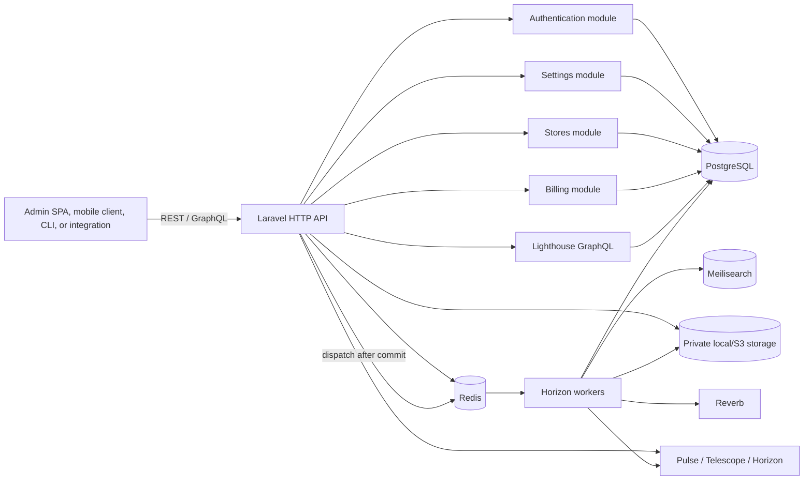
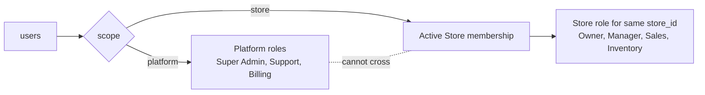
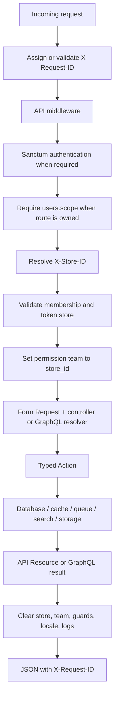
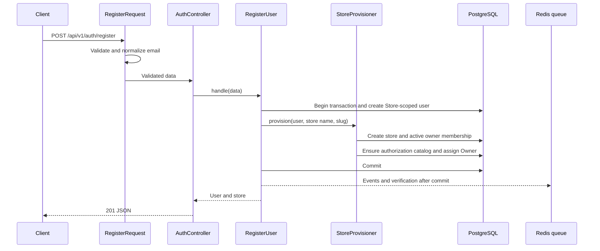
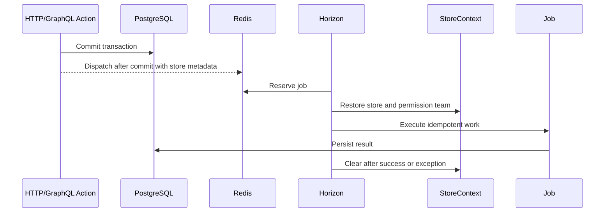

# ShopNXE backend developer guide

This is the working guide for developers extending the ShopNXE backend. It explains what is installed, why it exists, how information moves through the system, which process executes each kind of work, and how to make changes safely.

The [canonical application context](context.md) defines domain language, identifiers, authorization, and module boundaries. Exact package versions, enabled modules, routes, GraphQL operations, migrations, commands, and environment-variable names are maintained in the [generated system inventory](generated/system-inventory.md). Architectural decisions are recorded in the [ADRs](adr/001-modular-monolith.md), and meaningful behavioral changes belong in the [development log](development-log.md).

## 1. System shape

ShopNXE is an API-only modular Laravel monolith: one deployable application and one PostgreSQL database, with code ownership divided into modules.



There is no storefront or administration frontend here. Responses are JSON, GraphQL JSON, streamed files, or WebSocket traffic. Horizon, Pulse, and Telescope are vendor operational interfaces and stay disabled unless internal dashboards are explicitly enabled.

## 2. Installed platform

| Component | Responsibility | Main configuration |
| --- | --- | --- |
| Laravel | HTTP, validation, Eloquent, events, notifications, queues, cache, and service container | `bootstrap/app.php`, `config/*.php` |
| Nwidart Modules | Finds enabled modules and boots their providers | `config/modules.php`, `modules_statuses.json`, `Modules/*/module.json` |
| Sanctum | First-party cookie authentication and hashed bearer tokens | `config/sanctum.php`, custom `PersonalAccessToken` |
| Fortify | TOTP secrets, QR provisioning, recovery codes, and MFA lifecycle actions | `config/fortify.php`, custom JSON MFA controllers |
| Lighthouse | `/graphql`, schema loading, guards, query limits, and errors | `config/lighthouse.php`, `graphql/schema.graphql` |
| Spatie Permission | Store-specific roles and permissions using `store_id` as team key | `config/permission.php` |
| Spatie Multitenancy | Current store lifecycle and store-aware queues | `config/multitenancy.php` |
| Horizon and Redis | Background jobs, retries, cache, sessions, and rate limits | `config/queue.php`, `config/horizon.php` |
| Scout and Meilisearch | Store-filtered search; database driver is the local fallback | `config/scout.php` |
| Media Library and Flysystem | Media metadata, store paths, conversions, local/S3 storage | `config/media-library.php`, `config/filesystems.php` |
| Reverb | Private store/user real-time channels | `config/reverb.php`, `routes/channels.php` |
| Octane and FrankenPHP | Production-style long-running PHP workers | `config/octane.php`, `Dockerfile` |
| Pulse and Telescope | Performance visibility and local diagnostics | `config/pulse.php`, `config/telescope.php`, `config/observability.php` |

The generated inventory is the authoritative installed-package list.

## 3. Code ownership

`app/` contains only application-wide infrastructure: request IDs, health checks, context cleanup, global provider configuration, media paths, and shared search support.

`Modules/Authentication/` owns users, credentials, sessions, Sanctum tokens, password reset, email verification, resources, and authentication routes.

`Modules/Settings/` owns extensible Platform-wide settings, currently the global language and currency catalogs, their administration routes, and USD-relative exchange rates.

`Modules/Stores/` owns stores, the Platform Store catalog APIs, memberships, Store profiles/preferences, Store language selections, store context, store resolution, policies, cache keys, and provisioning.

`Modules/Billing/` owns editable Platform plan prices, reusable feature definitions, included/add-on assignments, catalog administration services/routes, and the initial sample catalog.

Each future business module owns its migrations, models, Actions/services, policies, routes, GraphQL schema, events, jobs, factories, and tests. Cross-module behavior uses contracts or events instead of reaching directly into another module's models.

### Administration component contracts

The visual admin application is separate, but backend work must maintain the
component contracts under [Admin component guides](components.md).
`GET /api/v1/auth/interfaces` drives the Platform shell:

- `Plans & Pricing` mounts at `/admin/plans` with `manage plans`.
- `Settings` mounts at `/admin/settings` with
  `manage platform settings`.
- `Merchants` mounts at `/admin/merchants` with `manage stores`; it may
  compose the Platform Store catalog and owner-aware merchant provisioning.
- Languages and Currencies are sections of the one Platform Settings shell.
- Platform components never enter Store context; future Store Settings remains
  a separate Store-admin component.

When adding a global setting, extend `Modules/Settings`, add a Settings API
section, and update the
[Platform Settings admin component guide](components/platform-settings-admin.md).
Do not add it to Store Management merely because a Store may later consume the
setting.

When the setting changes visible labels or language support, also follow the
[admin localization contract](components/localization.md). Keep
`EnsureLanguageCatalog`, direction metadata, catalog tests, frontend locale
registration, and every relevant frontend dictionary synchronized. The
backend currently has no runtime translation dictionaries; do not confuse
Store language availability with admin UI translation coverage.

### Identifier and identity rules

All human and staff identities use the `users` table, but `users.scope` exclusively classifies each account as `platform` or `store`. Platform accounts never receive Store membership/data; Store accounts never receive Platform assignments/data. Roles refine responsibility only within that account scope.



Use `ScopedRoleAssignmentService` for assignments. It checks account scope, role scope, active membership, and Store identity. PostgreSQL triggers reject bypasses through direct pivot inserts. `user.scope:platform` and `user.scope:store` middleware make route ownership explicit.

Domain entities use bigint `id` for primary keys, bigint `*_id` foreign keys for internal joins, and ULID `public_id` for REST, GraphQL, URLs, public events, and file paths. Middleware and actions resolve a public ULID once, then keep the internal bigint through the database flow. API resources and GraphQL fields serialize `public_id` as `id`; they must not expose bigint keys.

Pure relationship/package tables and protocol identifiers follow the documented exceptions in [application context](context.md). New business entity tables require both `id` and `public_id`.

### Store profile and capability data

`stores` keeps the merchant's first-class profile instead of hiding stable fields inside JSON. Identity/contact fields are `legal_name`, `description`, `email`, and `phone`; branding references are `logo`, `favicon`, and `cover_image`; classification is `industry` plus the typed `business_type`; locale is `currency_code`, `language_code`, `timezone`, and `country_code`; lifecycle is `status`, `launched_at`, and `trial_ends_at`; capability switches cover verification, AI, POS, B2B, and marketplace access.

Registration sets `legal_name` from `store_name`; database defaults provide `USD`, `en`, `UTC`, and disabled flags. `Store` casts business type/status to enums, flags to booleans, and lifecycle values to immutable datetimes. `StoreResource` and the GraphQL `Store` type serialize the public-safe values. Numeric `plan_id` and `subscription_id` remain internal Billing integration keys and never cross the API boundary.

Branding columns contain storage references only. `CreateStoreService`, `ViewStoreService`, `UpdateStoreProfileService`, and `StoreSettingsService` now own Store creation/read/profile/settings writes. Existing-Store operations require `X-Store-ID` and active membership; writes additionally require `manage store`. Merchant validation prohibits lifecycle, Billing, verification, capability, trial, and raw JSON fields. See [Store management](store-management.md).

Platform Store catalog routes are `/api/v1/platform/stores*`. They require a
Platform account with `manage stores` and never use Store context.
`PlatformStoreAdminService` provides case-insensitive search over stable Store
identity fields, exact profile/capability filters, creation-date filters,
whitelisted sorting, and deterministic pagination capped at 100 rows. Direct
creation makes an unassigned Store, defaults it to `pending`, and keeps Billing
links/raw JSON outside the request contract. The separate
`/api/v1/platform/merchants*` service remains the atomic owner-and-membership
provisioning path.

### Language catalog and Store language selection

`languages` is the Settings-owned platform-wide catalog. It uses an internal bigint key and public ULID, stores the administrative and native names, an immutable unique locale, `ltr`/`rtl` direction, and active state. `EnsureLanguageCatalog` idempotently maintains the initial 24-language catalog, including Hindi (`hi`, LTR), Urdu (`ur`, RTL), and Persian (`fa`, RTL). The separate Stores action `EnsureStoreLanguageDefaults` gives an existing Store one default selection matching `stores.language_code`, falling back to English.

`store_languages` joins an internal Store ID to an internal language ID. The Store/language pair is unique, and a PostgreSQL partial unique index permits only one `is_default = true` row per Store. Deleting a Store cascades its selections; deleting a language is restricted while Stores reference it.

Platform users call `GET /api/v1/platform/settings/languages`. Creating another catalog entry through `POST /api/v1/platform/settings/languages` or editing its names, direction, or active state through `PATCH /api/v1/platform/settings/languages/{language}` requires `manage platform settings`, initially assigned only to `Super Admin`. Locale is immutable after creation. The former `/api/v1/platform/languages` routes remain compatibility aliases. Store users call `GET /api/v1/store/languages` with `X-Store-ID`; updating the selected/default set through `PUT /api/v1/store/languages` requires `manage store`. The update runs transactionally, removes deselected rows, sets one default, and synchronizes the compatibility `stores.language_code` field.

### Currency catalog and USD exchange rates

`currencies` is the Settings-owned money-formatting and exchange-rate catalog. Each record has a public ULID, ISO-style three-letter code, display name and symbol, symbol placement, zero-to-four decimal places, active state, and a nullable decimal exchange rate. The rate convention is always `1 USD = X target currency units`; USD is the only base row, remains active, and is database-constrained to rate `1.00000000`.

`EnsureCurrencyCatalog` idempotently maintains 25 commonly used currencies without overwriting administrator-configured rates. Non-USD seed rates intentionally remain null because financial rates become stale; a Platform administrator enters or clears rates explicitly and `exchange_rate_updated_at` records when a configured rate changed.

Any Platform-scoped user may read `GET /api/v1/platform/settings/currencies`. Creating a currency through `POST /api/v1/platform/settings/currencies` or changing format, active state, or rate through `PATCH /api/v1/platform/settings/currencies/{currency}` requires `manage platform settings`, initially assigned only to `Super Admin`. The former `/api/v1/platform/currencies` routes remain compatibility aliases. Store accounts cannot use this API. The existing `stores.currency_code` remains the Store compatibility setting; Store-level catalog selection is outside this change.

### Plans, features, and add-ons

`plans` stores an editable name/slug, audience, fixed or custom price, currency, monthly/yearly interval, lifecycle status, featured flag, and display order. Money uses integer minor units. `features` is the reusable definition catalog; `plan_features` assigns typed values to plans and can mark an assignment as an optional add-on with its own price.

Platform plan routes require Platform scope plus `manage plans`, initially held by `Super Admin` and `Billing`. `PlanAdminService`, `FeatureAdminService`, and `PlanFeatureAdminService` own transactions, validation, typed assignments, and safe deletion. Plans referenced by a Store are archived instead of deleted. `GET /api/v1/auth/interfaces` supplies `Plans & Pricing` at `/admin/plans` only with `manage plans` and `Settings` at `/admin/settings` only with `manage platform settings`.

The idempotent sample seeder inserts Launch 1 ($3), Launch 5 ($5), Starter ($9), Growth ($29), Professional ($79), Business ($199), and custom Enterprise. Existing admin edits are not overwritten. See [Plans & Pricing](plans-and-pricing.md).

## 4. Application boot sequence

1. `public/index.php` loads Composer and creates the application from `bootstrap/app.php`.
2. Laravel registers the global API routes and broadcasting authorization routes. No normal web route file is registered.
3. `bootstrap/providers.php` registers global providers.
4. Nwidart reads `modules_statuses.json` and registers providers declared by enabled `module.json` files.
5. `AuthenticationServiceProvider` loads authentication routes and migrations.
6. `SettingsServiceProvider` loads global Settings routes and catalog migrations.
7. `StoresServiceProvider` binds request-scoped store context, store provisioning, policies, migrations, and queue context hooks.
8. `BillingServiceProvider` loads Platform plan/feature routes and catalog migrations.
9. `AppServiceProvider` configures Sanctum, Eloquent strict mode, rate limits, super-admin behavior, dashboards, reset URLs, and Octane cleanup.
10. Laravel accepts the request and runs the middleware pipeline.

Diagnose discovery with:

```powershell
& "C:\xampp\php\php.exe" artisan about
& "C:\xampp\php\php.exe" artisan module:list
& "C:\xampp\php\php.exe" artisan route:list
```

## 5. HTTP information flow



`AssignRequestId` accepts a safe incoming request ID or creates a UUIDv7, then adds it to logs and the response.

`ResolveStore` validates `X-Store-ID`, loads and activates the store, and places it in request-scoped `StoreContext`.

`EnsureStoreMembership` requires an active membership, rejects a bearer token issued for another store, activates the Spatie permission team, and adds store/user IDs to logs.

`ClearRequestContext` executes in a `finally` block. Store state, permission-team state, guards, locale, and log context are cleared even after an exception. Octane repeats cleanup after worker termination.

### REST list pagination

Table-backed management views use length-aware REST pagination. Clients send
`page` (minimum 1) and `per_page` (1-100); omitted `per_page` defaults to 25.
The response contains the current records in `data`, navigation URLs in
`links`, and counts/page state in `meta`. The convention applies to personal
access tokens, Platform users, Stores, merchants, plans, features, currencies,
languages, and selected-Store users. Role catalogs, Store selectors, and Store
language options remain unpaginated so dropdowns receive the complete option
set.

## 6. Registration execution



The transaction prevents partial registration. External side effects run after commit. Password hashes and plain passwords never appear in resources.

## 7. Authentication and store selection

### Stateful browser login

The browser obtains `/sanctum/csrf-cookie`, posts credentials to `/api/v1/auth/login`, and sends cookies with credentialed CORS. Without MFA, Laravel authenticates with the `web` session guard and regenerates the session. With MFA enabled, login returns `202` and a short-lived challenge without authenticating; completing `/api/v1/auth/mfa/challenge` creates and regenerates the session. The browser adds `X-Store-ID` on store-required operations.

### Bearer-token login

1. Post email, password, device name, and Store ULID to `/api/v1/auth/token`.
2. `IssueStoreToken` resolves the Store ULID, verifies credentials and active membership, and retains the internal Store ID.
3. When MFA is disabled, Sanctum generates a token immediately. When MFA is enabled, the response is `202` with `mfa_required`, a short-lived `challenge_token`, and no bearer token.
4. The client posts the challenge token plus either a six-digit TOTP code or a recovery code to `/api/v1/auth/mfa/challenge`; only then is the store token issued and returned once.
5. Later requests send `Authorization: Bearer …` and `X-Store-ID: …`.
6. Middleware requires the `store:access` ability and rejects a token unless its non-null Store binding exactly matches the selected Store.
7. New tokens expire after 30 days by default, configurable through `AUTH_TOKEN_TTL_MINUTES`; expired rows are pruned daily. Password reset revokes all of the user's bearer tokens.

Authorization has five layers: Sanctum authentication/abilities, exclusive user scope, active Store membership where applicable, scoped Spatie permissions, and model policies. Passing one never bypasses the others. Platform roles (`Super Admin`, `Support`, `Billing`) are evaluated without a Store team; Store roles (`Owner`, `Manager`, `Sales`, `Inventory`) are assigned under an internal Store team.

### Platform Admin and Store Admin interface selection

After login, call `GET /api/v1/auth/interfaces`. The response has two stable keys:

- `platform_admin` is available only for `users.scope = platform`. It returns Platform roles/permissions/navigation and never Store memberships. `Plans & Pricing` appears only with `manage plans`; `Settings` appears only with `manage platform settings`; `Merchants` appears only with `manage stores`.
- `store_admin` is available only for `users.scope = store` with at least one active membership. It returns only that user’s Stores and Store-isolated roles/permissions.

An account can never have both interfaces. The frontend selects the shell from `user.scope` and `available`; backend scope middleware remains authoritative. Store requests still send the selected Store ULID through `X-Store-ID`.

### Platform user, merchant, and Store user creation

Platform staff management is served by `/api/v1/platform/users*`. `PlatformUserAdminService` requires Platform scope plus `manage platform users`, validates roles against Platform catalog rows, creates/edits the identity transactionally, and returns the User ULID with role names, verification timestamps, MFA state, and created/updated timestamps. Changing the managed email clears verification and queues verification for the new address after commit; omitting an edit password preserves the current hash. The platform role catalog is `/api/v1/platform/roles`.

Merchant provisioning is served by `/api/v1/platform/merchants*` and requires `manage stores`. `PlatformMerchantService` creates a Store-scoped owner identity, Store, active membership, and Store-role assignments in one transaction; `Owner` is mandatory. It also edits owner identity/password and Platform-controlled Store profile/status without changing existing Store roles. Merchant resources identify the primary owner and return the Store users with membership metadata. Changing the owner email clears verification and queues verification for the new address after commit. The merchant role catalog is `/api/v1/platform/merchant-roles`.

Direct Store catalog management is served by `/api/v1/platform/stores*` under
the same permission. `GET` supports search, exact filters, date range,
whitelisted sorting, and `page`/`per_page`; the collection response includes
`data`, `meta`, and `links`. `POST` creates a Store without an owner or
membership, while `GET/PATCH /{store}` resolve a public Store ULID and expose
only public-safe fields. Use the merchant route when an owner must exist.

Within one selected Store, `/api/v1/store/users` lists members or creates a new unique-email Store user. Listing requires `manage store members`; creation also requires `manage store roles`. `/api/v1/store/roles` lists roles for the selected Store. Public requests and responses use ULIDs, while membership and role-team writes use bigint keys. Platform/Store roles can never be combined. See [User and merchant management](user-merchant-management.md).

### TOTP multi-factor authentication

MFA uses standard time-based one-time passwords and is compatible with Google Authenticator, Microsoft Authenticator, Authy mobile, 1Password, and other RFC 6238 applications. Provisioning returns both an `otpauth://` URI and an SVG QR code. Fortify's generated secret and recovery-code list are encrypted with `APP_KEY`; `two_factor_confirmed_at` prevents an unfinished setup from locking the user out.

Authenticated management routes are:

| Method | Route | Purpose |
| --- | --- | --- |
| `GET` | `/api/v1/auth/mfa` | Return enabled, pending-confirmation, and confirmation-time status. |
| `POST` | `/api/v1/auth/mfa/setup` | Require `current_password`, replace any pending setup, and return the secret, URI, and QR SVG. |
| `POST` | `/api/v1/auth/mfa/confirm` | Require `current_password` plus the first six-digit code and return eight recovery codes once setup is confirmed. |
| `POST` | `/api/v1/auth/mfa/recovery-codes` | Require `current_password`, invalidate the old recovery-code set, and return a replacement set. |
| `DELETE` | `/api/v1/auth/mfa` | Require `current_password` and remove the secret, recovery codes, and confirmation timestamp. |

Both stateful login and store-token login use the public `POST /api/v1/auth/mfa/challenge` completion endpoint. A challenge lasts five minutes by default, is stored in the configured cache rather than the database, allows five failed code attempts, is rate-limited, is bound to the current password hash and MFA secret, and is consumed after success. Password reset or an MFA-secret change therefore invalidates outstanding challenges. Successful TOTP timesteps are cached per secret so the same code cannot be replayed.

Session clients must remain Sanctum-stateful for both login requests: first fetch `/sanctum/csrf-cookie`, then send the session cookie, CSRF header, and an allowed `Origin` while posting credentials and the MFA challenge. API and CLI clients use the bearer-token flow.

Keep `APP_KEY` stable and backed up. Changing it makes existing TOTP secrets and recovery-code lists undecryptable. Redis should be the normal local and production cache because MFA challenges and replay markers are short-lived security state.

### Test TOTP MFA locally

Apply the migration, ensure Redis is running, and start Laravel:

```powershell
docker compose up -d redis
& "C:\xampp\php\php.exe" artisan migrate
& "C:\xampp\php\php.exe" artisan serve --host=127.0.0.1 --port=8000
```

The following PowerShell flow registers a disposable store owner, obtains the initial password-only token, enables MFA, saves the returned QR SVG, confirms the first code, and proves that the next token login requires MFA:

```powershell
$baseUrl = 'http://127.0.0.1:8000'
$stamp = Get-Date -Format 'yyyyMMddHHmmss'
$email = "mfa-local-$stamp@example.test"
$password = 'StrongPassword!123'

$registration = Invoke-RestMethod -Method Post -Uri "$baseUrl/api/v1/auth/register" `
    -ContentType 'application/json' `
    -Body (@{
        name = 'MFA Local Tester'
        email = $email
        password = $password
        password_confirmation = $password
        store_name = 'MFA Local Shop'
        store_slug = "mfa-local-$stamp"
    } | ConvertTo-Json)

$storeId = $registration.store.id
$loginPayload = @{
    email = $email
    password = $password
    device_name = 'powershell-setup'
    store_id = $storeId
}

$initialLogin = Invoke-RestMethod -Method Post -Uri "$baseUrl/api/v1/auth/token" `
    -ContentType 'application/json' -Body ($loginPayload | ConvertTo-Json)
$headers = @{
    Accept = 'application/json'
    Authorization = "Bearer $($initialLogin.token)"
}

$setup = Invoke-RestMethod -Method Post -Uri "$baseUrl/api/v1/auth/mfa/setup" `
    -Headers $headers -ContentType 'application/json' `
    -Body (@{ current_password = $password } | ConvertTo-Json)
$setup.qr_code_svg | Set-Content -Path .\mfa-qr.svg -Encoding utf8
Start-Process .\mfa-qr.svg

# Scan mfa-qr.svg with a TOTP app, then enter the displayed six-digit code.
$firstCode = Read-Host 'Authenticator code'
$confirmation = Invoke-RestMethod -Method Post -Uri "$baseUrl/api/v1/auth/mfa/confirm" `
    -Headers $headers -ContentType 'application/json' `
    -Body (@{ current_password = $password; code = $firstCode } | ConvertTo-Json)
$confirmation.recovery_codes

# Store the displayed recovery codes safely. A fresh login now returns a challenge, not a token.
$challenge = Invoke-RestMethod -Method Post -Uri "$baseUrl/api/v1/auth/token" `
    -ContentType 'application/json' -Body ($loginPayload | ConvertTo-Json)
$challenge.mfa_required

$loginCode = Read-Host 'Next authenticator code'
$completedLogin = Invoke-RestMethod -Method Post -Uri "$baseUrl/api/v1/auth/mfa/challenge" `
    -ContentType 'application/json' `
    -Body (@{
        challenge_token = $challenge.challenge_token
        code = $loginCode
    } | ConvertTo-Json)
$completedLogin.token
```

Wait for the next 30-second code after enrollment confirmation because successful TOTP values are intentionally single-use. To test account recovery, create another login challenge and submit one value from `$confirmation.recovery_codes` as `recovery_code` instead of `code`; submitting that recovery code again must fail.

## 8. GraphQL execution

`POST /graphql` is handled by Lighthouse. The root schema imports module-owned schemas.

1. API middleware creates a request ID.
2. The GraphQL rate limiter keys by user or IP.
3. Optional store middleware resolves the store header when present.
4. Lighthouse attempts Sanctum authentication.
5. Public fields execute without authentication only when explicitly public.
6. Protected fields use `@guard(with: ["sanctum"])`.
7. Store operations require `StoreContext` and authorization.
8. Lighthouse applies depth, complexity, pagination, introspection, and error policies.
9. Resolvers call typed Actions; store-sensitive mutations never use automatic create/update/delete directives.

After schema changes:

```powershell
& "C:\xampp\php\php.exe" artisan lighthouse:validate-schema
```

Add success, validation, authentication, authorization, and cross-store tests.

## 9. Queue execution



Use named queues such as `notifications`, `webhooks`, `exports`, `media`, `search`, and `billing`. Store-aware jobs inherit the active Spatie store. Global jobs use the global-job marker. Jobs need explicit retries/timeouts, idempotency, small serialized payloads, and no dependence on previous worker state.

```powershell
& "C:\xampp\php\php.exe" artisan horizon
```

## 10. Cache, search, storage, and real-time flow

Store cache keys include a store prefix, preventing collisions.

Future searchable documents include `store_id`; every search applies the active store filter. Meilisearch is a projection, while PostgreSQL remains authoritative.

Media uses bigint morph keys, a package UUID where Media Library requires it, and public Store/media ULIDs in private paths. Development uses private local storage; staging and production use private S3-compatible storage and temporary URLs.

Reverb authorizes Store channels through `/api/broadcasting/auth`. It checks the user, active Store, membership, token Store, and `access store`. Public channel names use ULIDs. Events carry public identifiers and small summaries rather than full models.

## 11. Development execution

### Host PHP and existing PostgreSQL

```powershell
Copy-Item .env.example .env
& "C:\xampp\php\php.exe" artisan key:generate
docker compose up -d redis meilisearch mailpit minio
& "C:\xampp\php\php.exe" artisan migrate --seed
& "C:\xampp\php\php.exe" artisan serve --host=127.0.0.1 --port=8000
```

Use `DB_HOST=127.0.0.1`, `REDIS_HOST=127.0.0.1`, and `SCOUT_DRIVER=database`.

The standard `artisan db:seed` entry point is defined in
`database/ApplicationSeeder.php` and loaded through Composer's
`autoload.files` configuration. It maintains the authorization catalog, the
24-language master catalog, existing Store language defaults, and the optional
local Platform Administrator account.

### Infrastructure Compose services

The root `compose.yaml` runs Redis, Meilisearch, Mailpit, and MinIO only. Laravel and PostgreSQL run on the host, so use `DB_HOST=127.0.0.1`, `REDIS_HOST=127.0.0.1`, `MEILISEARCH_HOST=http://127.0.0.1:7700`, and `AWS_ENDPOINT=http://127.0.0.1:9000`. Every published development port is bound to `127.0.0.1`; the services are not exposed to the LAN.

```powershell
docker compose up -d
docker compose ps
& "C:\xampp\php\php.exe" artisan migrate --seed
& "C:\xampp\php\php.exe" artisan serve --host=127.0.0.1 --port=8000
```

Mailpit is available on port `8025`, Meilisearch on `7700`, and MinIO on `9000` with its console on `9001`. The application Dockerfile remains available for a later production-style image build, but it is not started by the development Compose file.

When using XAMPP, configure a dedicated VirtualHost whose document root is
`C:/xampp/htdocs/shopnxebk/public`. The repository-root `.htaccess` blocks
direct HTTP reads outside `public/` as defense in depth, but production must
not serve the repository root.

### Daily commands

```powershell
composer docs:update
composer format
composer format:check
composer analyse
& "C:\xampp\php\php.exe" artisan test
& "C:\xampp\php\php.exe" artisan route:list
& "C:\xampp\php\php.exe" artisan migrate:status
```

Never use `migrate:fresh` against a valuable database.

## 12. Changing functionality

### REST endpoint

1. Put the route in the owning module.
2. Use a Form Request for normalization, validation, and authorization.
3. Keep the controller limited to an Action and API Resource.
4. Put transactions, policies, store enforcement, and events in the Action.
5. Test success, validation, unauthenticated, unauthorized, and cross-store behavior.
6. Update OpenAPI and the development log.

### GraphQL field

1. Add it to the owning module schema.
2. Mark authentication explicitly.
3. Require store context for store-owned data.
4. Use an explicit resolver and typed Action for mutations.
5. Restrict filters/order columns and avoid N+1 queries.
6. Test validation, authorization, store isolation, and success.

### Database change

1. Put the migration in the owning module.
2. Add bigint `id`, unique ULID `public_id`, and timezone timestamps to a domain entity.
3. Use bigint foreign keys; add indexed non-null bigint `store_id` to Store-owned records.
4. Include `store_id` in Store-local uniqueness constraints.
5. Return `public_id` as API/GraphQL `id`; never expose the bigint key.
6. Use integer minor units plus ISO currency for future money.
7. Test against PostgreSQL, never SQLite.
8. Update factories, resources, policies, API contracts, affected module/communication docs, and the log.

### New module

1. Confirm its boundary in `docs/modules.md`; add an ADR for major decisions.
2. Generate it with the API-only Nwidart configuration.
3. Keep migrations, routes, schema, policies, Actions, events, factories, and tests inside it.
4. Expose cross-module behavior with contracts or events.
5. Enable it, regenerate the inventory, and verify discovery.

## 13. Living-document workflow

For every code, schema, dependency, route, migration, module, or configuration change:

```powershell
composer docs:update
composer docs:check
composer format:check
composer analyse
& "C:\xampp\php\php.exe" artisan test
```

Then add a concise entry to `docs/development-log.md`, update the relevant module and directional communication documents, confirm no secrets are tracked, and recheck Store isolation/context cleanup.

`composer docs:update` regenerates factual inventory. Composer also runs it after autoload dumps. CI runs `composer docs:check` and rejects stale inventory.

Automation cannot infer why a business decision was made. That part remains a short human-written log entry.

## 14. Troubleshooting order

1. Find `X-Request-ID` in response and logs.
2. Check route registration.
3. Check Sanctum guard and abilities.
4. Check store header, membership, token store, and permission team.
5. Check validation and policies.
6. Check migrations and PostgreSQL constraints.
7. Check Redis, failed jobs, and Horizon.
8. Check search/storage/Reverb after the database operation is correct.

`/api/health/live` confirms PHP is responding. `/api/health/ready` checks PostgreSQL and cache availability.

## 15. Related documentation

- [Architecture](architecture.md)
- [Canonical application context](context.md)
- [Authorization](authorization.md)
- [Admin component guides](components.md)
- [Platform Settings admin component](components/platform-settings-admin.md)
- [Admin localization contract](components/localization.md)
- [Module boundaries](modules.md)
- [Authentication module](modules/authentication.md)
- [Settings module](modules/settings.md)
- [Stores module](modules/stores.md)
- [Billing module](modules/billing.md)
- [Module communication contracts](module-communication/)
- [Authentication](authentication.md)
- [Platform settings](settings.md)
- [Stores](stores.md)
- [Store management](store-management.md)
- [Plans & Pricing](plans-and-pricing.md)
- [GraphQL](graphql.md)
- [REST API](rest-api.md)
- [Local development](local-development.md)
- [Deployment](deployment.md)
- [Security model](security-model.md)
- [OpenAPI](openapi.yaml)
