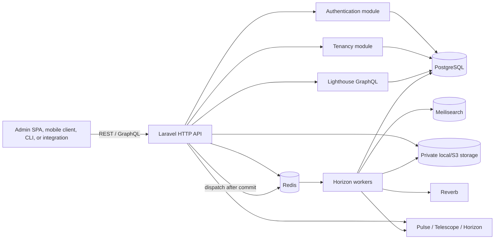
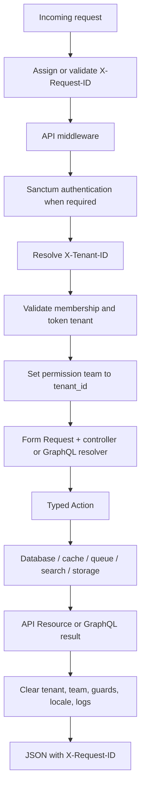
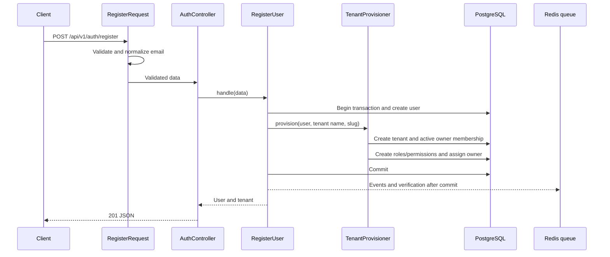
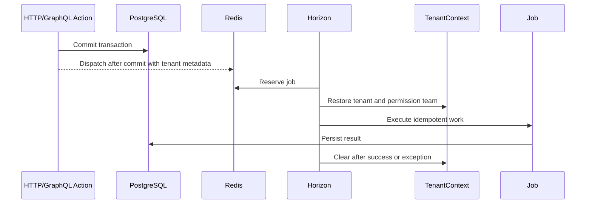

# ShopNXE backend developer guide

This is the working guide for developers extending the ShopNXE backend. It explains what is installed, why it exists, how information moves through the system, which process executes each kind of work, and how to make changes safely.

Exact package versions, enabled modules, routes, GraphQL operations, migrations, commands, and environment-variable names are maintained in the [generated system inventory](generated/system-inventory.md). Architectural decisions are recorded in the [ADRs](adr/001-modular-monolith.md), and meaningful behavioral changes belong in the [development log](development-log.md).

## 1. System shape

ShopNXE is an API-only modular Laravel monolith: one deployable application and one PostgreSQL database, with code ownership divided into modules.



There is no storefront or administration frontend here. Responses are JSON, GraphQL JSON, streamed files, or WebSocket traffic. Horizon, Pulse, and Telescope are vendor operational interfaces and stay disabled unless internal dashboards are explicitly enabled.

## 2. Installed platform

| Component | Responsibility | Main configuration |
| --- | --- | --- |
| Laravel | HTTP, validation, Eloquent, events, notifications, queues, cache, and service container | `bootstrap/app.php`, `config/*.php` |
| Nwidart Modules | Finds enabled modules and boots their providers | `config/modules.php`, `modules_statuses.json`, `Modules/*/module.json` |
| Sanctum | First-party cookie authentication and hashed bearer tokens | `config/sanctum.php`, custom `PersonalAccessToken` |
| Lighthouse | `/graphql`, schema loading, guards, query limits, and errors | `config/lighthouse.php`, `graphql/schema.graphql` |
| Spatie Permission | Tenant-specific roles and permissions using `tenant_id` as team key | `config/permission.php` |
| Spatie Multitenancy | Current tenant lifecycle and tenant-aware queues | `config/multitenancy.php` |
| Horizon and Redis | Background jobs, retries, cache, sessions, and rate limits | `config/queue.php`, `config/horizon.php` |
| Scout and Meilisearch | Tenant-filtered search; database driver is the local fallback | `config/scout.php` |
| Media Library and Flysystem | Media metadata, tenant paths, conversions, local/S3 storage | `config/media-library.php`, `config/filesystems.php` |
| Reverb | Private tenant/user real-time channels | `config/reverb.php`, `routes/channels.php` |
| Octane and FrankenPHP | Production-style long-running PHP workers | `config/octane.php`, `Dockerfile` |
| Pulse and Telescope | Performance visibility and local diagnostics | `config/pulse.php`, `config/telescope.php`, `config/observability.php` |

The generated inventory is the authoritative installed-package list.

## 3. Code ownership

`app/` contains only application-wide infrastructure: request IDs, health checks, context cleanup, global provider configuration, media paths, and shared search support.

`Modules/Authentication/` owns users, credentials, sessions, Sanctum tokens, password reset, email verification, resources, and authentication routes.

`Modules/Tenancy/` owns tenants, memberships, tenant context, tenant resolution, policies, cache keys, and provisioning.

Each future business module owns its migrations, models, Actions, policies, routes, GraphQL schema, events, jobs, factories, and tests. Cross-module behavior uses contracts or events instead of reaching directly into another module's models.

## 4. Application boot sequence

1. `public/index.php` loads Composer and creates the application from `bootstrap/app.php`.
2. Laravel registers the global API routes and broadcasting authorization routes. No normal web route file is registered.
3. `bootstrap/providers.php` registers global providers.
4. Nwidart reads `modules_statuses.json` and registers providers declared by enabled `module.json` files.
5. `AuthenticationServiceProvider` loads authentication routes and migrations.
6. `TenancyServiceProvider` binds request-scoped tenant context, tenant provisioning, policies, migrations, and queue context hooks.
7. `AppServiceProvider` configures Sanctum, Eloquent strict mode, rate limits, super-admin behavior, dashboards, reset URLs, and Octane cleanup.
8. Laravel accepts the request and runs the middleware pipeline.

Diagnose discovery with:

```powershell
& "C:\xampp\php\php.exe" artisan about
& "C:\xampp\php\php.exe" artisan module:list
& "C:\xampp\php\php.exe" artisan route:list
```

## 5. HTTP information flow



`AssignRequestId` accepts a safe incoming request ID or creates a UUIDv7, then adds it to logs and the response.

`ResolveTenant` validates `X-Tenant-ID`, loads and activates the tenant, and places it in request-scoped `TenantContext`.

`EnsureTenantMembership` requires an active membership, rejects a bearer token issued for another tenant, activates the Spatie permission team, and adds tenant/user IDs to logs.

`ClearRequestContext` executes in a `finally` block. Tenant state, permission-team state, guards, locale, and log context are cleared even after an exception. Octane repeats cleanup after worker termination.

## 6. Registration execution



The transaction prevents partial registration. External side effects run after commit. Password hashes and plain passwords never appear in resources.

## 7. Authentication and tenant selection

### Stateful browser login

The browser obtains `/sanctum/csrf-cookie`, posts credentials to `/api/v1/auth/login`, and sends cookies with credentialed CORS. Laravel authenticates with the `web` session guard and regenerates the session. The browser adds `X-Tenant-ID` on tenant-required operations.

### Bearer-token login

1. Post email, password, device name, and tenant UUID to `/api/v1/auth/token`.
2. `IssueTenantToken` verifies credentials and active membership.
3. Sanctum generates a token, stores only its hash, and records tenant, abilities, expiry, and metadata.
4. The plain token is returned once.
5. Later requests send `Authorization: Bearer …` and `X-Tenant-ID: …`.
6. Middleware rejects a token when its tenant differs from the selected tenant.

Authorization has three layers: Sanctum abilities, tenant permissions, and model policies. Passing one never bypasses the others.

## 8. GraphQL execution

`POST /graphql` is handled by Lighthouse. The root schema imports module-owned schemas.

1. API middleware creates a request ID.
2. The GraphQL rate limiter keys by user or IP.
3. Optional tenant middleware resolves the tenant header when present.
4. Lighthouse attempts Sanctum authentication.
5. Public fields execute without authentication only when explicitly public.
6. Protected fields use `@guard(with: ["sanctum"])`.
7. Tenant operations require `TenantContext` and authorization.
8. Lighthouse applies depth, complexity, pagination, introspection, and error policies.
9. Resolvers call typed Actions; tenant-sensitive mutations never use automatic create/update/delete directives.

After schema changes:

```powershell
& "C:\xampp\php\php.exe" artisan lighthouse:validate-schema
```

Add success, validation, authentication, authorization, and cross-tenant tests.

## 9. Queue execution



Use named queues such as `notifications`, `webhooks`, `exports`, `media`, `search`, and `billing`. Tenant-aware jobs inherit the active Spatie tenant. Global jobs use the global-job marker. Jobs need explicit retries/timeouts, idempotency, small serialized payloads, and no dependence on previous worker state.

```powershell
& "C:\xampp\php\php.exe" artisan horizon
```

## 10. Cache, search, storage, and real-time flow

Tenant cache keys include a tenant prefix, preventing collisions.

Future searchable documents include `tenant_id`; every search applies the active tenant filter. Meilisearch is a projection, while PostgreSQL remains authoritative.

Media uses UUID morphs and tenant-prefixed paths. Development uses private local storage; staging and production use private S3-compatible storage and temporary URLs.

Reverb authorizes tenant channels through `/api/broadcasting/auth`. It checks the user, active tenant, membership, token tenant, and `tenant.access`. Events carry identifiers and small summaries rather than full models.

## 11. Development execution

### Host PHP and existing PostgreSQL

```powershell
Copy-Item .env.example .env
& "C:\xampp\php\php.exe" artisan key:generate
docker compose up -d redis meilisearch mailpit minio
& "C:\xampp\php\php.exe" artisan migrate --seed
& "C:\xampp\php\php.exe" artisan serve --host=127.0.0.1 --port=8000
```

Use `DB_HOST=127.0.0.1`, `REDIS_HOST=127.0.0.1`, and `SCOUT_DRIVER=database`.

### Infrastructure Compose services

The root `compose.yaml` runs Redis, Meilisearch, Mailpit, and MinIO only. Laravel and PostgreSQL run on the host, so use `DB_HOST=127.0.0.1`, `REDIS_HOST=127.0.0.1`, `MEILISEARCH_HOST=http://127.0.0.1:7700`, and `AWS_ENDPOINT=http://127.0.0.1:9000`.

```powershell
docker compose up -d
docker compose ps
& "C:\xampp\php\php.exe" artisan migrate --seed
& "C:\xampp\php\php.exe" artisan serve --host=127.0.0.1 --port=8000
```

Mailpit is available on port `8025`, Meilisearch on `7700`, and MinIO on `9000` with its console on `9001`. The application Dockerfile remains available for a later production-style image build, but it is not started by the development Compose file.

### Daily commands

```powershell
composer docs:update
composer format
composer format:check
composer analyse
& "C:\xampp\php\php.exe" artisan test
& "C:\xampp\php\php.exe" artisan route:list
& "C:\xampp\php\php.exe" artisan migrate:status
```

Never use `migrate:fresh` against a valuable database.

## 12. Changing functionality

### REST endpoint

1. Put the route in the owning module.
2. Use a Form Request for normalization, validation, and authorization.
3. Keep the controller limited to an Action and API Resource.
4. Put transactions, policies, tenant enforcement, and events in the Action.
5. Test success, validation, unauthenticated, unauthorized, and cross-tenant behavior.
6. Update OpenAPI and the development log.

### GraphQL field

1. Add it to the owning module schema.
2. Mark authentication explicitly.
3. Require tenant context for tenant-owned data.
4. Use an explicit resolver and typed Action for mutations.
5. Restrict filters/order columns and avoid N+1 queries.
6. Test validation, authorization, tenant isolation, and success.

### Database change

1. Put the migration in the owning module.
2. Use PostgreSQL UUID foreign keys and timezone timestamps.
3. Add indexed `tenant_id` to tenant-owned records.
4. Include `tenant_id` in tenant-local uniqueness constraints.
5. Use integer minor units plus ISO currency for future money.
6. Test against PostgreSQL, never SQLite.
7. Update factories, resources, policies, API contracts, and the log.

### New module

1. Confirm its boundary in `docs/modules.md`; add an ADR for major decisions.
2. Generate it with the API-only Nwidart configuration.
3. Keep migrations, routes, schema, policies, Actions, events, factories, and tests inside it.
4. Expose cross-module behavior with contracts or events.
5. Enable it, regenerate the inventory, and verify discovery.

## 13. Living-document workflow

For every code, schema, dependency, route, migration, module, or configuration change:

```powershell
composer docs:update
composer docs:check
composer format:check
composer analyse
& "C:\xampp\php\php.exe" artisan test
```

Then add a concise entry to `docs/development-log.md`, update the relevant narrative document, confirm no secrets are tracked, and recheck tenant isolation/context cleanup.

`composer docs:update` regenerates factual inventory. Composer also runs it after autoload dumps. CI runs `composer docs:check` and rejects stale inventory.

Automation cannot infer why a business decision was made. That part remains a short human-written log entry.

## 14. Troubleshooting order

1. Find `X-Request-ID` in response and logs.
2. Check route registration.
3. Check Sanctum guard and abilities.
4. Check tenant header, membership, token tenant, and permission team.
5. Check validation and policies.
6. Check migrations and PostgreSQL constraints.
7. Check Redis, failed jobs, and Horizon.
8. Check search/storage/Reverb after the database operation is correct.

`/api/health/live` confirms PHP is responding. `/api/health/ready` checks PostgreSQL and cache availability.

## 15. Related documentation

- [Architecture](architecture.md)
- [Module boundaries](modules.md)
- [Authentication](authentication.md)
- [Tenancy](tenancy.md)
- [GraphQL](graphql.md)
- [REST API](rest-api.md)
- [Local development](local-development.md)
- [Deployment](deployment.md)
- [Security model](security-model.md)
- [OpenAPI](openapi.yaml)
