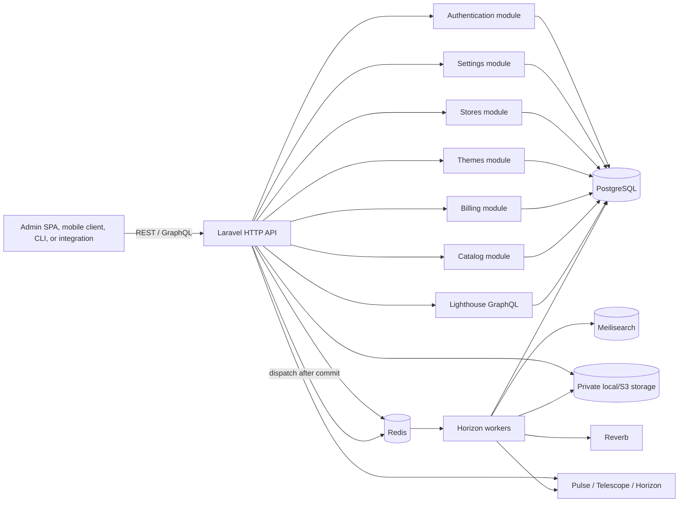
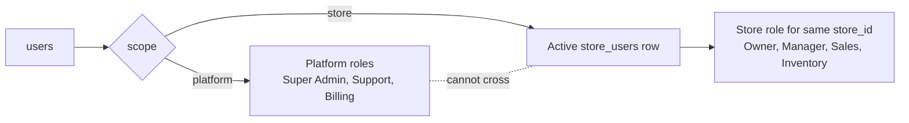
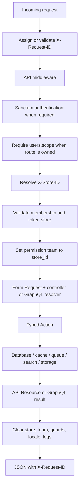
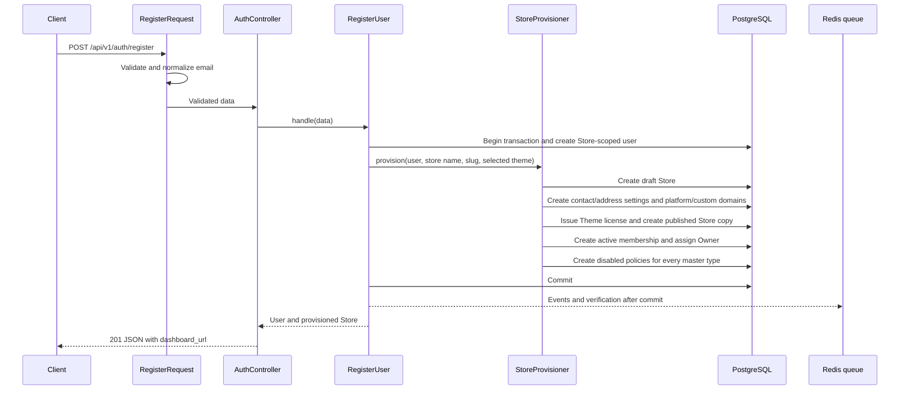
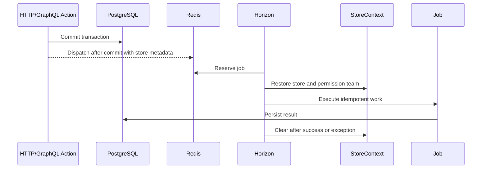

# ShopNXE backend developer guide

This is the working guide for developers extending the ShopNXE backend. It explains what is installed, why it exists, how information moves through the system, which process executes each kind of work, and how to make changes safely.

The [canonical application context](context.md) defines domain language, identifiers, authorization, and module boundaries. The [API manual](api-manual.md) is the implementation handoff for request cycles and client contracts. Exact package versions, enabled modules, routes, GraphQL operations, migrations, commands, and environment-variable names are maintained in generated references. Architectural decisions are recorded in the [ADRs](adr/001-modular-monolith.md), and meaningful behavioral changes belong in the [development log](development-log.md).

## 1. System shape

ShopNXE is an API-only modular Laravel monolith: one deployable application and one PostgreSQL database, with code ownership divided into modules.



There is no storefront or administration frontend here. Responses are JSON, GraphQL JSON, streamed files, or WebSocket traffic. Horizon, Pulse, and Telescope are vendor operational interfaces and stay disabled unless internal dashboards are explicitly enabled.

## 2. Installed platform

| Component | Responsibility | Main configuration |
| --- | --- | --- |
| Laravel | HTTP, validation, Eloquent, events, notifications, queues, cache, and service container | `bootstrap/app.php`, `config/*.php` |
| Nwidart Modules | Finds enabled modules and boots their providers | `config/modules.php`, `modules_statuses.json`, `Modules/*/module.json` |
| Sanctum | First-party cookie authentication and hashed bearer tokens | `config/sanctum.php`, custom `PersonalAccessToken` |
| Fortify | TOTP secrets, QR provisioning, recovery codes, and MFA lifecycle actions | `config/fortify.php`, custom JSON MFA controllers |
| Lighthouse | `/graphql`, schema loading, guards, query limits, and errors | `config/lighthouse.php`, `graphql/schema.graphql` |
| Spatie Permission | Store-specific roles and permissions using `store_id` as team key | `config/permission.php` |
| Spatie Multitenancy | Current store lifecycle and store-aware queues | `config/multitenancy.php` |
| Horizon and Redis | Background jobs, retries, cache, sessions, and rate limits | `config/queue.php`, `config/horizon.php` |
| Scout and Meilisearch | Store-filtered search; database driver is the local fallback | `config/scout.php` |
| Media Library and Flysystem | Media metadata, store paths, conversions, local/S3 storage | `config/media-library.php`, `config/filesystems.php` |
| Reverb | Private store/user real-time channels | `config/reverb.php`, `routes/channels.php` |
| Octane and FrankenPHP | Production-style long-running PHP workers | `config/octane.php`, `Dockerfile` |
| Pulse and Telescope | Performance visibility and local diagnostics | `config/pulse.php`, `config/telescope.php`, `config/observability.php` |

The generated inventory is the authoritative installed-package list.

## 3. Code ownership

`app/` contains only application-wide infrastructure: request IDs, health checks, context cleanup, global provider configuration, media paths, and shared search support.

`Modules/Authentication/` owns users, credentials, sessions, Sanctum tokens, password reset, email verification, resources, and authentication routes.

`Modules/Settings/` owns extensible Platform-wide settings, currently the global language and currency catalogs, their administration routes, and USD-relative exchange rates.

`Modules/Stores/` owns stores, the Platform Store catalog APIs, `store_users` relationships, Store profiles/preferences/address settings, Store language selections, the policy-type catalog, localized Store policies and immutable versions, store context, store resolution, authorization policies, cache keys, and provisioning.

`Modules/Themes/` owns Theme publishers/categories/listings, immutable
versions, review submissions, Store licenses, installed/customized Store
copies, and the Theme installer used by Store provisioning.

`Modules/Billing/` owns editable Platform plan prices, reusable feature definitions, included/add-on assignments, catalog administration services/routes, and the initial sample catalog.

`Modules/Catalog/` owns global Platform classification taxonomies plus
Store-local brands, collections, categories, Product Types, products, options,
variants, the global localized fulfillment-type catalog, media/fulfillment
metadata, license-key pools, and typed custom-field persistence. Brands expose
Store-scoped CRUD services and REST routes.
Categories, Product Types, and Products expose Store-scoped models,
transactional services, GraphQL queries/mutations, and automatic-translation
handlers; the remaining Catalog areas are still persistence-only. Localized
category persistence includes independent image and banner locators, SEO metadata,
optional page titles and search keywords, and a category-specific rendering
template.

Each future business module owns its migrations, models, Actions/services, policies, routes, GraphQL schema, events, jobs, factories, and tests. Cross-module behavior uses contracts or events instead of reaching directly into another module's models.

### Administration component contracts

The visual admin application is separate, but backend work must maintain the
component contracts under [Admin component guides](components.md).
`GET /api/v1/auth/interfaces` drives the Platform shell:

- `Plans & Pricing` mounts at `/admin/plans` with `manage plans`.
- `Themes` mounts at `/admin/themes` with `manage marketplace`; its
  Platform requests never send `X-Store-ID`.
- `Settings` mounts at `/admin/settings` with
  `manage platform settings`.
- `Merchants` mounts at `/admin/merchants` with `manage stores`; it may
  compose the Platform Store catalog and owner-aware merchant provisioning.
- Languages and Currencies are sections of the one Platform Settings shell.
- Platform components never enter Store context; future Store Settings remains
  a separate Store-admin component.
- Platform accounts read the global fulfillment catalog through
  `/api/v1/platform/settings/fulfillment-types`; users with `manage platform
  settings` may create/update entries and translations. Store members read
  active entries through `/api/v1/store/fulfillment-types` with Store context.

When adding a global setting, extend `Modules/Settings`, add a Settings API
section, and update the
[Platform Settings admin component guide](components/platform-settings-admin.md).
Do not add it to Store Management merely because a Store may later consume the
setting.

When the setting changes visible labels or language support, also follow the
[admin localization contract](components/localization.md). Keep
`EnsureLanguageCatalog`, direction metadata, catalog tests, frontend locale
registration, and every relevant frontend dictionary synchronized. The
backend currently has no runtime translation dictionaries; do not confuse
Store language availability with admin UI translation coverage.

### Identifier and identity rules

All human and staff identities use the `users` table, but `users.scope` exclusively classifies each account as `platform` or `store`. Platform accounts never receive Store membership/data; Store accounts never receive Platform assignments/data. Roles refine responsibility only within that account scope.



Use `ScopedRoleAssignmentService` for assignments. It checks account scope, role scope, active membership, and Store identity. PostgreSQL triggers reject bypasses through direct pivot inserts. `user.scope:platform` and `user.scope:store` middleware make route ownership explicit.

The `store_users` row only establishes that a Store-scoped user belongs to a Store and records its active/suspended state. It does not grant management powers by itself. Store-scoped roles and permissions, evaluated with the same internal `store_id` as the permission team, decide which API operations that user may perform.

`store_users` has bigint `id`, ULID `public_id`, bigint `store_id`/`user_id`, `status`, invitation/join timestamps, and audit timestamps. The Store/user pair is unique. The rename migration preserves existing records and rewrites PostgreSQL authorization functions; a follow-up migration normalizes legacy sequences, constraints, foreign keys, and indexes to `store_users_*`. Eloquent's `StoreMembership` model name and the public `membership` resource field remain compatibility terminology, but both use the `store_users` table.

Permission resolution for a Store request is:

1. Require an authenticated `users.scope = store` identity.
2. Resolve `X-Store-ID` from the public Store ULID to the internal bigint key.
3. Require an active `store_users` row for that user and Store.
4. For bearer authentication, require `store:access` and the same token `store_id`.
5. Set Spatie Permission's team to that internal `store_id`.
6. Evaluate Store roles, permissions, and the model policy for the requested action.

Membership never substitutes for steps 5–6. For example, both Owner and Sales may have active `store_users` rows, while their assigned permissions expose different APIs.

Domain entities use bigint `id` for primary keys, bigint `*_id` foreign keys for internal joins, and ULID `public_id` for REST, GraphQL, URLs, public events, and file paths. Middleware and actions resolve a public ULID once, then keep the internal bigint through the database flow. API resources and GraphQL fields serialize `public_id` as `id`; they must not expose bigint keys.

Pure relationship/package tables and protocol identifiers follow the documented exceptions in [application context](context.md). New business entity tables require both `id` and `public_id`.

### Store profile and capability data

`stores` keeps the merchant's first-class profile instead of hiding stable fields inside JSON. Identity/contact fields are `legal_name`, `description`, `email`, and `phone`; branding references are `logo`, `favicon`, and `cover_image`; classification is `industry` plus the typed `business_type`; locale is `currency_code`, `language_code`, `timezone`, and `country_code`; lifecycle is `status`, `launched_at`, and `trial_ends_at`; capability switches cover verification, AI, POS, B2B, and marketplace access.

Registration sets `legal_name` from `store_name`; database defaults provide `USD`, `en`, `UTC`, and disabled flags. `Store` casts business type/status to enums, flags to booleans, and lifecycle values to immutable datetimes. `StoreResource` and the GraphQL `Store` type serialize the public-safe values. Numeric `plan_id` and `subscription_id` remain internal Billing integration keys and never cross the API boundary.

Branding columns contain storage references only. `CreateStoreService`, `ViewStoreService`, `UpdateStoreProfileService`, and the transactional `StoreController` settings flow own Store creation/read/profile/settings writes. Existing-Store operations require `X-Store-ID` and active membership; writes additionally require `manage store`. Merchant validation prohibits lifecycle, Billing, verification, capability, trial, and raw JSON fields. See [Store management](store-management.md).

Platform Store catalog routes are `/api/v1/platform/stores*`. They require a
Platform account with `manage stores` and never use Store context.
`PlatformStoreAdminService` provides case-insensitive search over stable Store
identity fields and related member name/email, exact profile/capability
filters, creation-date filters, whitelisted sorting, and deterministic
pagination that defaults to 10 and is capped at 100 rows. List queries eager-
load `primaryMembership.user`; `primaryMembership` is the earliest membership
row and `PlatformStoreListResource` returns only that user's public ID, name,
and email as `owner`. Direct
creation makes an unassigned Store, defaults it to `draft`, and keeps Billing
links/raw JSON outside the request contract. The separate
`/api/v1/platform/merchants*` service remains the atomic owner-and-membership
provisioning path.

The Store edit workflow has a dedicated locale boundary at
`GET/PATCH /api/v1/platform/stores/{store}/locale-settings`. It returns the
active Store currency/language/country/timezone together with the one-to-one
`store_locale_settings` display preferences. `PlatformStoreLocaleSettingsService`
updates those sources in one transaction and preserves the older Store-settings
preference projection for compatible merchant clients.

Domain administration uses `GET/POST
/api/v1/platform/stores/{store}/domains` and `PATCH
/api/v1/platform/stores/{store}/domains/{domain}`. These routes expose public
Store/domain ULIDs only and map directly to `store_domains`. Hostnames are
globally unique; `StoreDomainManager` enforces primary-domain switching and
keeps `stores.primary_domain` synchronized in the same transaction. Direct
Platform Store creation always generates the configured ShopNXE platform
hostname, optionally registers a submitted custom primary domain, and accepts
an optional normalized `locale_settings` object for first-save regional
preferences.

Store lifecycle values are `draft`, `trial`, `active`, `suspended`, `frozen`,
and `closed`. Historical `pending` and `cancelled` rows are migrated to
`draft` and `closed`. Stores owns `store_domains` and the one-to-one
`store_settings` record. Themes owns `store_themes`, licenses, catalog
identity, and immutable versions; normalized Store address fields live in
`store_settings`, while membership rows live in `store_users`. See the
module guides for keys, constraints, media relationships, and API boundaries.

Store legal/customer-information pages use the normalized policy architecture
documented in [Store policies](store-policies.md). Platform-maintained
`policy_types` provide stable codes, Store-local policies are unique by type
and slug, translations reference the Settings language catalog, and immutable
versions are scoped by policy and language. Store provisioning creates one
editable `disabled` policy for every master type, migrations backfill the same
catalog for existing Stores, and custom type creation propagates a disabled row
to every Store. Enabling moves a policy to draft; disabling or DELETE preserves
its content/history and clears publication state. Merchant writes require
`manage policies`; anonymous storefront reads return published content only.
Saving the default-language policy translation generates title, content, and
SEO values for every other active Store language through the shared translation
provider. Generated policy content receives the same immutable language-scoped
version history as a manual edit. A target with `lock_it = true` is excluded;
saving another non-default language is a manual edit and does not cascade.

### Normalized Store settings and address flow

`store_settings.store_id` is both the primary key and the cascading foreign key
to `stores.id`; the row is not independently URL-addressable. The normalized
address columns are:

| API/database field | Validation and behavior |
| --- | --- |
| `store_country_code` | Nullable two-letter country code, normalized uppercase. |
| `store_state` | Nullable state/province/region, maximum 120 characters. |
| `store_city` | Nullable city, maximum 120 characters. |
| `store_zip` | Nullable postal/ZIP value, maximum 32 characters. |
| `store_address_1` | Nullable primary street/address line, maximum 255 characters. |
| `store_address_2` | Nullable secondary address line, maximum 255 characters. |
| `auto_store_translation_flag` | Boolean opt-in for future automatic Store-content translation; defaults to `false`. |
| `is_searchable_on_platform_flag` | Boolean opt-in for future Platform discovery/search inclusion; defaults to `false`. |

Registration, `CreateStoreService`, and `PlatformMerchantService` pass these
fields into `StoreProvisioner`, so the initial `store_settings` row is created
inside the same transaction as the draft Store, domains, theme, Owner
relationship, and Owner role. `GET /api/v1/store/settings` loads the one-to-one
record. `PATCH /api/v1/store/settings` requires `manage store`, updates contact
and address columns, and keeps `support_email`, `weight_unit`, and
`order_prefix` synchronized with their normalized columns. The two opt-in flags
are returned by the settings resource and may be changed through the same
Store-authorized PATCH operation; this persistence change does not itself run
translation jobs or alter Platform search indexes. Profile email/phone updates
also synchronize contact settings. Platform merchant create/detail/edit
responses include `store_settings`; Platform merchant edits update it in the
same transaction as owner and Store-profile changes.

### Store locale settings

`store_locale_settings.store_id` is both its primary key and a cascading
foreign key to `stores.id`. It owns `date_format`, `time_format`,
`week_starts_on`, `weight_unit`, `dimension_unit`, `decimal_places`,
`decimal_separator`, and `thousands_separator`. The Store row remains the
single source for `currency_code`, `language_code`, `country_code`, and the
IANA `timezone`; the table does not duplicate those stable fields, and
`store_languages` remains the source for enabled/default language selection.

The migration backfills every Store using validated legacy preferences where
available. Direct Platform Store creation and full merchant provisioning both
create the locale row in the same transaction. Store settings writes keep the
legacy date/time/weight/dimension projection synchronized, while the dedicated
Platform locale service also synchronizes `store_settings.weight_unit`.
Character encoding is always UTF-8, and IANA timezone rules provide automatic
daylight-saving changes; neither is a manually persisted switch.

### Language catalog and Store language selection

`languages` is the Settings-owned platform-wide catalog. It uses an internal bigint key and public ULID, stores the administrative and native names, an immutable unique locale, `lang_icon` and `lang_image` asset references, `ltr`/`rtl` direction, and active state. `EnsureLanguageCatalog` idempotently maintains the initial 24-language catalog and its country-flag references, including Hindi (`hi`, LTR), Urdu (`ur`, RTL), and Persian (`fa`, RTL). Bundled SVGs live under `public/assets/languages/flags`; the circular 256×256 WebP selector images derived from the supplied flag sprite live under `public/assets/languages/images`. Seventeen current languages use a matching WebP, while languages absent from the sprite use their existing SVG flag as `lang_image`. API resources resolve root-relative references to absolute URLs and preserve administrator-supplied HTTP(S) URLs. A deliberately partial model query falls back through `lang_image`, `lang_icon`, and finally the generic bundled asset instead of raising a missing-attribute exception. The separate Stores action `EnsureStoreLanguageDefaults` gives an existing Store one default selection matching `stores.language_code`, falling back to English.

`store_languages` joins an internal Store ID to an internal language ID. The Store/language pair is unique, and a PostgreSQL partial unique index permits only one `is_default = true` row per Store. Deleting a Store cascades its selections; deleting a language is restricted while Stores reference it.

Platform users call `GET /api/v1/platform/settings/languages`. Creating another catalog entry through `POST /api/v1/platform/settings/languages` or editing its names, icon/image references, direction, or active state through `PATCH /api/v1/platform/settings/languages/{language}` requires `manage platform settings`, initially assigned only to `Super Admin`. Omitted create assets use the bundled generic language asset; accepted custom `lang_icon` and `lang_image` references are root-relative paths or HTTP(S) URLs. Locale is immutable after creation. The former `/api/v1/platform/languages` routes remain compatibility aliases. Store users call `GET /api/v1/store/languages` with `X-Store-ID`; each option includes render-ready `lang_image` and `lang_icon` URLs for storefront/admin language selectors and translation tabs. Clients should display `lang_image` and retain `lang_icon` as compatibility fallback. Updating the selected/default set through `PUT /api/v1/store/languages` requires `manage store`. The update runs transactionally, removes deselected rows, sets one default, and synchronizes the compatibility `stores.language_code` field.

### Currency catalog and USD exchange rates

`currencies` is the Settings-owned money-formatting and exchange-rate catalog. Each record has a public ULID, ISO-style three-letter code, display name and symbol, symbol placement, zero-to-four decimal places, active state, and a nullable decimal exchange rate. The rate convention is always `1 USD = X target currency units`; USD is the only base row, remains active, and is database-constrained to rate `1.00000000`.

`EnsureCurrencyCatalog` idempotently maintains 25 commonly used currencies without overwriting administrator-configured rates. Non-USD seed rates intentionally remain null because financial rates become stale; a Platform administrator enters or clears rates explicitly and `exchange_rate_updated_at` records when a configured rate changed.

Any Platform-scoped user may read `GET /api/v1/platform/settings/currencies`. Creating a currency through `POST /api/v1/platform/settings/currencies` or changing format, active state, or rate through `PATCH /api/v1/platform/settings/currencies/{currency}` requires `manage platform settings`, initially assigned only to `Super Admin`. The former `/api/v1/platform/currencies` routes remain compatibility aliases. Store accounts cannot use this API. The existing `stores.currency_code` remains the Store compatibility setting; Store-level catalog selection is outside this change.

### Catalog persistence foundation

Catalog owns 38 normalized tables spanning global Platform taxonomies, brands,
manual/rule/AI collections, strict Store category trees, tags, Product Types,
products, translated content, product assignments, options/values, variants,
images, digital assets, software license-key pools, and typed custom fields.
Addressable rows use bigint internal IDs, public ULIDs, and timezone timestamps;
Store-owned rows also use indexed Store IDs. Translations and Store-local
relationship rows carry Store IDs for composite foreign keys even when their
primary key is a natural pair.

`platform_taxonomies` and `platform_taxonomy_nodes` provide a versioned global
classification tree with a single default taxonomy, same-taxonomy ancestry,
stable node codes/paths, and node-specific custom-field behavior.
`product_types` and `product_type_translations` provide a Store-local,
localized reference catalog. Product types carry a public ULID, stable code,
nullable foreign-key Platform taxonomy-node mapping, active state, and sort order.
Translations use their requested bigint `id` while unique
`(product_type_id, locale)` and `(store_id, locale, slug)` constraints preserve
one locale row and one Store-local URL segment. A composite parent/Store foreign
key prevents cross-Store content, and the standard non-null `lock_it = false`
protects manual translations. Product Type GraphQL provides paginated,
filterable list/detail reads plus explicit create/update/delete mutations.
Writes validate Store locales, code format, sort/active metadata, and an
optional global Platform-node ULID in one Store-scoped transaction. Product
GraphQL accepts `productTypeId` and `platformTaxonomyNodeId` public ULIDs; the
Product Type is resolved inside the selected Store and both relationships are
stored as nullable bigint foreign keys. Product persistence additionally holds
product-level SKU/trade identifiers, downloadable-file and availability
metadata, four-decimal price/cost snapshots, inventory thresholds, warranty,
dimensions/shipping cost, ratings/activity counters,
purchase/visibility/search switches, a related-product display count,
condition/preorder/release settings, review enablement, quantity bounds,
product points, and a legacy
tax-class identifier. Store Product REST CRUD validates and returns these
columns; the Product GraphQL contract remains unchanged.

Product image metadata is available through nested routes in
`routes/product-api.php`: `/api/v1/store/products/{product}/images`. The
controller maps snake_case requests into `ProductImageManagementService`,
which resolves the Product, image, and optional variant inside the selected
Store and Product before writing. `ProductImageResource` returns only public
ULIDs. Localized alt text is upserted for active Store languages and preserves
an omitted `lock_it`; it does not currently request automatic translation.
The `url` field is a validated root-relative or HTTP(S) locator, not an upload
or object-storage lifecycle operation.

Brand identity keeps optional `website_url` and `origin` values alongside its
legacy logo reference. The Brand model now owns single-file `image` and
`banner` Media Library collections, and Brand create/update delegates validated
JPEG, PNG, WebP, or AVIF uploads to the shared image service. List/detail
resources expose media public IDs and metadata. Replacing an upload removes the
former object; deleting a Brand removes both managed media collections.
Localized name, slug, description, and SEO fields remain in
`brand_translations`.

`BrandResponseResource` is co-located with the active Brand controller so route
resolution cannot depend on a separately autoloaded response class. It
serializes the Store public ID, both media slots, Brand metadata, localized
content, timestamps, and each translation's `lock_it` flag. Each media slot
exposes a 15-minute relative signed URL for the Brand-only media endpoint. The
endpoint streams only the `image` or `banner` object from its configured Media
Library disk, allowing edit previews while the disk remains private; expired or
modified URLs are rejected by `signed:relative`.
The dedicated `routes/brand-api.php` file registers Brand CRUD and signed media
routes against the retained module controller. `AppServiceProvider` loads that
route file and keeps Catalog config and migration discovery active after
removal of the standalone Catalog provider and route include. The root
`routes/api.php` remains limited to application health routes.

`TranslationProvider` is the application-wide contract for automatic content
translation. `AppServiceProvider` binds it to the field-agnostic
`OpenAiTranslationService`, so Brand, Store-policy, and future module services
share one server-side integration instead of creating feature-specific clients.
`OPENAI_API_KEY` remains server-only; `OPENAI_TRANSLATION_MODEL` defaults to
`gpt-5-mini`, `OPENAI_TRANSLATION_TIMEOUT` defaults to 180 seconds, and
`OPENAI_TRANSLATION_MAX_OUTPUT_TOKENS` defaults to 16,000 so multi-locale legal
content is not truncated before its strict JSON response closes. Requests
use the OpenAI Responses API with strict JSON Schema output, disable response
storage, preserve HTML, placeholders, URLs, numbers, names, and null fields, and
do not log the API key or merchant content on failure.

`TranslationCoordinator` is the only HTTP write-path entry point for automatic
translation. A Brand or default-language Store-policy transaction saves the
source and a deduplicated, Store-scoped `translation_requests` row. Its
`DB::afterCommit` callback dispatches `TranslateContentJob` with only the
request bigint. Consequently, a slow or unavailable provider never holds the
HTTP transaction, database locks, or an application connection, and provider
failure never rolls back merchant source content.

`TranslationContentRegistry` resolves tagged `TranslationContentHandler`
implementations. Brand, Category, Product Type, Product, and Store policy are registered handlers. A handler
selects the source and active/unlocked targets, supplies the field contract,
and applies structured output. Snapshot hashes include source data and target
revisions. Workers check the hash before and after the provider call, mark
changed work `superseded`, mark deleted content `cancelled`, and apply output in
a short transaction. `failed` requests retain a safe status message and can be
retried by saving the source again. The minute scheduler redispatches stranded
pending work and reclaims processing rows older than the configured recovery
window.

The policy controller's co-located `StorePolicyTranslationWorkflow` owns the
synchronous source/version write and hands eligible default-language work to
the coordinator. It replaces the former provider-calling policy translation
service.

Brand create queues every unlocked non-source Store locale. Translation-bearing
updates queue all unlocked targets; metadata/media-only edits queue only
missing locales. An explicit `lock_it = true` preserves manual content, while
`lock_it = false` opts the locale back into later automation. Default-language
policy saves use the same pipeline and generated policy changes still append
language-specific versions. Production clients receive a nullable
`translation_request` object on these write responses and poll
`GET /api/v1/store/translation-requests/{public-ulid}` when one is queued.

Every table whose name ends in `_translations` must define a non-null boolean
`lock_it` column with default `false`, using `TranslationSchema::addLock()` in
new migrations. User-facing editors may set or clear the flag. Background,
AI, import, and machine-translation code must write through
`AutomatedTranslationWriter`; it row-locks the target and skips merchant-locked
translations without changing their lock state. The PostgreSQL feature test
discovers translation tables dynamically so future tables missing this contract
fail verification.

PostgreSQL makes localized slugs unique per Store and locale, permits one
primary category per product, keeps every relationship within the same Store
and product, and constrains lifecycle/type values. Variant money follows the
platform convention: non-negative integer minor units plus an uppercase
three-letter currency code. Catalog registers REST CRUD under
`/api/v1/store/brands`; shared application classes own request validation, the
Store-scoped model/resource, and image integration. Catalog owns the Brand
controller and `BrandManagementService`. Its module-owned GraphQL schema
exposes paginated/filterable Category/Product Type/Product queries and explicit
mutations backed by `CategoryManagementService`,
`ProductTypeManagementService`, and `ProductManagementService`. Reads
require active Store membership; writes require `manage products`; Store-owned
relationships accept same-Store ULIDs while Platform taxonomy nodes use global
ULIDs. Options, variants, product file delivery, custom fields, and search
indexing still lack APIs. See the
[API manual](api-manual.md) and [Catalog module](modules/catalog.md).
The [Catalog schema reference](catalog.md) documents every column, relationship,
constraint, index, deletion rule, and operational query pattern.

### Plans, features, and add-ons

`plans` stores an editable name/slug, audience, fixed or custom price, currency, monthly/yearly interval, lifecycle status, featured flag, and display order. Money uses integer minor units. `features` is the reusable definition catalog; `plan_features` assigns typed values to plans and can mark an assignment as an optional add-on with its own price.

Platform plan routes require Platform scope plus `manage plans`, initially held by `Super Admin` and `Billing`. `PlanAdminService`, `FeatureAdminService`, and `PlanFeatureAdminService` own transactions, validation, typed assignments, and safe deletion. Plans referenced by a Store are archived instead of deleted. `GET /api/v1/auth/interfaces` supplies `Plans & Pricing` at `/admin/plans` only with `manage plans` and `Settings` at `/admin/settings` only with `manage platform settings`.

The idempotent sample seeder inserts Launch 1 ($3), Launch 5 ($5), Starter ($9), Growth ($29), Professional ($79), Business ($199), and custom Enterprise. Existing admin edits are not overwritten. See [Plans & Pricing](plans-and-pricing.md).

### Theme marketplace, release, and Store installation

The Theme model separates four responsibilities:

1. `themes` plus publisher/category rows describe the marketplace product.
2. `theme_versions` and numbered `theme_submissions` preserve immutable
   artifact and review history.
3. `theme_licenses` grant one Store the right to use a Theme.
4. `store_themes` hold only that Store's mutable settings, layout data, CSS,
   ancestry, and publication state.

Platform Theme routes require `manage marketplace`; Store Theme routes require
resolved Store context plus `manage themes`. Owner and Manager receive the
Store permission. `ThemeCatalogAdminService` owns paginated catalog/taxonomy
writes, `ThemeReleaseAdminService` owns release/review/license state, and
`StoreThemeService` owns installation, revision-safe customization,
duplication, publication, and draft deletion.

`ProvisionStore` calls the `ThemeInstaller` interface so Stores does not
write Theme tables. `DefaultThemeInstaller` ensures the bundled Platform
Theme/version, issues a license, and creates the first published installation
inside the Store transaction. Existing Stores are backfilled with the same
catalog/version/license/install structure.

Theme archives are opaque private-storage keys plus SHA-256 and package limits.
Metadata registration never executes package code. A later artifact worker
must quarantine, scan, safely extract, validate the manifest/schema, and only
then produce a compiled artifact key. See [Theme marketplace and Store
themes](themes.md) and [Themes module](modules/themes.md).

## 4. Application boot sequence

1. `public/index.php` loads Composer and creates the application from `bootstrap/app.php`.
2. Laravel registers the global API routes and broadcasting authorization routes. No normal web route file is registered.
3. `bootstrap/providers.php` registers global providers.
4. Nwidart reads `modules_statuses.json` and registers providers declared by enabled `module.json` files.
5. `AuthenticationServiceProvider` loads authentication routes and migrations.
6. `SettingsServiceProvider` loads global Settings routes and catalog migrations.
7. `StoresServiceProvider` binds request-scoped store context, store provisioning, policies, migrations, and queue context hooks.
8. `BillingServiceProvider` loads Platform plan/feature routes and catalog migrations.
9. `ThemesServiceProvider` loads Theme routes/migrations, media relationships,
   and binds the Store-provisioning `ThemeInstaller`.
10. `AppServiceProvider` loads the Store-local Catalog migrations.
11. `AppServiceProvider` configures Sanctum, Eloquent strict mode, rate limits, super-admin behavior, dashboards, reset URLs, and Octane cleanup.
12. Laravel accepts the request and runs the middleware pipeline.

Diagnose discovery with:

```powershell
& "C:\xampp\php\php.exe" artisan about
& "C:\xampp\php\php.exe" artisan module:list
& "C:\xampp\php\php.exe" artisan route:list
```

## 5. HTTP information flow



`AssignRequestId` accepts a safe incoming request ID or creates a UUIDv7, then adds it to logs and the response.

`ResolveStore` validates `X-Store-ID`, loads and activates the store, and places it in request-scoped `StoreContext`.

`EnsureStoreMembership` requires an active membership, rejects a bearer token issued for another store, activates the Spatie permission team, and adds store/user IDs to logs.

`ClearRequestContext` executes in a `finally` block. Store state, permission-team state, guards, locale, and log context are cleared even after an exception. Octane repeats cleanup after worker termination.

### REST list pagination

Table-backed management views use length-aware REST pagination. Clients send
`page` (minimum 1) and `per_page` (1-100); omitted `per_page` defaults to 25.
The response contains the current records in `data`, navigation URLs in
`links`, and counts/page state in `meta`. The convention applies to personal
access tokens, Platform users, Stores, merchants, plans, features, currencies,
languages, and selected-Store users. Role catalogs, Store selectors, and Store
language options remain unpaginated so dropdowns receive the complete option
set.

## 6. Registration execution



`ProvisionStore` owns an atomic nested transaction, so registration, additional
Store creation, Platform merchant creation, and local fixture creation all use
the same invariant. The Store starts as `draft`; settings, its
`<slug>.<STOREFRONT_ROOT_DOMAIN>` platform domain, the Theme license, and the
published installed Store copy exist before the Owner membership is returned.
The complete disabled policy catalog is created in the same transaction so
merchants can add translations and enable selected policies later. External
side effects run after
the outermost commit. Password hashes and plain passwords never appear in
resources. Creation responses build `dashboard_url` from
`STORE_ADMIN_DASHBOARD_URL` and the Store public ULID.

## 7. Authentication and store selection

### Stateful browser login

The browser obtains `/sanctum/csrf-cookie`, posts credentials to `/api/v1/auth/login`, and sends cookies with credentialed CORS. Without MFA, Laravel authenticates with the `web` session guard and regenerates the session. With MFA enabled, login returns `202` and a short-lived challenge without authenticating; completing `/api/v1/auth/mfa/challenge` creates and regenerates the session. The browser adds `X-Store-ID` on store-required operations.

### Bearer-token login

1. Post email, password, device name, and Store ULID to `/api/v1/auth/token`.
2. `IssueStoreToken` resolves the Store ULID, verifies credentials and active membership, and retains the internal Store ID.
3. When MFA is disabled, Sanctum generates a token immediately. When MFA is enabled, the response is `202` with `mfa_required`, a short-lived `challenge_token`, and no bearer token.
4. The client posts the challenge token plus either a six-digit TOTP code or a recovery code to `/api/v1/auth/mfa/challenge`; only then is the store token issued and returned once.
5. Later requests send `Authorization: Bearer …` and `X-Store-ID: …`.
6. Middleware requires the `store:access` ability and rejects a token unless its non-null Store binding exactly matches the selected Store.
7. New tokens expire after 30 days by default, configurable through `AUTH_TOKEN_TTL_MINUTES`; expired rows are pruned daily. Password reset revokes all of the user's bearer tokens.

Authorization has five layers: Sanctum authentication/abilities, exclusive user scope, active Store membership where applicable, scoped Spatie permissions, and model policies. Passing one never bypasses the others. Platform roles (`Super Admin`, `Support`, `Billing`) are evaluated without a Store team; Store roles (`Owner`, `Manager`, `Sales`, `Inventory`) are assigned under an internal Store team.

### Platform Admin and Store Admin interface selection

After login, dashboards call `GET /api/v1/auth/session`. It returns the public
`user` resource and the same interface profile exposed separately by
`GET /api/v1/auth/interfaces`, avoiding two authenticated requests during the
initial render. The interface `data` has two stable keys:

- `platform_admin` is available only for `users.scope = platform`. It returns Platform roles/permissions/navigation and never Store memberships. `Plans & Pricing` appears only with `manage plans`; `Settings` appears only with `manage platform settings`; `Merchants` appears only with `manage stores`.
- `store_admin` is available only for `users.scope = store` with at least one active membership. It returns only that user’s Stores and Store-isolated roles/permissions.

An account can never have both interfaces. The frontend selects the shell from `user.scope` and `available`; backend scope middleware remains authoritative. Store requests still send the selected Store ULID through `X-Store-ID`.

### Platform user, merchant, and Store user creation

Platform staff management is served by `/api/v1/platform/users*`. `PlatformUserAdminService` requires Platform scope plus `manage platform users`, validates roles against Platform catalog rows, creates/edits the identity transactionally, and returns the User ULID with role names, verification timestamps, MFA state, and created/updated timestamps. Changing the managed email clears verification and queues verification for the new address after commit; omitting an edit password preserves the current hash. The platform role catalog is `/api/v1/platform/roles`.

Merchant provisioning is served by `/api/v1/platform/merchants*` and requires `manage stores`. `PlatformMerchantService` creates a Store-scoped owner identity, Store, active `store_users` relationship, normalized Store settings/address, and Store-role assignments in one transaction; `Owner` is mandatory. It also edits owner identity/password, Store address, and Platform-controlled Store profile/status without changing existing Store roles. Merchant resources identify the primary owner, expose normalized `store_settings`, and return the Store users with membership metadata. Changing the owner email clears verification and queues verification for the new address after commit. The merchant role catalog is `/api/v1/platform/merchant-roles`.

Direct Store catalog management is served by `/api/v1/platform/stores*` under
the same permission. `GET` supports Store/member search, exact filters, date
range, whitelisted sorting, and `page`/`per_page`; the collection response
includes `data`, `meta`, and `links`, with an `owner` projection from the
earliest membership. `POST` creates a Store, normalized locale/settings rows,
and platform/custom domain records without an owner or membership, while
`GET/PATCH /{store}` resolve a public Store ULID and expose only public-safe
fields. Use the merchant route when an owner must exist.
`GET/PATCH /{store}/locale-settings` is the separate regional-format workflow
and `GET/POST /{store}/domains` plus `PATCH /{store}/domains/{domain}` are the
separate domain lifecycle workflow. Neither requires or accepts `X-Store-ID`.

Within one selected Store, `/api/v1/store/users` lists members or creates a new unique-email Store user. Listing requires `manage store members`; creation also requires `manage store roles`. `/api/v1/store/roles` lists roles for the selected Store. Public requests and responses use ULIDs, while membership and role-team writes use bigint keys. Platform/Store roles can never be combined. See [User and merchant management](user-merchant-management.md).

### Signed-in password changes

Platform and Store users share the authenticated `PATCH /api/v1/auth/password`
account-security route. The JSON body is
`{ current_password, password, password_confirmation }`. Laravel verifies the
current hash and applies the same strong-password policy used by registration
and reset: at least 12 characters with mixed case, a number, and a symbol. The
new value must differ from the current password.

On success Laravel rotates `remember_token`, regenerates the active web session
and CSRF token, revokes every personal access token owned by the account, emits
`PasswordReset`, and returns
`{ message: "Password changed successfully.", tokens_revoked: number }`. The
current browser session remains authenticated. Password mutation attempts are
limited to five per minute per authenticated user through
`auth.password-management`. Because MFA challenges are bound to the password
hash, changing the password also invalidates every outstanding challenge.

### TOTP multi-factor authentication

MFA uses standard time-based one-time passwords and is compatible with Google Authenticator, Microsoft Authenticator, Authy mobile, 1Password, and other RFC 6238 applications. Provisioning returns both an `otpauth://` URI and an SVG QR code. Fortify's generated secret and recovery-code list are encrypted with `APP_KEY`; `two_factor_confirmed_at` prevents an unfinished setup from locking the user out.

Authenticated management routes are:

| Method | Route | Purpose |
| --- | --- | --- |
| `GET` | `/api/v1/auth/mfa` | Return enabled, pending-confirmation, and confirmation-time status. |
| `POST` | `/api/v1/auth/mfa/setup` | Require `current_password`, replace any pending setup, and return the secret, URI, and QR SVG. |
| `POST` | `/api/v1/auth/mfa/confirm` | Require `current_password` plus the first six-digit code and return eight recovery codes once setup is confirmed. |
| `POST` | `/api/v1/auth/mfa/recovery-codes` | Require `current_password`, invalidate the old recovery-code set, and return a replacement set. |
| `DELETE` | `/api/v1/auth/mfa` | Require `current_password` and remove the secret, recovery codes, and confirmation timestamp. |

Both stateful login and store-token login use the public `POST /api/v1/auth/mfa/challenge` completion endpoint. A challenge lasts five minutes by default, is stored in the configured cache rather than the database, allows five failed code attempts, is rate-limited, is bound to the current password hash and MFA secret, and is consumed after success. Password reset or an MFA-secret change therefore invalidates outstanding challenges. Successful TOTP timesteps are cached per secret so the same code cannot be replayed.

Session clients must remain Sanctum-stateful for both login requests: first fetch `/sanctum/csrf-cookie`, then send the session cookie, CSRF header, and an allowed `Origin` while posting credentials and the MFA challenge. API and CLI clients use the bearer-token flow.

The local Next.js admin exposes Laravel to browser code through its same-origin
`/laravel/*` rewrite. Next.js forwards those requests to the server-only
Laravel upstream (`http://localhost/shopnxebk/public` under XAMPP). Keep local
`SESSION_DOMAIN` empty so the rewritten response creates a host-only cookie on
whichever admin hostname the browser uses. Both `localhost:3000` and
`127.0.0.1:3000` remain explicit allowed development origins/stateful domains.
The admin verifies sign-in and protected renders through one
`GET /api/v1/auth/session` request and uses a server timeout above the measured
local PHP bootstrap time; do not restore parallel `/auth/me` and
`/auth/interfaces` requests in the login transition.

Keep `APP_KEY` stable and backed up. Changing it makes existing TOTP secrets and recovery-code lists undecryptable. Redis should be the normal local and production cache because MFA challenges and replay markers are short-lived security state.

### Test TOTP MFA locally

Apply the migration, ensure Redis is running, and start Laravel:

```powershell
docker compose up -d redis
& "C:\xampp\php\php.exe" artisan migrate
curl.exe http://localhost/shopnxebk/public/api/health/ready
```

The following PowerShell flow registers a disposable store owner, obtains the initial password-only token, enables MFA, saves the returned QR SVG, confirms the first code, and proves that the next token login requires MFA:

```powershell
$baseUrl = 'http://localhost/shopnxebk/public'
$stamp = Get-Date -Format 'yyyyMMddHHmmss'
$email = "mfa-local-$stamp@example.test"
$password = 'StrongPassword!123'

$registration = Invoke-RestMethod -Method Post -Uri "$baseUrl/api/v1/auth/register" `
    -ContentType 'application/json' `
    -Body (@{
        name = 'MFA Local Tester'
        email = $email
        password = $password
        password_confirmation = $password
        store_name = 'MFA Local Shop'
        store_slug = "mfa-local-$stamp"
    } | ConvertTo-Json)

$storeId = $registration.store.id
$loginPayload = @{
    email = $email
    password = $password
    device_name = 'powershell-setup'
    store_id = $storeId
}

$initialLogin = Invoke-RestMethod -Method Post -Uri "$baseUrl/api/v1/auth/token" `
    -ContentType 'application/json' -Body ($loginPayload | ConvertTo-Json)
$headers = @{
    Accept = 'application/json'
    Authorization = "Bearer $($initialLogin.token)"
}

$setup = Invoke-RestMethod -Method Post -Uri "$baseUrl/api/v1/auth/mfa/setup" `
    -Headers $headers -ContentType 'application/json' `
    -Body (@{ current_password = $password } | ConvertTo-Json)
$setup.qr_code_svg | Set-Content -Path .\mfa-qr.svg -Encoding utf8
Start-Process .\mfa-qr.svg

# Scan mfa-qr.svg with a TOTP app, then enter the displayed six-digit code.
$firstCode = Read-Host 'Authenticator code'
$confirmation = Invoke-RestMethod -Method Post -Uri "$baseUrl/api/v1/auth/mfa/confirm" `
    -Headers $headers -ContentType 'application/json' `
    -Body (@{ current_password = $password; code = $firstCode } | ConvertTo-Json)
$confirmation.recovery_codes

# Store the displayed recovery codes safely. A fresh login now returns a challenge, not a token.
$challenge = Invoke-RestMethod -Method Post -Uri "$baseUrl/api/v1/auth/token" `
    -ContentType 'application/json' -Body ($loginPayload | ConvertTo-Json)
$challenge.mfa_required

$loginCode = Read-Host 'Next authenticator code'
$completedLogin = Invoke-RestMethod -Method Post -Uri "$baseUrl/api/v1/auth/mfa/challenge" `
    -ContentType 'application/json' `
    -Body (@{
        challenge_token = $challenge.challenge_token
        code = $loginCode
    } | ConvertTo-Json)
$completedLogin.token
```

Wait for the next 30-second code after enrollment confirmation because successful TOTP values are intentionally single-use. To test account recovery, create another login challenge and submit one value from `$confirmation.recovery_codes` as `recovery_code` instead of `code`; submitting that recovery code again must fail.

## 8. GraphQL execution

`POST /graphql` is handled by Lighthouse. The root schema imports module-owned schemas.

Category and Product operations are owned by
`Modules/Catalog/graphql/schema.graphql`. They use explicit resolvers and
transactional services, bounded page pagination, allow-listed filters/sorts,
public ULIDs, Store context, and durable translation requests. Copy/paste
operations and the full lifecycle are in the [API manual](api-manual.md); the
generated [operation reference](generated/graphql-operations.md) is the current
schema index.

1. API middleware creates a request ID.
2. The GraphQL rate limiter keys by user or IP.
3. Optional store middleware resolves the store header when present.
4. Lighthouse attempts Sanctum authentication.
5. Public fields execute without authentication only when explicitly public.
6. Protected fields use `@guard(with: ["sanctum"])`.
7. Store operations require `StoreContext` and authorization.
8. Lighthouse applies depth, complexity, pagination, introspection, and error policies.
9. Resolvers call typed Actions; store-sensitive mutations never use automatic create/update/delete directives.

Parsed GraphQL queries default to Lighthouse's `opcache` mode through
`LIGHTHOUSE_QUERY_CACHE_MODE=opcache`. This writes generated PHP cache files
under `bootstrap/cache` and avoids serializing GraphQL AST objects through the
shared Redis store, which is not compatible with this stack across fresh PHP
processes. After changing the query-cache mode or GraphQL parser dependencies,
run `php artisan lighthouse:clear-query-cache` before serving requests.

After schema changes:

```powershell
& "C:\xampp\php\php.exe" artisan lighthouse:validate-schema
```

Add success, validation, authentication, authorization, and cross-store tests.

## 9. Queue execution



Use named queues such as `notifications`, `webhooks`, `exports`, `media`,
`search`, `billing`, and `translations`. Horizon runs separate critical,
default, translation, and heavy supervisors so AI latency cannot starve payment,
webhook, or ordinary Store work. Store-aware jobs inherit the active Spatie
store. Global jobs use the global-job marker. Jobs need explicit
retries/timeouts, idempotency, small serialized payloads, and no dependence on
previous worker state.

For a new translatable content type:

1. Save and validate user source content in the feature transaction.
2. Implement `TranslationContentHandler` with a stable content type, snapshot,
   required fields, target selection, and locked-row-safe apply method.
3. Tag the handler in the service container and call `TranslationCoordinator`
   before the transaction returns.
4. Include `translation_request` in the write resource and reuse the generic
   Store status endpoint.
5. Never call `TranslationProvider` directly from the HTTP transaction and
   never put full merchant content in a serialized queue payload.

Translation operations are configured with `TRANSLATION_QUEUE_CONNECTION`,
`TRANSLATION_QUEUE`, `TRANSLATION_MAX_ATTEMPTS`,
`TRANSLATION_RECOVERY_BATCH_SIZE`, and
`TRANSLATION_RECOVERY_AFTER_MINUTES`. Production supervisor sizes use
`HORIZON_CRITICAL_MAX_PROCESSES`, `HORIZON_MAX_PROCESSES`,
`HORIZON_TRANSLATION_MAX_PROCESSES`, and
`HORIZON_HEAVY_MAX_PROCESSES`.

```powershell
& "C:\xampp\php\php.exe" artisan horizon
```

Horizon requires `pcntl` and therefore does not stay running under native
Windows PHP. For local XAMPP development, run the translation consumer and
scheduler in separate terminals:

```powershell
& "C:\xampp\php\php.exe" artisan queue:work redis --queue=translations --sleep=1 --tries=3 --timeout=240
& "C:\xampp\php\php.exe" artisan schedule:work
```

The translation provider timeout is 180 seconds, the job and Horizon
translation-supervisor timeout is 240 seconds, and Redis `retry_after` defaults
to 300 seconds so long multi-locale responses finish before retry eligibility.

Linux staging/production uses Horizon with the supervisor groups in
`config/horizon.php` and a process manager. The scheduler must also run once
per minute so durable dispatch recovery is active.

## 10. Cache, search, storage, and real-time flow

Store cache keys include a store prefix, preventing collisions.

Future searchable documents include `store_id`; every search applies the active store filter. Meilisearch is a projection, while PostgreSQL remains authoritative.

Media uses bigint morph keys, a package UUID where Media Library requires it, and public Store/media ULIDs in private paths. Development uses private local storage; staging and production use private S3-compatible storage and temporary URLs.

Reverb authorizes Store channels through `/api/broadcasting/auth`. It checks the user, active Store, membership, token Store, and `access store`. Public channel names use ULIDs. Events carry public identifiers and small summaries rather than full models.

## 11. Development execution

### Host PHP and existing PostgreSQL

```powershell
Copy-Item .env.example .env
& "C:\xampp\php\php.exe" artisan key:generate
docker compose up -d redis meilisearch mailpit minio
& "C:\xampp\php\php.exe" artisan migrate --seed
& "C:\xampp\php\php.exe" artisan serve --host=127.0.0.1 --port=8000
```

Use `DB_HOST=127.0.0.1`, `REDIS_HOST=127.0.0.1`, and `SCOUT_DRIVER=database`.

The standard `artisan db:seed` entry point is defined in
`database/ApplicationSeeder.php` and loaded through Composer's
`autoload.files` configuration. It maintains the authorization catalog, the
24-language master catalog, existing Store language defaults, and the optional
local Platform Administrator account.

### Infrastructure Compose services

The root `compose.yaml` runs Redis, Meilisearch, Mailpit, and MinIO only. Laravel and PostgreSQL run on the host, so use `DB_HOST=127.0.0.1`, `REDIS_HOST=127.0.0.1`, `MEILISEARCH_HOST=http://127.0.0.1:7700`, and `AWS_ENDPOINT=http://127.0.0.1:9000`. Every published development port is bound to `127.0.0.1`; the services are not exposed to the LAN.

```powershell
docker compose up -d
docker compose ps
& "C:\xampp\php\php.exe" artisan migrate --seed
curl.exe http://localhost/shopnxebk/public/api/health/ready
```

Mailpit is available on port `8025`, Meilisearch on `7700`, and MinIO on `9000` with its console on `9001`. The application Dockerfile remains available for a later production-style image build, but it is not started by the development Compose file.

When using XAMPP, configure a dedicated VirtualHost whose document root is
`C:/xampp/htdocs/shopnxebk/public`. The repository-root `.htaccess` blocks
direct HTTP reads outside `public/` as defense in depth, but production must
not serve the repository root.

The current local fallback URL is
`http://localhost/shopnxebk/public`. The separate Next.js admin keeps this
upstream server-only and proxies browser requests through `/laravel`, avoiding
cross-origin hostname and cookie-domain failures.

### Daily commands

```powershell
composer docs:update
composer format
composer format:check
composer analyse
& "C:\xampp\php\php.exe" artisan test
& "C:\xampp\php\php.exe" artisan route:list
& "C:\xampp\php\php.exe" artisan migrate:status
```

Never use `migrate:fresh` against a valuable database.

## 12. Changing functionality

### REST endpoint

1. Put the route in the owning module.
2. Use a Form Request for normalization, validation, and authorization.
3. Keep the controller limited to an Action and API Resource.
4. Put transactions, policies, store enforcement, and events in the Action.
5. Test success, validation, unauthenticated, unauthorized, and cross-store behavior.
6. Update OpenAPI and the development log.

### GraphQL field

1. Add it to the owning module schema.
2. Mark authentication explicitly.
3. Require store context for store-owned data.
4. Use an explicit resolver and typed Action for mutations.
5. Restrict filters/order columns and avoid N+1 queries.
6. Test validation, authorization, store isolation, and success.

### Database change

1. Put the migration in the owning module.
2. Add bigint `id`, unique ULID `public_id`, and timezone timestamps to a domain entity.
3. Use bigint foreign keys; add indexed non-null bigint `store_id` to Store-owned records.
4. Include `store_id` in Store-local uniqueness constraints.
5. Return `public_id` as API/GraphQL `id`; never expose the bigint key.
6. Use integer minor units plus ISO currency for future money.
7. Test against PostgreSQL, never SQLite.
8. Update factories, resources, policies, API contracts, affected module/communication docs, and the log.

### New module

1. Confirm its boundary in `docs/modules.md`; add an ADR for major decisions.
2. Generate it with the API-only Nwidart configuration.
3. Keep migrations, routes, schema, policies, Actions, events, factories, and tests inside it.
4. Expose cross-module behavior with contracts or events.
5. Enable it, regenerate the inventory, and verify discovery.

## 13. Living-document workflow

For every code, schema, dependency, route, migration, module, or configuration change:

```powershell
composer docs:update
composer docs:check
composer format:check
composer analyse
& "C:\xampp\php\php.exe" artisan test
```

Then add a concise entry to `docs/development-log.md`, update the relevant module and directional communication documents, confirm no secrets are tracked, and recheck Store isolation/context cleanup.

`composer docs:update` regenerates factual inventory and the GraphQL operation reference. Composer also runs it after autoload dumps. CI runs `composer docs:check` and rejects either stale artifact. API/business intent remains hand-written in the API manual, affected module/context guides, and development log.

Automation cannot infer why a business decision was made. That part remains a short human-written log entry.

## 14. Troubleshooting order

1. Find `X-Request-ID` in response and logs.
2. Check route registration.
3. Check Sanctum guard and abilities.
4. Check store header, membership, token store, and permission team.
5. Check validation and policies.
6. Check migrations and PostgreSQL constraints.
7. Check Redis, failed jobs, and Horizon.
8. Check search/storage/Reverb after the database operation is correct.

`/api/health/live` confirms PHP is responding. `/api/health/ready` checks PostgreSQL and cache availability.

## 15. Related documentation

- [Architecture](architecture.md)
- [Canonical application context](context.md)
- [Authorization](authorization.md)
- [Admin component guides](components.md)
- [Platform Settings admin component](components/platform-settings-admin.md)
- [Admin localization contract](components/localization.md)
- [Module boundaries](modules.md)
- [Authentication module](modules/authentication.md)
- [Settings module](modules/settings.md)
- [Stores module](modules/stores.md)
- [Billing module](modules/billing.md)
- [Catalog module](modules/catalog.md)
- [Catalog schema reference](catalog.md)
- [Module communication contracts](module-communication/)
- [Authentication](authentication.md)
- [Platform settings](settings.md)
- [Stores](stores.md)
- [Store management](store-management.md)
- [Plans & Pricing](plans-and-pricing.md)
- [GraphQL](graphql.md)
- [API manual](api-manual.md)
- [Generated GraphQL operation reference](generated/graphql-operations.md)
- [REST API](rest-api.md)
- [Local development](local-development.md)
- [Deployment](deployment.md)
- [Security model](security-model.md)
- [OpenAPI](openapi.yaml)
