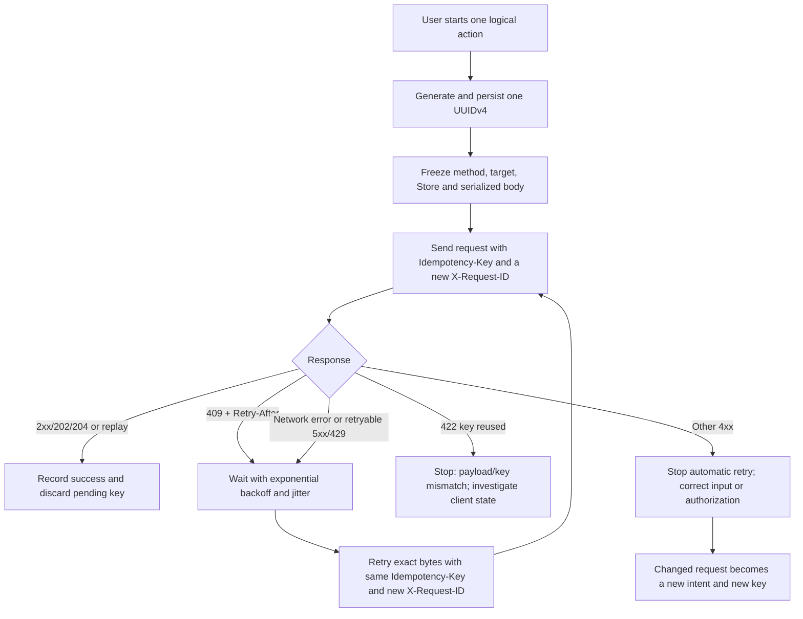
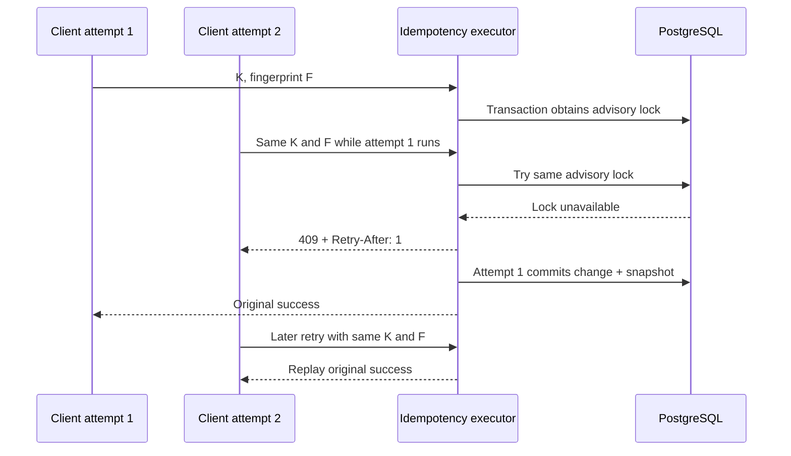

# Universal HTTP `Idempotency-Key` design for ShopNXE

Status: Phase 1 core and initial REST integrations implemented; migration prepared but not executed
Prepared: 2026-08-31  
Audience: backend, frontend, mobile, integration, SRE, security, and QA teams

## Executive recommendation

ShopNXE should implement one system-wide `Idempotency-Key` contract for mutation
requests, with mandatory adoption first on the operations where a duplicate has
the highest business cost. The mechanism should be available to REST and
GraphQL, but it should not be applied blindly to every HTTP request.

The recommended design is:

1. Authenticate the caller, resolve Platform or Store scope, verify active Store
   membership, authorize the operation, and validate the request.
2. Parse and validate a client-generated `Idempotency-Key` and derive a scoped,
   non-secret lookup hash.
3. Use a PostgreSQL transaction and transaction-scoped advisory lock to ensure
   only one matching operation can execute at a time.
4. Commit the business changes and the encrypted response snapshot in the same
   PostgreSQL transaction.
5. On a completed retry, re-run the current security checks and return the
   original status, selected headers, and body without repeating the mutation.
6. Put external effects behind after-commit events, an outbox, or a downstream
   provider idempotency key. Never call a non-idempotent external provider inside
   the protected database transaction.

This produces **effectively-once execution within ShopNXE's PostgreSQL boundary**.
It does not promise universal exactly-once delivery across networks and external
systems; that promise is not technically possible without cooperation from
every downstream system.

The architecture should be centrally reusable but route-aware. A single early
middleware that immediately replays responses is unsafe in this application
because fine-grained authorization currently also occurs in policies, Form
Requests, services, and GraphQL actions. A replay must never bypass those current
checks.

## Implementation status

The first safe increment now exists behind `IDEMPOTENCY_ENABLED=false`:

- a create-only `idempotency_records` migration is prepared but has not been
  executed;
- PostgreSQL advisory transaction locking, HMAC-scoped UUIDv4 keys, exact request
  fingerprints, encrypted JSON snapshots, integrity checks, replay headers, and
  bounded pruning are implemented;
- CORS accepts `Idempotency-Key` and exposes replay/correlation headers;
- additional Store creation, direct Platform Store creation, Platform merchant
  creation, and selected-Store user creation use authorization preflight plus the
  atomic executor;
- the four operations start in `supported` mode, so existing clients may omit the
  header; `required` enforcement is a later rollout decision;
- GraphQL, Customer credits, payments/orders, webhooks, uploads, and general CRUD
  are not yet integrated.

Enabling requires an explicit review and authorized execution of
`2026_08_31_010000_create_idempotency_records_table`, a stable non-empty
`IDEMPOTENCY_HMAC_KEY`, and then `IDEMPOTENCY_ENABLED=true`. The migration was
not executed as part of this implementation. Use a dedicated random HMAC secret
and retain it until all records written with it have expired and been pruned;
rotating it sooner would move retries into a new lookup namespace.

## Why ShopNXE needs it

The present system already has useful foundations:

- Laravel 13 API-only HTTP execution;
- REST under `/api/v1` and Lighthouse GraphQL under `/graphql`;
- PostgreSQL as the authoritative database;
- Redis for cache, queues, and Horizon;
- `X-Request-ID` correlation on every response;
- Platform/Store account separation, `X-Store-ID`, Store-bound bearer tokens,
  active membership, permissions, policies, and Store-owned binding checks;
- transactional application services and after-commit queue delivery;
- public ULIDs and internal bigint keys;
- Octane-safe request-context cleanup.

There is no general client-request idempotency layer. Database unique constraints
prevent some duplicate rows, but they do not return the first successful response
or prevent every repeated side effect. A client can submit a request, lose the
response because of a timeout, and be unable to tell whether it is safe to retry.

High-impact examples include:

- creating a Store, merchant, Store user, customer credit, order, or payment;
- installing, duplicating, licensing, or publishing a Theme;
- launching media AI, translation, collection refresh, import, or export work;
- attaching the same resource or recording the same ledger operation twice;
- sending duplicate email, webhook, queue, inventory, or billing effects after
  a retry;
- a user double-clicking a submit button while the first request is still active.

`X-Request-ID` solves correlation, not deduplication. Every retry should have a
new `X-Request-ID`; the same logical operation keeps the same `Idempotency-Key`.

## Standards position

HTTP defines `PUT`, `DELETE`, and safe methods as idempotent by intended effect,
while `POST` and `PATCH` are not inherently idempotent. HTTP also advises clients
not to retry a non-idempotent method automatically unless they have a way to know
the request is idempotent or was never applied.

The IETF HTTPAPI Working Group's `Idempotency-Key` document defines the header,
key uniqueness, expiry, fingerprints, replay behavior, and the expected `400`,
`409`, and `422` failure cases. As of 2026-08-31, revision 07 is an expired
Internet-Draft rather than a final RFC, so it must be treated as strong design
guidance and monitored for replacement or publication.

ShopNXE should follow these stable parts of the draft:

- the key is generated by the client;
- a key cannot be reused with a different request;
- the server publishes its validity and expiry policy;
- the server may fingerprint the request;
- a completed retry receives the original result;
- a concurrent duplicate receives `409 Conflict`;
- a reused key with a different request receives `422 Unprocessable Content`.

Canonical client documentation should use an RFC 8941 string:

```http
Idempotency-Key: "8e03978e-40d5-43e8-bc93-6894a57f9324"
```

For practical SDK and browser compatibility, the parser may temporarily accept
the same UUID without quotes. It must normalize both forms to one value. New
clients should send the quoted form.

Authoritative references:

- [RFC 9110, HTTP Semantics](https://www.rfc-editor.org/rfc/rfc9110.html#name-idempotent-methods)
- [IETF HTTPAPI Idempotency-Key draft, revision 07](https://datatracker.ietf.org/doc/html/draft-ietf-httpapi-idempotency-key-header-07)
- [IETF document status and history](https://datatracker.ietf.org/doc/draft-ietf-httpapi-idempotency-key-header/history/)
- [RFC 8941, Structured Field Values for HTTP](https://www.rfc-editor.org/rfc/rfc8941.html)
- [Laravel 13 atomic locks](https://laravel.com/framework/docs/13.x/cache#atomic-locks)

## Scope policy

“Universal” should mean one header, one client contract, one fingerprinting
policy, one persistence model, one replay format, and one observability model.
It should not mean storing or replaying every request.

### Requests covered

The mechanism is intended for JSON mutation operations:

- REST `POST`, `PATCH`, `PUT`, and selected `DELETE` routes;
- GraphQL mutation operations;
- commands that synchronously create an asynchronous job and return `202`;
- future order, payment, refund, inventory, fulfillment, ledger, import, and
  export creation operations.

`PUT` and `DELETE` are already idempotent by HTTP semantics, but the mechanism
is still valuable when they emit events or when the client needs the original
response instead of a later `404` or changed representation.

### Requests excluded from generic response replay

- `GET`, `HEAD`, and `OPTIONS`;
- health, Telescope, Horizon, Pulse, and other internal dashboards;
- login, logout, token issuance, password reset, MFA challenges, recovery codes,
  session rotation, and any response containing credentials or `Set-Cookie`;
- streamed downloads, WebSockets, server-sent events, and broadcasting streams;
- raw multipart/binary upload bodies and presigned-upload transfer operations;
- anonymous operations until a safe client identity scope exists;
- incoming provider webhooks, which should deduplicate on the verified provider
  installation and immutable provider event ID;
- operations that make an irreversible external call before the database commit.

Some excluded endpoints need a purpose-built mechanism. Uploads should use a
durable upload-session ID and deterministic object key. Webhooks should store a
provider event ledger after signature verification. Authentication endpoints
should rely on their own replay and token-rotation protections.

### Adoption tiers

| Tier | Policy | ShopNXE examples |
| --- | --- | --- |
| A: required | Reject a missing key with `400` | Money/credit/order/refund operations, Store or merchant provisioning, user creation, irreversible publish/license actions, async job launch |
| B: supported | Honor a supplied key; do not require it yet | Ordinary Product, Customer, Page, Collection, Theme, Settings, and Catalog writes during migration |
| C: excluded | Ignore or reject the header according to route documentation | Reads, auth/security, streaming, uploads, dashboards, webhook delivery |

Tier B allows an incremental rollout without silently changing every existing
client. After official clients send keys reliably and metrics are healthy,
selected Tier B endpoints can move to Tier A.

## Public HTTP contract

### Key rules

- Generate one UUIDv4 with a cryptographically secure generator for each new
  user intent. Browser clients can use `crypto.randomUUID()`.
- Reuse the same key only for retries of the exact same operation.
- Use a new key if the method, target, Store, or payload changes.
- Accept at most one `Idempotency-Key` header.
- After optional structured-field quotes are removed, accept only a canonical
  lowercase UUIDv4 during the first production release.
- Limit the normalized value to 36 characters for UUIDv4. A future format change
  must be versioned and documented before other strings are accepted.
- Never put an email address, user ID, Store ID, order number, or other business
  data in the key.
- Never treat the key as authentication or authorization.
- Never log or persist the raw key. Store an HMAC-SHA-256 lookup hash.

Strict UUIDv4 is recommended instead of arbitrary 1–255 character values. It
reduces low-entropy guessing, injection, index abuse, log abuse, and accidental
business-data disclosure.

### Validity window

Recommended defaults:

| Operation class | Retention |
| --- | ---: |
| General Store/Platform administration | 24 hours |
| Provisioning and long-running job creation | 72 hours |
| Money, order, refund, credit, or ledger effects | 7 days minimum |
| Provider-facing operation | At least the provider's documented retry window |

Clients must not automatically retry after expiry. Once a record expires and is
pruned, the same key can no longer protect against repeating its old effect.

### Fingerprint

ShopNXE should calculate a versioned SHA-256 fingerprint from:

```text
fingerprint_version
HTTP method
route name and API version
normalized route parameters / target public ULIDs
canonical query parameters that affect the mutation
normalized Content-Type
raw request-body bytes
```

The authenticated principal and Store belong in the lookup scope rather than
the payload fingerprint. Exact raw body bytes are safer for the first release:
the retried payload must be byte-for-byte identical. Semantic JSON
canonicalization can be introduced later only with a fully specified algorithm.

The following must not affect the fingerprint:

- `X-Request-ID`;
- tracing headers;
- cookies and bearer token values;
- timestamps added by proxies;
- `User-Agent`;
- response content-negotiation headers unless the stored response actually
  varies by them.

### Scope

A lookup must be scoped to all of the following:

```text
contract version
authenticated actor type and internal user ID
Platform versus Store context
internal Store ID when present
stable route name / GraphQL mutation field
normalized idempotency key
```

Scope by User, not by bearer-token row. This allows a safe retry after the same
User refreshes an expired token. Current authorization is still checked before
replay. A Store membership that was revoked after the original request must
cause the retry to fail with the current `403`, not reveal the old response.

Route parameters remain in the fingerprint. Reusing a key on the same route
template for a different Product, Store, or other public ULID therefore returns
`422` instead of affecting the second resource.

### Responses

| Situation | Response |
| --- | --- |
| First valid request | Execute once and return the normal endpoint response |
| Completed retry, same scope and fingerprint | Return the stored status, allow-listed headers, and body |
| Same scoped key, different fingerprint | `422 Unprocessable Content` |
| Same operation is still executing | `409 Conflict` plus `Retry-After` |
| Required key missing, duplicated, malformed, or weak | `400 Bad Request` |
| Idempotency persistence unavailable on a required route | `503 Service Unavailable`; do not run the mutation |
| Request failed before protected execution began | Return the normal failure; do not consume the key |
| Protected transaction threw before commit | Roll back changes and record; same key may retry |

For the first release, persist only successful `2xx` results, including `202`
and `204`. Authentication, authorization, rate-limit, validation, domain `4xx`,
and unhandled `5xx` results do not consume the key; the protected transaction
must roll back if such a result is produced after it begins. This policy is
safer than replaying transient failures and is simple for clients to reason
about. If a future endpoint must durably replay a non-`2xx` result, that behavior
requires an explicit route policy and proof that no partial effect is committed.

Error responses should use the application's JSON envelope initially. A later
API-wide RFC 9457 migration can use `application/problem+json`; idempotency alone
should not introduce two unrelated error formats.

Recommended machine-readable error codes:

```json
{
  "message": "An operation with this Idempotency-Key is still processing.",
  "code": "idempotency_in_progress",
  "request_id": "019..."
}
```

The other codes are `idempotency_key_required`, `idempotency_key_invalid`,
`idempotency_key_reused`, and `idempotency_unavailable`.

On replay, return these custom response headers:

```http
Idempotency-Replayed: true
Idempotency-Original-Request-ID: 019...
X-Request-ID: <the current attempt request ID>
```

The current attempt keeps a new `X-Request-ID` for tracing. The stored response
body is reproduced as originally returned, so an embedded `request_id`, if any,
may identify the original execution. The two headers make that relationship
explicit.

Only replay these stored headers:

- `Content-Type`;
- `Content-Language`;
- `Location`;
- `ETag` when it describes the original result;
- explicitly reviewed endpoint-specific headers.

Never store or replay `Authorization`, `Set-Cookie`, `Cookie`, CORS decision
headers, hop-by-hop headers, `Date`, `Server-Timing`, debug headers, or proxy
headers. CORS should allow `Idempotency-Key` and expose the replay, original
request ID, and `X-Request-ID` headers to browser clients.

## Recommended internal architecture

### Components

| Component | Responsibility |
| --- | --- |
| `CaptureIdempotencyKey` middleware | Parse and validate the header, enforce route mode, and attach immutable request context; it does not replay |
| `IdempotencyContext` | Carry normalized key hash, fingerprint inputs, mode, retention, route identity, actor, and Store scope for this request |
| `IdempotencyExecutor` | Run lookup, advisory locking, protected transaction, response capture, and replay after authorization/validation |
| `RequestFingerprinter` | Produce the versioned fingerprint without logging raw body or credentials |
| `IdempotencyRepository` | Perform scoped lookup and insert using PostgreSQL |
| `ResponseSnapshot` | Serialize status, allow-listed headers, encrypted/compressed body, content type, and original request ID |
| `IdempotencyResponseFactory` | Restore a completed response and add replay/correlation headers |
| `PruneIdempotencyRecords` command | Delete expired records in bounded batches and emit metrics |
| REST integration contract | Place the executor around the mutation callback after Form Request validation and authorization |
| GraphQL integration contract | Place the executor inside a mutation action/directive after Lighthouse validation and Store authorization |

`CaptureIdempotencyKey` can be universal middleware. `IdempotencyExecutor` is the
actual correctness boundary. Splitting them is deliberate: replaying in early
middleware would bypass service or policy authorization that currently occurs
later in ShopNXE's request cycle.

### Persistence model

Recommended `idempotency_records` fields:

| Field | Purpose |
| --- | --- |
| `id` bigint | Internal primary key; never returned publicly |
| `scope_hash` char(64) | HMAC-derived actor/Store/operation scope |
| `key_hash` char(64) | HMAC of the normalized client key |
| `fingerprint_version` smallint | Permits safe future algorithm changes |
| `request_fingerprint` char(64) | Detects reuse with a different request |
| `actor_id` bigint | Audit and ownership; references the authenticated User |
| `store_id` bigint nullable | Store isolation and audit context |
| `route_name` varchar | Stable REST route or GraphQL mutation identity |
| `http_method` varchar(8) | Diagnostic contract field |
| `response_status` smallint | Original HTTP status |
| `response_headers` jsonb | Small allow-listed metadata only |
| `response_body_ciphertext` bytea/text | Encrypted, optionally compressed response bytes |
| `response_body_sha256` char(64) | Integrity verification after decrypt/decompress |
| `original_request_id` varchar(128) | Correlates first execution to later retries |
| `completed_at` timestamptz | Completion timestamp |
| `expires_at` timestamptz | Retention and pruning boundary |
| timestamps | Operational audit |

Required database protections:

- unique index on `(scope_hash, key_hash)`;
- index on `expires_at` for bounded pruning;
- index on `actor_id, created_at` only if operational queries need it;
- Store/User foreign keys where they do not interfere with the chosen deletion
  and privacy-retention policy;
- no raw key, bearer token, cookie, request headers, or unencrypted response body.

Use a dedicated idempotency HMAC secret. Use a stable application encryption key
for response snapshots, with a documented rotation plan. Do not put either value
in tracked configuration or documentation.

### Why PostgreSQL is the source of truth

Redis locks are fast, but a Redis-only design has a correctness gap if a lock or
cached response disappears while the business change remains committed. Cache
eviction, failover, TTL expiry, or a process crash could allow a duplicate.

PostgreSQL is already ShopNXE's authoritative state and supports transaction
rollback, unique indexes, and advisory transaction locks. The business change
and replay record can therefore share one commit decision.

Redis may later provide a short-lived completed-response cache, but only as an
optimization backed by the PostgreSQL record. A Redis miss must fall through to
PostgreSQL and must never authorize a second execution by itself.

### Transaction and lock algorithm

Use a 64-bit advisory-lock identifier derived from the scoped key hash. A lock
collision can cause a harmless temporary `409`, but it must never cause a second
execution.

Conceptual server algorithm:

```text
preflight:
  assign a new X-Request-ID
  authenticate
  resolve Platform/Store context and active membership
  bind Store-owned models
  rate-limit
  validate Idempotency-Key if route supports/requires it
  validate request data
  authorize policy/permission
  compute scope and request fingerprint

fast replay check:
  read a completed row by scope_hash + key_hash
  if found and fingerprint differs -> 422
  if found and fingerprint matches -> replay response

protected execution:
  begin PostgreSQL transaction
  try pg_try_advisory_xact_lock(scoped_lock_id)
  if lock is unavailable -> roll back and return 409 + Retry-After

  read the completed row again
  if found and fingerprint differs -> roll back and return 422
  if found and fingerprint matches -> commit/close and replay

  execute the authorized business mutation
  build the complete HTTP response inside the boundary
  if result is not an allowed 2xx response -> roll back; do not consume key
  enforce response type and maximum snapshot size
  encrypt and insert the response snapshot
  commit business changes and idempotency record together

after commit:
  dispatch outbox/events/jobs
  release occurs automatically with transaction end
  return response
```

A non-blocking advisory lock is preferable to waiting for the first request.
Waiting ties up PHP/Octane workers and database connections. The client can retry
the `409` after `Retry-After: 1` with jitter.

### Response size and types

The first release should support JSON responses up to 1 MiB after serialization.
Most mutation responses should be much smaller. Responses over the limit should
not silently execute without protection. The route must instead:

- return a compact resource/job representation;
- store a resource locator and deterministic reconstruction contract; or
- be explicitly excluded until it has a purpose-built strategy.

Binary data, streams, temporary signed download URLs, session cookies, and
credential-bearing responses must never enter the generic snapshot table.

## Complete runtime workflow

### Client workflow



The client should persist an outstanding key until the outcome is known. A page
refresh, mobile reconnect, or token refresh must not silently generate a new key
for the same uncertain operation.

Suggested automatic retry policy:

- retry network disconnects, timeouts, `409`, `425`, `429`, `500`, `502`, `503`,
  and `504` only when route documentation allows it;
- reuse the exact key, method, URL, Store, and body;
- honor `Retry-After`;
- use exponential backoff with jitter and a bounded attempt/deadline budget;
- never change to a fresh key simply to get around `409` or an uncertain timeout;
- never automatically retry after the documented idempotency retention expires.

### First successful request

```mermaid
sequenceDiagram
    participant C as Client
    participant H as HTTP/GraphQL boundary
    participant A as Auth/Store/Policy/Validation
    participant I as Idempotency executor
    participant P as PostgreSQL
    participant O as After-commit outbox/queue

    C->>H: Mutation + Idempotency-Key K + X-Request-ID R1
    H->>A: Authenticate, resolve Store, bind, validate, authorize
    A->>I: Authorized mutation callback + scoped K + fingerprint F
    I->>P: Begin transaction and try advisory lock(K scope)
    P-->>I: Lock acquired; no completed record
    I->>P: Execute business changes
    I->>P: Insert encrypted response snapshot(K, F, R1)
    I->>P: Commit atomically
    P-->>O: Deliver only after commit
    I-->>C: Original status/body + X-Request-ID R1
```

### Retry after the original completed

```mermaid
sequenceDiagram
    participant C as Client
    participant A as Auth/Store/Policy/Validation
    participant I as Idempotency executor
    participant P as PostgreSQL

    C->>A: Exact retry K + new X-Request-ID R2
    A->>A: Re-check current identity, Store membership, permission and input
    A->>I: Scoped K + fingerprint F
    I->>P: Read completed record
    P-->>I: Same fingerprint; original response R1
    I-->>C: Original result; Replayed=true; Original-Request-ID=R1; X-Request-ID=R2
```

### Concurrent duplicate



### Failure behavior

| Failure point | Required outcome |
| --- | --- |
| Validation or authorization fails | No record and no business mutation; return current `4xx` |
| Process crashes before database commit | PostgreSQL rolls back business change, snapshot, and advisory lock; exact retry may execute |
| Database commit succeeds but connection to client drops | Snapshot exists with business change; exact retry replays it |
| Second request arrives while first transaction is open | `409` and `Retry-After`; no second execution |
| Same key arrives with different body/path | `422`; no business execution |
| PostgreSQL/idempotency table is unavailable | Required routes fail closed with `503` |
| Redis is unavailable | Core correctness remains intact; optional replay cache is bypassed |
| After-commit job dispatch temporarily fails | Outbox/recovery dispatcher retries the one recorded event/job |
| External provider timed out | Retry downstream with a stable derived provider key; reconcile by provider operation ID |
| Key expired and was pruned | It is no longer safe to auto-retry; client must reconcile state before a new intent |

## REST integration

For REST, Form Request validation occurs before controller mutation logic. The
controller or application action should make authorization explicit, then call
the executor with a callback returning the final response or a serializable
result from which the response is deterministically built.

Conceptual shape:

```php
$this->authorize('create', Product::class);

return $idempotency->execute(
    request: $request,
    operation: 'api.v1.store.products.store',
    callback: fn () => $service->create($actor, $request->validated()),
    response: fn ($product) => response()->json([
        'data' => new ProductResource($product),
    ], 201),
);
```

The concrete API can differ, but authorization and validation must be complete
before a stored response can be returned. The executor should own the outer
transaction; existing nested service transactions must be reviewed for correct
savepoint and after-commit behavior.

Route configuration should declare `required`, `supported`, or `excluded`, plus
retention and maximum response size. Route names, not controller class strings,
should be stable operation identifiers.

## GraphQL integration

Applying HTTP middleware to every `POST /graphql` request is insufficient because
the same URL carries queries and many mutation fields. It could also replay before
a resolver re-checks Store authorization.

Recommended GraphQL contract:

- queries ignore `Idempotency-Key`;
- each protected request contains exactly one top-level mutation field;
- the mutation action validates arguments and authorizes the actor/Store first;
- the operation scope includes the mutation field name and schema contract
  version;
- the fingerprint includes the selected operation, GraphQL document, variables,
  and operation name as received;
- a successful GraphQL JSON response is stored in full;
- validation, authorization, or execution errors roll back and do not consume
  the key even when GraphQL transports them with HTTP `200`;
- partial multi-mutation execution is rejected for protected operations unless
  ShopNXE later defines an explicit all-or-nothing GraphQL transaction contract.

This rule avoids changing Lighthouse's normal partial-error semantics by
accident. REST should be completed first; GraphQL support should be a separate
rollout phase with mutation-level contract tests.

## Queues, webhooks, and external providers

HTTP idempotency protects creation of the work, not every later delivery. The
same logical identity must continue through asynchronous boundaries.

### Queue/outbox rule

- Create the business row, idempotency response, and outbox/job-intent row in one
  transaction.
- Dispatch only after commit.
- Give the job a stable operation/event public ID.
- Make the job handler idempotent on that ID and enforce a database unique key.
- Do not serialize secrets or full merchant content solely for deduplication.
- Retrying the HTTP request replays the same `202` and job public ID.

### Incoming webhooks

An untrusted webhook must first pass raw-body signature and timestamp checks.
Then deduplicate on a composite such as:

```text
verified provider installation + provider account + immutable provider event ID
```

Do not trust `X-Store-ID`, merchant content, or a caller-supplied
`Idempotency-Key` to choose the Store. A provider that officially defines
`Idempotency-Key` may have it included as signed metadata, but the provider event
ID remains the durable inbound identity.

### Outbound providers

Derive a stable downstream key from ShopNXE's internal operation/event public ID,
not from the raw client key. Persist the provider request ID and reconcile an
unknown timeout before creating a new provider operation. If the provider has no
idempotency contract, use an outbox plus a reconciliation state machine; do not
claim exactly-once delivery.

## Security and privacy controls

- Authenticate and rate-limit before creating any idempotency record to prevent
  anonymous storage exhaustion.
- Re-run current authorization, Store membership, token Store binding, policy,
  and validation before every replay.
- Include actor and Store in the server-derived scope to prevent cross-user and
  cross-Store response leakage.
- Require a high-entropy fixed key format and reject multiple/oversized headers.
- HMAC raw keys and never log them. Logs may include only a short, non-reversible
  hash prefix if operationally necessary.
- Encrypt response bodies at the application layer and keep retention minimal.
- Do not store request authorization headers, cookies, raw secrets, or full raw
  request bodies. Store only their fingerprint.
- Do not replay tokens, cookies, signed download URLs, or responses whose content
  is unsafe after time passes.
- Cap request and response sizes and rate-limit unique keys per actor/Store.
- Fail closed on required routes when the durable idempotency store is unhealthy.
- Keep database unique constraints, Store scopes, policies, optimistic revisions,
  and domain validation. Idempotency complements rather than replaces them.
- Keep `X-Request-ID` distinct so each network attempt is independently auditable.
- Add idempotency context to Octane cleanup so one request cannot leak scope or a
  replay flag into the next request.

## Accuracy boundaries and companion controls

`Idempotency-Key` solves duplicate execution of the same request. It does not
solve every concurrency or consistency problem.

| Problem | Correct control |
| --- | --- |
| Same request is retried | `Idempotency-Key` |
| Two different users submit logically duplicate data | Domain unique constraint/business rule |
| Two editors overwrite each other's changes | ETag/`If-Match`, revision number, or optimistic lock |
| Multi-row business invariant | PostgreSQL transaction and constraints |
| Reliable event delivery | Transactional outbox and idempotent consumer |
| Provider callback repeats | Verified provider event ledger |
| Inventory overselling | Row/version lock and stock reservation rules |
| Payment timeout with unknown provider outcome | Provider idempotency key plus reconciliation |
| Read-your-writes across replicas | Sticky primary read or version-aware routing |

Calling the feature “exactly once” in public documentation would be misleading.
Use “safe retry” or “effectively once within the protected ShopNXE transaction.”

## Observability and operations

Add low-cardinality metrics:

- `idempotency.requests_total{mode,operation,outcome}` where outcome is
  `executed`, `replayed`, `in_progress`, `mismatch`, `invalid`, or `unavailable`;
- `idempotency.transaction_duration_ms`;
- `idempotency.response_snapshot_bytes`;
- `idempotency.records_active` and `idempotency.records_pruned_total`;
- `idempotency.lock_conflicts_total`;
- replay and mismatch rates by stable route name;
- pruning age and failures.

Logs should include current `request_id`, original request ID on replay, route
name, actor internal ID, Store internal ID, outcome, fingerprint version, and a
short hash correlation prefix. Never log the raw key or stored body.

Alert on:

- sudden mismatch growth, which usually indicates a client key-lifecycle bug;
- sustained advisory-lock conflicts;
- pruning failure or record growth beyond forecast;
- snapshot decrypt/integrity failures;
- required-route fail-closed responses;
- external provider reconciliation backlog.

Prune expired records in small indexed batches. Do not run one unbounded delete
that creates long locks or large PostgreSQL vacuum pressure. A legal or audit
requirement should store a separate minimal business audit record, not extend
encrypted response replay indefinitely.

## Cost estimate

### Engineering cost

The current application has many REST mutation surfaces, GraphQL mutations,
Store authorization layers, nested transactions, queues, and future external
effects. A production-quality universal mechanism is therefore a medium-sized
cross-cutting project, not a one-file middleware change.

| Work package | Estimate |
| --- | ---: |
| Contract, endpoint inventory, threat/failure review | 2–3 engineer-days |
| Migration, config, context, fingerprint, repository, encryption | 3–5 engineer-days |
| PostgreSQL advisory locking and atomic executor | 3–5 engineer-days |
| Tier A REST integration and client contract | 4–6 engineer-days |
| Unit, PostgreSQL integration, concurrency, crash-window tests | 4–7 engineer-days |
| Metrics, pruning, OpenAPI/docs, staging rollout | 3–5 engineer-days |
| Broader REST migration | 5–10 engineer-days |
| GraphQL mutation adapter and contract tests | 4–7 engineer-days |
| Provider/outbox reconciliation hardening | 4–8 engineer-days |

Expected totals:

- Tier A REST MVP: **16–24 engineer-days**;
- broad REST production rollout: **24–35 engineer-days**;
- REST + GraphQL + external-effect hardening: **32–50 engineer-days**.

These are planning ranges, not a quotation. Dollar cost is:

```text
engineer-days × 8 × blended hourly rate
```

For illustration only, 32–50 days at USD 50/hour is about USD 12,800–20,000;
at USD 100/hour it is about USD 25,600–40,000. Scope, existing client code,
test-fixture quality, and the number of Tier A routes are the largest variables.

### Runtime cost

There is no required new vendor if the existing PostgreSQL capacity is adequate.
Each protected first request adds roughly one indexed lookup, one response-row
insert, encryption/compression work, and a slightly longer transaction. A replay
adds a lookup and decrypt/decompress step but avoids the business mutation.

Storage forecast:

```text
rows/day = protected writes per second × 86,400
raw bytes = rows/day × average stored record bytes × retention days
planned PostgreSQL bytes = raw bytes × 2 to 3
```

The 2–3 multiplier accounts for indexes, row/page overhead, dead tuples, and
operational headroom. Example estimates at a 5 KB average stored record:

| Protected average rate | Retention | Rows | Raw data | Plan with 2–3× overhead |
| ---: | ---: | ---: | ---: | ---: |
| 1 request/s | 1 day | 86,400 | ~0.43 GB | ~0.9–1.3 GB |
| 10 requests/s | 1 day | 864,000 | ~4.32 GB | ~8.6–13 GB |
| 10 requests/s | 7 days | 6,048,000 | ~30.2 GB | ~60–91 GB |

Encryption and compression may reduce or increase the actual row size depending
on response content. Measure real staging payloads before selecting retention.
Keeping mutation responses compact produces the largest saving.

### Organizational cost

- SDK/frontend logic must persist keys across retries and reloads.
- API teams must classify every new mutation route.
- Services must move irreversible remote effects to after-commit/outbox flows.
- QA must test duplicate, concurrent, timeout, crash, replay, mismatch, expiry,
  Store isolation, and revoked-permission cases.
- SRE must monitor pruning, table growth, lock conflicts, and fail-closed health.

## Benefits

### Direct benefits

- prevents duplicate Store, merchant, order, credit, refund, job, and other
  mutation effects caused by retries or double submission;
- gives browser, mobile, and partner clients a deterministic retry contract;
- returns the first successful result after the response was lost;
- reduces orphaned or partially duplicated queue and provider work;
- improves financial and inventory accuracy when combined with domain locks and
  constraints;
- improves user experience under slow or unreliable networks;
- creates an auditable relationship between one logical operation and multiple
  HTTP attempts;
- reduces one-off deduplication code in controllers and modules;
- supports safer automated retries at gateways and client SDKs;
- reduces support investigation time for “did my request succeed?” incidents.

### Expected measurable outcomes

After rollout, compare:

- duplicate business-row and duplicate-side-effect incidents;
- replay rate and requests recovered after client timeout;
- `409` concurrent-submission rate;
- `422` mismatch rate by client version;
- support tickets involving double submit or unknown outcomes;
- payment/provider reconciliation cases;
- average mutation latency and database storage growth;
- queue duplicates for protected operation IDs.

## Risks and mitigations

| Risk | Mitigation |
| --- | --- |
| Early middleware replays data without current permission | Replay only through executor after current authentication, Store, validation, and authorization checks |
| Business commit succeeds but response record is missing | Commit both in the same PostgreSQL transaction |
| Redis eviction permits a duplicate | PostgreSQL is authoritative; Redis is optional cache only |
| Long transactions reduce throughput | Protect JSON mutations only, keep external I/O after commit, cap response work, measure by route |
| Response table stores PII | Encrypt bodies, minimize headers, short retention, access controls, bounded pruning |
| Client reuses a key with changed data | Versioned fingerprint and `422` |
| Low-entropy keys leak another client's result | Strict UUIDv4 plus actor/Store/operation scope and HMAC storage |
| A replay returns stale credentials or cookies | Exclude auth/session endpoints and disallow sensitive headers/body types |
| Multi-field GraphQL mutation changes semantics | Require one top-level protected mutation during initial GraphQL rollout |
| External provider executes twice | Derived provider key, outbox, stable operation ID, and reconciliation |
| Expired record allows an old retry to execute | Publish retention; clients stop auto-retry at deadline and reconcile state |
| Table/index growth harms PostgreSQL | Compact responses, tiered TTL, indexed batch pruning, capacity alerts |

## Implementation and rollout plan

### Phase 0 — decision and inventory

1. Approve this public contract, retention tiers, response cap, and the term
   “effectively once.”
2. Inventory every REST mutation and GraphQL mutation.
3. Classify each route as required, supported, or excluded.
4. Identify external I/O currently performed before commit.
5. Select the first Tier A workflows and their owning modules.
6. Capture baseline duplicate incidents, write throughput, response sizes, and
   p50/p95/p99 mutation latency.

Exit condition: reviewed endpoint matrix and threat model.

### Phase 1 — core behind a disabled feature switch

1. Add configuration with a global default-off switch and route policies.
2. Add the create-only `idempotency_records` migration.
3. Implement key parsing, HMAC scope, fingerprint version 1, repository,
   response encryption, and snapshot cap.
4. Implement the PostgreSQL executor and non-blocking advisory lock.
5. Add prune command, schedule, metrics, logs, and Octane cleanup.
6. Add unit tests and PostgreSQL concurrency/failure tests.

Exit condition: no route uses the mechanism in production, but the core passes
failure-window and Store-isolation tests.

### Phase 2 — supported mode on Tier A REST routes

1. Integrate Store/merchant provisioning and one async job-creation workflow.
2. Honor keys but do not require them.
3. Update OpenAPI, API manual, developer guide, SDK/client examples, and CORS.
4. Update the official browser client to generate and persist UUIDv4 keys.
5. Run staging load, concurrency, timeout, PostgreSQL restart, Octane, and queue
   recovery tests.

Exit condition: executed/replayed responses are equivalent, no cross-Store
replay is possible, and latency/storage stay inside the agreed budget.

### Phase 3 — require keys for highest-risk workflows

1. Announce the enforcement date and client compatibility window.
2. Enable required mode for provision, money/credit/order, irreversible publish,
   and async launch operations.
3. Fail closed if idempotency persistence is unavailable.
4. Monitor invalid/mismatch/conflict/client-version metrics.
5. Keep a reversible route-level switch for controlled rollback.

Exit condition: official clients send compliant keys and duplicate incidents
decrease without an unacceptable error or latency increase.

### Phase 4 — broad REST and GraphQL

1. Migrate remaining valuable REST mutations by owning module.
2. Add the one-top-level-mutation GraphQL adapter.
3. Integrate Category, Product Type, Product, and other GraphQL mutations.
4. Keep reads and excluded endpoint classes outside generic replay.
5. Add contract tests that every required route declares and enforces its mode.

### Phase 5 — downstream continuity

1. Standardize outbox/event operation IDs.
2. Standardize provider-derived idempotency keys.
3. Add webhook event ledgers per provider.
4. Add reconciliation dashboards for unknown external outcomes.
5. Re-evaluate retention using measured retry and provider windows.

## Test and acceptance plan

### Functional contract

- valid first request executes exactly one protected database mutation;
- same key, actor, Store, route, target, and body returns the original response;
- same key with changed body, query, or route parameter returns `422`;
- two concurrent requests allow one executor and return `409` for the other;
- required route without a key returns `400` before mutation;
- supported route without a key keeps legacy behavior during migration;
- excluded route never snapshots sensitive or streamed content;
- replay has a new `X-Request-ID` and the original request correlation header.

### Security and tenancy

- User B cannot replay User A's result even with the key;
- Store B cannot replay Store A's result;
- an unbound or wrong-Store bearer token cannot access a replay;
- revoked membership/permission denies the retry before lookup response is
  returned;
- malformed, duplicated, oversized, or low-entropy keys are rejected;
- raw key, bearer token, cookie, payload, and decrypted body do not appear in
  logs;
- auth/session/token responses cannot be registered for replay.

### Transaction and crash windows

- exception before commit leaves neither business change nor completed record;
- process termination during the transaction releases the advisory lock through
  PostgreSQL rollback;
- commit followed by simulated network disconnect replays the committed result;
- after-commit job/outbox work is created once;
- a provider timeout follows reconciliation and does not create a second remote
  operation with a fresh key.

### Performance and operations

- test p50/p95/p99 latency at expected and peak protected write throughput;
- verify one-key contention does not reduce unrelated route throughput;
- measure average and p95 encrypted snapshot size;
- prove batch pruning stays bounded and indexes remain usable;
- verify PostgreSQL fail-closed behavior and optional Redis-cache fallback;
- verify Octane workers clear idempotency context between requests;
- test key and response-encryption key rotation procedures in staging.

### Definition of done

- endpoint inventory and route modes are reviewed;
- core unit and PostgreSQL concurrency tests pass;
- ShopNXE security/Store isolation tests pass;
- official clients persist one key for the entire uncertain operation;
- OpenAPI and human documentation publish syntax, retention, errors, and retry
  rules;
- dashboards and pruning alerts are live;
- Tier A external effects use after-commit/outbox and downstream deduplication;
- staged rollback switches are tested;
- no secrets or raw `.env` values appear in code, docs, logs, or fixtures.

## Final decision summary

Implement the mechanism, but do it as an **atomic application boundary** rather
than a response cache. Start with Tier A REST operations, make PostgreSQL the
source of truth, re-check security on every attempt, and carry the same logical
operation ID through queues and providers. This gives ShopNXE the main safety and
accuracy benefits while avoiding the most common idempotency failures: Redis-only
deduplication, replay before authorization, a commit/snapshot race, cross-tenant
keys, sensitive response storage, and false exactly-once claims.
