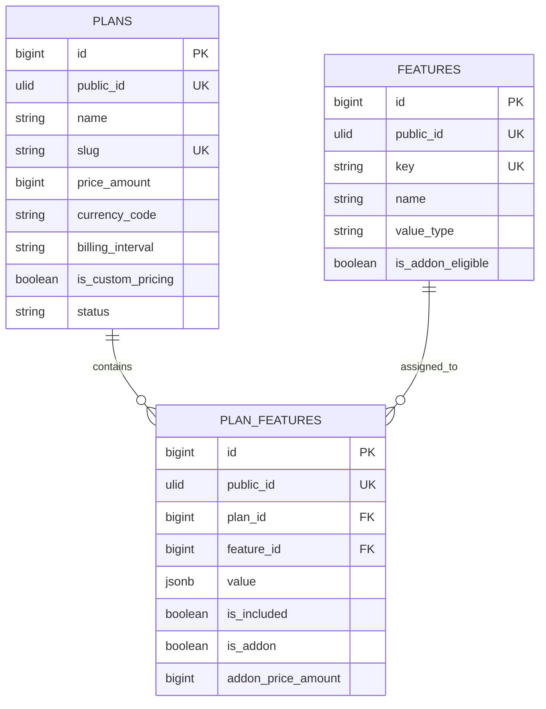

# Plans & Pricing

The Billing module owns the Platform Admin plan catalog. The backend exposes a `Plans & Pricing` navigation item at `/admin/plans` to Platform users with `manage plans`. This repository is API-only; the frontend should render that menu entry and call the APIs documented here.

## Data model

`features` is a reusable master catalog. `plan_features` assigns a feature and typed value to any plan. An assignment may be included or an optional add-on; add-ons may carry their own price/currency/interval. This avoids duplicating feature definitions when plans change.

Money is stored as integer minor units: `300` means USD 3.00. Fixed plans require an amount and `month` or `year` interval. Custom-price plans store a null amount/interval. Plan status is `draft`, `active`, or `archived`.

## Platform authorization

Every route requires:

1. Sanctum authentication;
2. `users.scope = platform`;
3. the Platform `manage plans` permission.

`Super Admin` and `Billing` initially have this permission. `Support` and every Store account are rejected. No Store context header is used for Platform plan administration.

## Admin REST contract

| Method | Route | Purpose |
| --- | --- | --- |
| `GET` | `/api/v1/platform/plans` | List plans with assignments. |
| `POST` | `/api/v1/platform/plans` | Add a plan and price. |
| `GET` | `/api/v1/platform/plans/{plan}` | View a plan by public ULID. |
| `PATCH` | `/api/v1/platform/plans/{plan}` | Edit price, description, status, order, or pricing mode. |
| `DELETE` | `/api/v1/platform/plans/{plan}` | Remove an unassigned plan. Assigned plans must be archived. |
| `GET` | `/api/v1/platform/features` | List reusable features. |
| `POST` | `/api/v1/platform/features` | Add a feature definition. |
| `PATCH` | `/api/v1/platform/features/{feature}` | Edit a feature definition. |
| `DELETE` | `/api/v1/platform/features/{feature}` | Remove a feature after detaching it from all plans. |
| `PUT` | `/api/v1/platform/plans/{plan}/features/{feature}` | Add or update a plan-feature assignment/add-on. |
| `DELETE` | `/api/v1/platform/plans/{plan}/features/{feature}` | Detach the feature from the plan. |

Public ULIDs cross the API. Internal bigint plan, feature, Store, and assignment keys never do.

## Initial editable sample

| Plan | Monthly price | Best for |
| --- | ---: | --- |
| Launch 1 | $3 | Single-product businesses |
| Launch 5 | $5 | Small catalog (up to 5 products) |
| Starter | $9 | Growing stores |
| Growth | $29 | Small businesses |
| Professional | $79 | Established brands |
| Business | $199 | Large businesses |
| Enterprise | Custom | High-volume merchants |

`EnsurePlanCatalog` inserts this sample only when a slug/key does not already exist, so rerunning the seeder does not overwrite later admin edits. Launch 1 and Launch 5 include the supplied feature sets; Launch 5 models its optional blog as an add-on assignment.

## Safe lifecycle

Plans referenced by `stores.plan_id` cannot be deleted. Set their status to `archived` so historical Store assignments remain meaningful. A feature cannot be deleted while any plan assignment references it. Subscription/provider/invoice behavior remains future Billing work and must build on this catalog instead of storing provider payloads in `stores.settings`.
