# Store management

This document is the implementation contract for creating, viewing, and editing merchant Stores. It complements the lower-level [Stores and context document](stores.md).

## Account boundary

Only `users.scope = store` accounts use these endpoints. Creating another Store makes the caller its active `Owner`. Every read or update of an existing Store requires `X-Store-ID: <store-public-ulid>` and an active membership in that exact Store.

Viewing requires membership. Profile, settings, and language changes additionally require the Store-scoped `manage store` permission, initially granted to `Owner` and `Manager`. Platform users cannot enter this flow.

## Service layer

| Service | Responsibility |
| --- | --- |
| `CreateStoreService` | Transactionally provisions the Store, active membership, Owner role, initial profile, locale, and preferences. |
| `ViewStoreService` | Returns one Store only after Store-scope and active-membership checks. |
| `UpdateStoreProfileService` | Updates merchant-owned identity, contact, branding, and classification fields after `manage store`. |
| `StoreSettingsService` | Views locale/preferences for any active member and merges settings updates for Store managers. |
| `StoreAccessService` | Centralizes Store scope, active membership, and `manage store` enforcement for services. |

Controllers contain no business writes. Form Requests normalize and validate input, services enforce authorization and transactions, and API Resources expose public ULIDs while hiding internal bigint keys.

## REST contract

| Method | Route | Header | Authorization |
| --- | --- | --- | --- |
| `POST` | `/api/v1/stores` | none | Authenticated Store account |
| `GET` | `/api/v1/store` | `X-Store-ID` | Active member |
| `PATCH` | `/api/v1/store/profile` | `X-Store-ID` | `manage store` |
| `GET` | `/api/v1/store/settings` | `X-Store-ID` | Active member |
| `PATCH` | `/api/v1/store/settings` | `X-Store-ID` | `manage store` |

## Field ownership

Store owners/managers may edit:

- identity/contact: `name`, `slug`, `legal_name`, `description`, `email`, `phone`, and `primary_domain`;
- branding references: `logo`, `favicon`, and `cover_image`;
- classification: `industry` and `business_type`;
- locale: `currency_code`, `language_code`, `timezone`, and `country_code`;
- validated preferences: order prefix, date/time formats, weight/dimension units, inventory tracking, guest checkout, tax-inclusive pricing, low-stock threshold, and support email.

Platform/Billing-controlled fields are prohibited in merchant write requests: `status`, `plan_id`, `subscription_id`, verification, AI/POS/B2B/marketplace entitlements, launch/trial timestamps, raw `settings`, and raw `metadata`. Capabilities are visible in the settings response but read-only.

Settings updates merge validated preference keys into the existing JSON object, so changing one preference does not erase the others. Stable business fields remain first-class columns rather than being moved into JSON.

## Information flow

```mermaid
flowchart LR
    Client["Store Admin client"]
    Scope["Require Store account"]
    Resolve["Resolve X-Store-ID ULID"]
    Member["Require active membership"]
    Permission["Require manage store for writes"]
    Service["Store service + transaction"]
    DB["PostgreSQL bigint Store row"]
    Resource["Public-safe Store resource"]

    Client --> Scope --> Resolve --> Member --> Permission --> Service --> DB --> Resource
```

Unknown Store ULIDs return 404. Missing context returns 400. Platform accounts, inactive/non-members, cross-Store tokens, and staff without permission return 403. Invalid or platform-controlled input returns 422.
