# Store management

This document is the implementation contract for creating, viewing, and editing merchant Stores. It complements the lower-level [Stores and context document](stores.md).

## Account boundary

Only `users.scope = store` accounts use these endpoints. Creating another Store makes the caller its active `Owner`. Every read or update of an existing Store requires `X-Store-ID: <store-public-ulid>` and an active membership in that exact Store.

Viewing requires membership. Profile, settings, and language changes additionally require the Store-scoped `manage store` permission, initially granted to `Owner` and `Manager`. Platform users cannot enter this flow.

## Service layer

| Service | Responsibility |
| --- | --- |
| `CreateStoreService` | Transactionally provisions a draft Store, normalized settings, platform/custom domains, selected active theme, active membership, Owner role, initial profile, locale, and preferences. |
| `ViewStoreService` | Returns one Store only after Store-scope and active-membership checks. |
| `UpdateStoreProfileService` | Updates merchant-owned identity, contact, branding, and classification fields after `manage store`. |
| `StoreSettingsService` | Views locale, normalized contact/address data, and preferences for any active member and merges settings updates for Store managers. |
| `StoreAccessService` | Centralizes Store scope, active membership, and `manage store` enforcement for services. |
| `PlatformMerchantService` | Lets Platform staff with `manage stores` list/view merchants or atomically provision a Store-scoped owner, Store, membership, and roles. |
| `PlatformStoreAdminService` | Lets Platform staff with `manage stores` search/filter/page, create, view, and edit Store rows without entering Store context. |
| `StoreUserAdminService` | Lists selected-Store members and creates new Store users after member/role-management checks. |

Controllers contain no business writes. Form Requests normalize and validate input, services enforce authorization and transactions, and API Resources expose public ULIDs while hiding internal bigint keys.

## REST contract

| Method | Route | Header | Authorization |
| --- | --- | --- | --- |
| `POST` | `/api/v1/stores` | none | Authenticated Store account |
| `GET` | `/api/v1/store` | `X-Store-ID` | Active member |
| `PATCH` | `/api/v1/store/profile` | `X-Store-ID` | `manage store` |
| `GET` | `/api/v1/store/settings` | `X-Store-ID` | Active member |
| `PATCH` | `/api/v1/store/settings` | `X-Store-ID` | `manage store` |
| `GET` | `/api/v1/store/users` | `X-Store-ID` | `manage store members` |
| `POST` | `/api/v1/store/users` | `X-Store-ID` | `manage store members` and `manage store roles` |
| `GET` | `/api/v1/store/roles` | `X-Store-ID` | `manage store roles` |
| `GET/POST` | `/api/v1/platform/stores` | none | Platform `manage stores`; page/search/filter or direct Store creation |
| `GET/PATCH` | `/api/v1/platform/stores/{store}` | none | Platform `manage stores`; public-ULID view/edit |

Platform merchant listing/provisioning uses `/api/v1/platform/merchants*` without a Store header. See [User and merchant management](user-merchant-management.md) for request shapes and the Platform/Store identity boundary.

Merchant creation requests may send `theme_template_key`; omission uses the
configured default. Successful registration, additional-Store creation, and
Platform merchant creation responses include `dashboard_url`. It points to
`STORE_ADMIN_DASHBOARD_URL` with `store=<public-ulid>`, never an internal key.

The direct Platform Store API is intentionally different from merchant
provisioning: it creates no owner, membership, Store role, plan, or
subscription. Its list combines case-insensitive Store and member search with exact status,
classification, locale/country, verification/capability, and creation-date
filters. The list defaults to 10 rows, returns the earliest membership user's
public identity as `owner`, and caps `per_page` at 100. See the
[Platform Stores admin guide](components/platform-stores-admin.md).

## Field ownership

Store owners/managers may edit:

- identity/contact: `name`, `slug`, `legal_name`, `description`, `email`, `phone`, and `primary_domain`;
- branding references: `logo`, `favicon`, and `cover_image`;
- classification: `industry` and `business_type`;
- locale: `currency_code`, `language_code`, `timezone`, and `country_code`;
- normalized contact/address settings: `contact_email`, `contact_phone`, `store_country_code`, `store_state`, `store_city`, `store_zip`, `store_address_1`, and `store_address_2`;
- validated preferences: order prefix, date/time formats, weight/dimension units, inventory tracking, guest checkout, tax-inclusive pricing, low-stock threshold, and support email.

Platform/Billing-controlled fields are prohibited in merchant write requests: `status`, `plan_id`, `subscription_id`, verification, AI/POS/B2B/marketplace entitlements, launch/trial timestamps, raw `settings`, and raw `metadata`. Capabilities are visible in the settings response but read-only.

Platform Store administrators may edit lifecycle, verification, and capability
fields through `/api/v1/platform/stores*`, plus the same public profile/locale
fields. Internal `plan_id`/`subscription_id`, raw JSON, preferences, owner
payloads, and role payloads are prohibited there as well; each belongs to a
separate validated workflow.

Settings updates write contact/address values to `store_settings` and merge validated preference keys into the existing JSON object, so changing one preference does not erase the others. Support email, weight unit, and order prefix stay synchronized with their normalized settings columns. Stable business fields remain first-class columns rather than being moved into JSON.

## Information flow

```mermaid
flowchart LR
    Client["Store Admin client"]
    Scope["Require Store account"]
    Resolve["Resolve X-Store-ID ULID"]
    Member["Require active membership"]
    Permission["Require manage store for writes"]
    Service["Store service + transaction"]
    DB["PostgreSQL bigint Store row"]
    Resource["Public-safe Store resource"]

    Client --> Scope --> Resolve --> Member --> Permission --> Service --> DB --> Resource
```

Unknown Store ULIDs return 404. Missing context returns 400. Platform accounts, inactive/non-members, cross-Store tokens, and staff without permission return 403. Invalid or platform-controlled input returns 422.
