# User and merchant management

This owner-aware merchant workflow is distinct from the direct Platform Store
catalog at `/api/v1/platform/stores*`. Use the Store catalog for
search/filter/page and unassigned Store-row create/edit; use the merchant API
when an owner identity, active membership, and Store roles must be maintained
atomically. See the
[Platform Stores admin component](components/platform-stores-admin.md).

This is the implementation contract for creating Platform staff, merchant Stores, and Store staff. A merchant is a Store account; there is no separate tenant or merchant identity table.

## Scope boundary

Platform and Store identities share the `users` table but never share access. A Platform user can hold only Platform roles and cannot have a Store membership. A Store user can hold only Store roles under an active Store membership and cannot receive a Platform role. API input uses public ULIDs; services and authorization joins use bigint IDs internally.

“All roles” always means every role inside one scope:

- Platform test admin: `Super Admin`, `Support`, and `Billing`;
- Store test merchant: `Owner`, `Manager`, `Sales`, and `Inventory` for its own Store.

It never means combining Platform and Store roles on one account.

## Platform administration API

All routes require Sanctum, `users.scope = platform`, and the stated permission. They never accept `X-Store-ID`.

| Method | Route | Permission | Purpose |
| --- | --- | --- | --- |
| `GET` | `/api/v1/platform/roles` | `manage platform users` | List assignable Platform role names. |
| `GET` | `/api/v1/platform/users` | `manage platform users` | Page Platform users and their Platform roles. |
| `POST` | `/api/v1/platform/users` | `manage platform users` | Create a Platform user and assign one or more Platform roles. |
| `GET/PATCH` | `/api/v1/platform/users/{user}` | `manage platform users` | View or edit one Platform user by User ULID. |
| `GET` | `/api/v1/platform/merchant-roles` | `manage stores` | List assignable Store role names for merchant provisioning. |
| `GET` | `/api/v1/platform/merchants` | `manage stores` | Page Stores and their users/Store roles. |
| `POST` | `/api/v1/platform/merchants` | `manage stores` | Atomically create a Store-scoped owner, Store, active membership, and roles. |
| `GET/PATCH` | `/api/v1/platform/merchants/{merchant}` | `manage stores` | View or edit a merchant owner/Store by Store ULID. |

`manage platform users` belongs initially only to `Super Admin`. `manage stores` belongs initially to `Super Admin` and `Support`.

Platform-user example (use placeholders, never a real password in source control):

```json
{
  "name": "Platform Staff",
  "email": "staff@example.test",
  "password": "<strong-password>",
  "password_confirmation": "<strong-password>",
  "roles": ["Support"]
}
```

Merchant example:

```json
{
  "owner": {
    "name": "Merchant Owner",
    "email": "owner@example.test",
    "password": "<strong-password>",
    "password_confirmation": "<strong-password>"
  },
  "store": {
    "name": "Example Store",
    "slug": "example-store",
    "business_type": "ecommerce",
    "timezone": "UTC"
  },
  "roles": ["Owner", "Manager"]
}
```

The merchant workflow always includes `Owner`, even if the submitted role list omits it. User creation, Store provisioning, membership, and role assignment share one transaction. Registration and verification side effects run after commit. Platform-user edits may change identity, password, and Platform roles. Merchant edits may change owner identity/password and Platform-controlled Store profile/status; existing Store-role assignments are preserved. Changing either managed email clears `email_verified_at` and queues a fresh verification message after commit.

Managed-user resources include `created_at`, `updated_at`,
`email_verified_at`, `mfa_enabled`, and role names resolved in the correct
scope. Merchant resources return the primary `owner`, the Store profile, and
all Store users; membership status and joined/invited timestamps are included
for Store users.

## Store user API

These routes require a Store-scoped account, `X-Store-ID: <store-ulid>`, and an active membership.

| Method | Route | Permission | Purpose |
| --- | --- | --- | --- |
| `GET` | `/api/v1/store/roles` | `manage store roles` | List roles assignable inside the selected Store. |
| `GET` | `/api/v1/store/users` | `manage store members` | Page selected-Store members, membership status, and Store roles. |
| `POST` | `/api/v1/store/users` | `manage store members` and `manage store roles` | Create a new Store identity, active membership, and selected-Store roles. |

The initial `Owner` can create Store users. `Manager` may list members but cannot assign roles because it does not have `manage store roles`. The endpoint currently creates a new unique-email identity; invitation or linking of an existing identity is deliberately separate future behavior.

The three user/merchant list routes accept `page` and `per_page`. Page size
defaults to 25 and cannot exceed 100. Records remain under `data`; clients use
the returned `links` and `meta` objects for navigation and totals. Role routes
remain unpaginated because they supply complete assignment options.

## Execution flow

```mermaid
flowchart LR
    Client["Authenticated admin client"]
    Scope["Require Platform or Store scope"]
    Context["Resolve Store ULID when Store-scoped"]
    Permission["Check management permissions"]
    Validate["Validate email, password, and same-scope roles"]
    Transaction["Create user, Store/membership, and assignments"]
    Database["PostgreSQL scope triggers"]
    Events["After-commit registration and verification"]
    Resource["Return ULIDs, scope, memberships, and role names"]

    Client --> Scope --> Context --> Permission --> Validate --> Transaction --> Database --> Events --> Resource
```



The application service validates the boundary first; PostgreSQL triggers independently reject mixed-scope memberships and assignments. Duplicate email/slug or invalid roles return `422`; missing authentication returns `401`; wrong scope or permission returns `403`; unknown public ULIDs return `404`.

## Local test accounts

Local fixtures are opt-in through ignored `.env` values: `PLATFORM_ADMIN_NAME`, `PLATFORM_ADMIN_EMAIL`, `PLATFORM_ADMIN_PASSWORD`, `LOCAL_MERCHANT_NAME`, `LOCAL_MERCHANT_EMAIL`, `LOCAL_MERCHANT_PASSWORD`, `LOCAL_MERCHANT_STORE_NAME`, and `LOCAL_MERCHANT_STORE_SLUG`. Run `php artisan db:seed --force` after setting them.

The seeder is idempotent, runs account creation only in `APP_ENV=local`, verifies both emails, and synchronizes each fixture to every role in its own scope. No default password or local credential is stored in tracked files.
